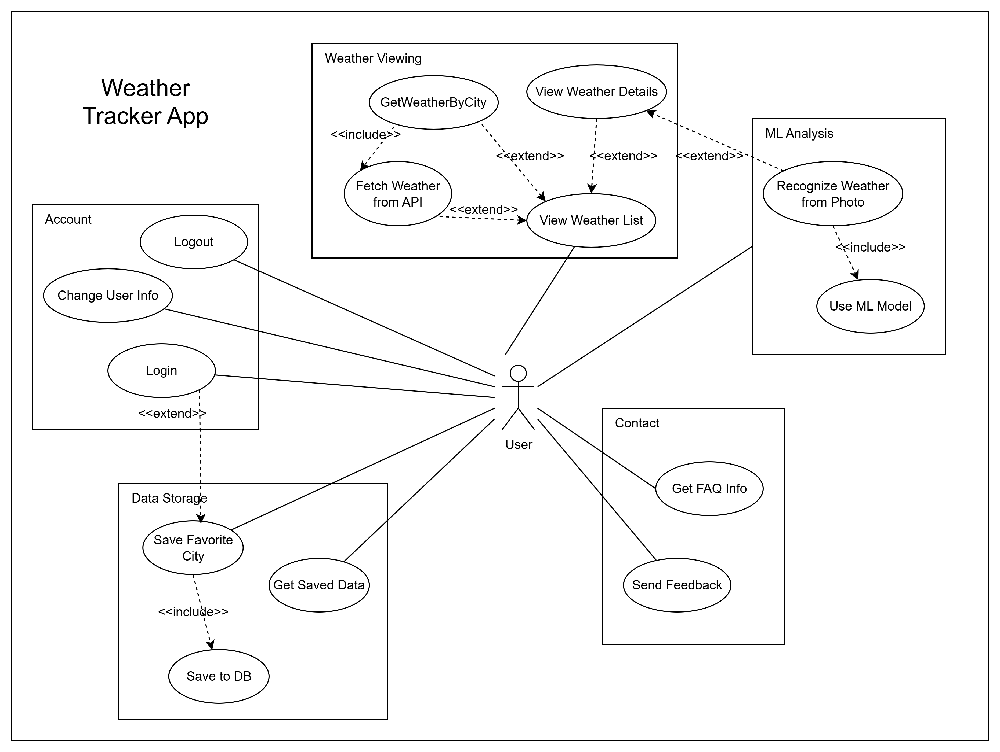
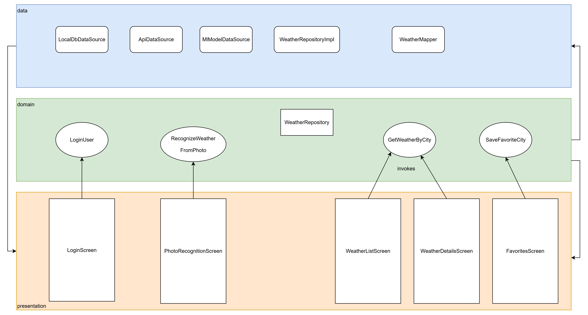

**"Weather Tracker"** — мобильное приложение для просмотра погоды в разных городах. Оно удовлетворяет всем требованиям:

- Авторизация (логин для сохранения предпочтений).
- Взаимодействие с внешним сервисом (API погоды, например, OpenWeatherMap, возвращающий JSON с данными о погоде).
- Сохранение данных в БД (локальная SQLite для хранения любимых городов и истории просмотров).
- Отображение списка сущностей с изображениями (список городов с иконками погоды).
- Отображение страницы сущности (детальная страница погоды для выбранного города).
- Различные возможности: Гость может только просматривать базовую погоду, авторизованный пользователь — добавлять города в избранное и использовать ML для анализа фото.
- Использование обученной модели: TensorFlow Lite модель для распознавания погоды по фото (например, готовую модель для классификации изображений на "солнечно", "дождливо", "облачно" из репозитория TensorFlow Hub, такую как MobileNet с кастомной обучением на датасете погоды. Анализ: модель легковесная, работает оффлайн, точность ~85% на простых изображениях; альтернативы — EfficientNet Lite, но MobileNet проще для интеграции).

Приложение использует чистую архитектуру: Use Cases управляют бизнес-логикой (получение погоды, сохранение, распознавание), сущности — City, WeatherData, User; границы — через репозитории для API и БД.

