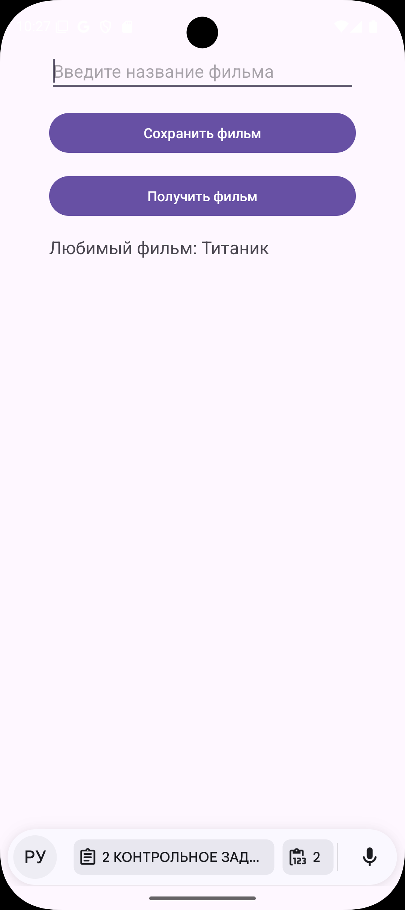
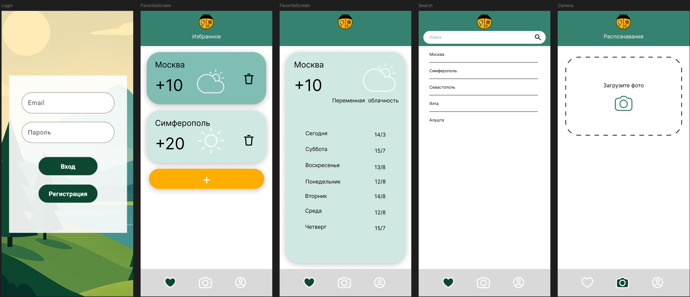
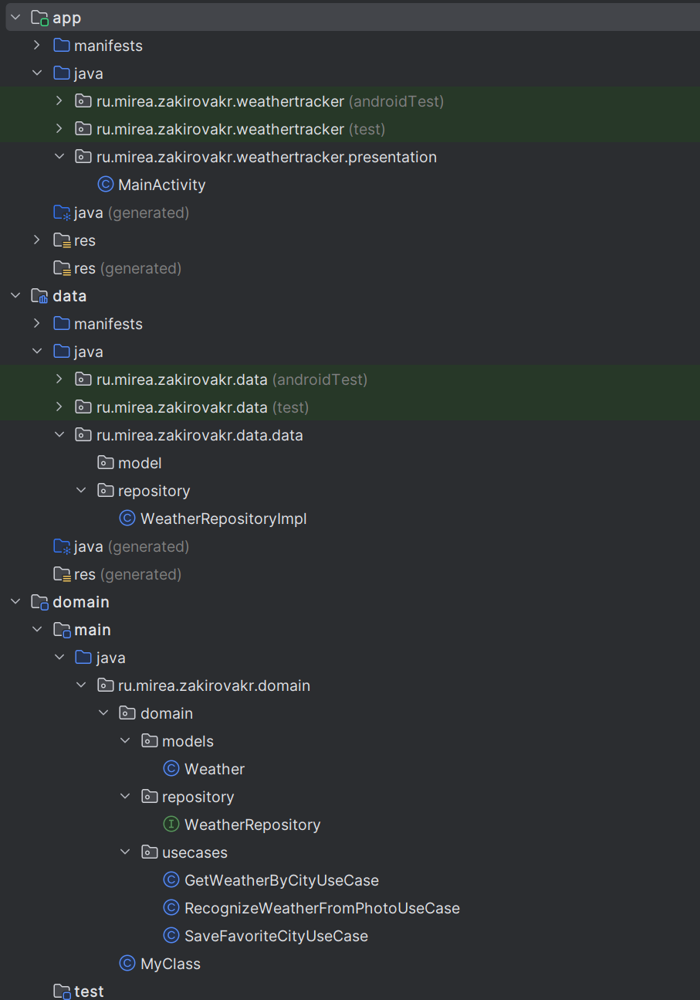
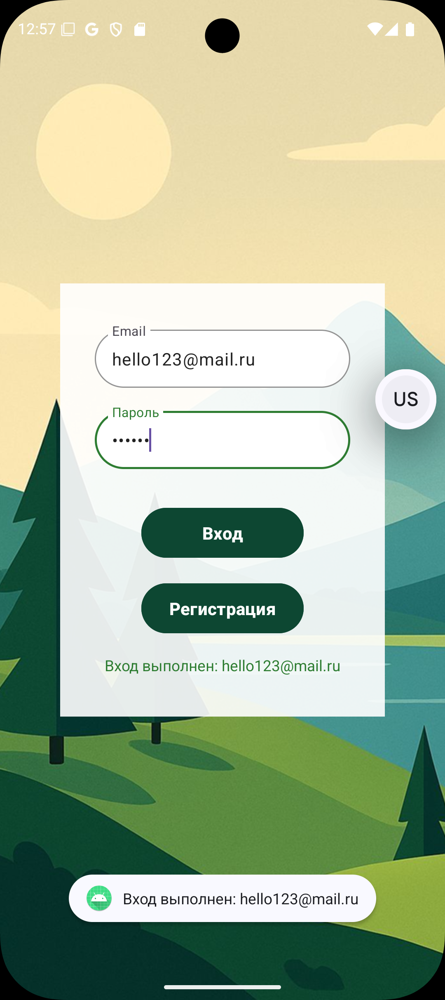
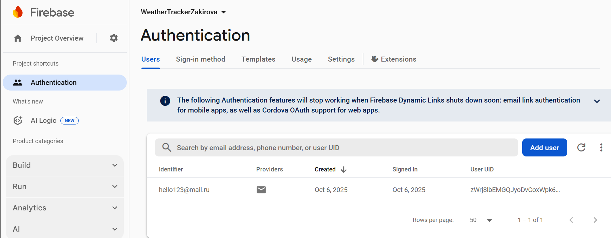
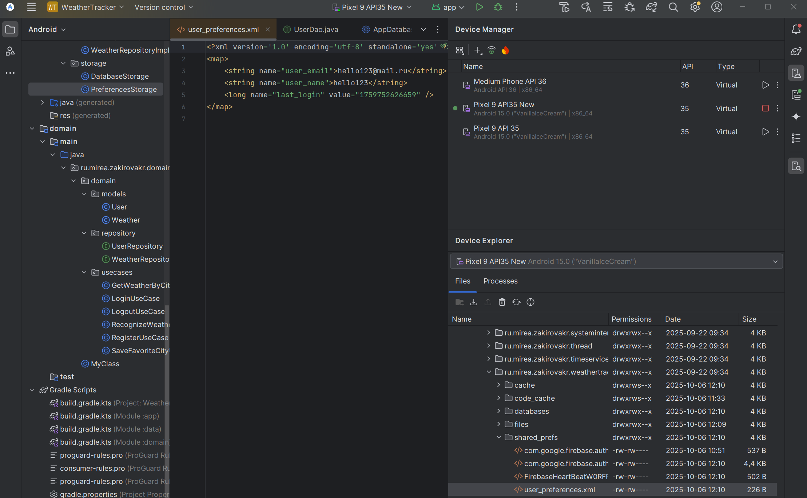
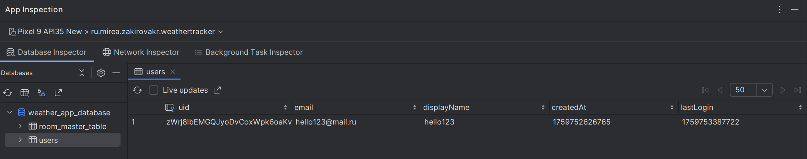
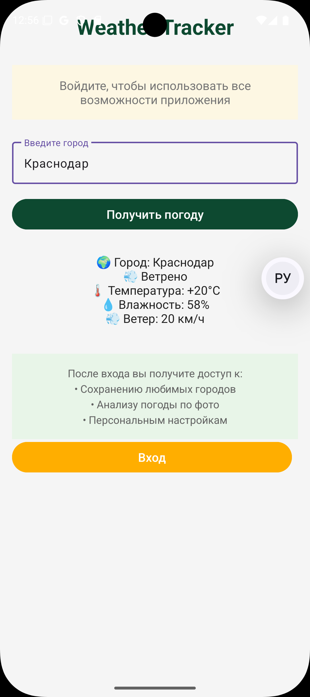
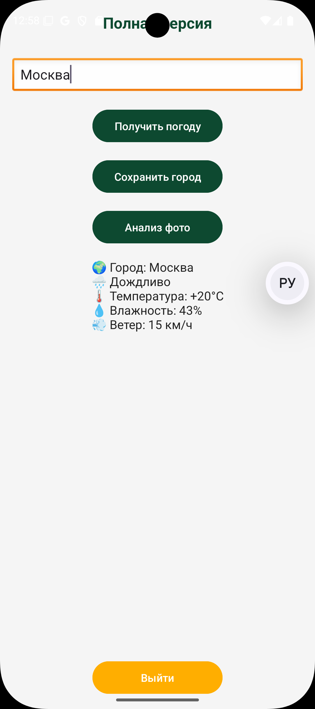

# Практическая работа №2

## 1 ПОСТРОЕНИЕ МОДУЛЬНОГО ПРОЕКТА

​	MovieD.java - Доменная модель данных, содержащая идентификатор и название фильма

```java
public class MovieD {
    private final int id;
    private final String name;

    public MovieD(int id, String name) {
        this.id = id;
        this.name = name;
    }

    public int getId() {
        return id;
    }

    public String getName() {
        return name;
    }
}
```

​	MovieRepository.java \- Интерфейс репозитория для абстракции операций с данными фильмов

```java
public interface MovieRepository {
    boolean saveMovie(MovieD movie);
    MovieD getMovie();
}
```

​	GetFavoriteFilmUseCase.java \- Use case для получения избранного фильма из репозитория

```java
public class GetFavoriteFilmUseCase {
    private final MovieRepository movieRepository;

    public GetFavoriteFilmUseCase(MovieRepository movieRepository) {
        this.movieRepository = movieRepository;
    }

    public MovieD execute() {
        return movieRepository.getMovie();
    }
}
```

​	SaveMovieToFavoriteUseCase.java \- Use case для сохранения фильма в избранное через репозиторий

```java
public class SaveMovieToFavoriteUseCase {
    private final MovieRepository movieRepository;

    public SaveMovieToFavoriteUseCase(MovieRepository movieRepository) {
        this.movieRepository = movieRepository;
    }

    public boolean execute(MovieD movie) {
        return movieRepository.saveMovie(movie);
    }
}
```

​	Movie.java \- Модель данных слоя хранения с дополнительным полем даты сохранения

```java
public class Movie {
    private final int id;
    private final String name;
    private final String localDate;

    public Movie(int id, String name, String localDate) {
        this.id = id;
        this.name = name;
        this.localDate = localDate;
    }

    public String getName() {
        return name;
    }

    public int getId() {
        return id;
    }

    public String getLocalDate() {
        return localDate;
    }
}
```

​	MovieStorage.java \- Интерфейс хранилища для абстракции механизма сохранения данных

```java
public interface MovieStorage {
    Movie get();
    boolean save(Movie movie);
}
```

​	SharedPrefMovieStorage.java \- Реализация хранения данных в SharedPreferences с сохранением даты

```java
public class SharedPrefMovieStorage implements MovieStorage {
    private static final String SHARED_PREFS_NAME = "shared_prefs_name";
    private static final String KEY = "movie_name";
    private static final String DATE_KEY = "movie_date";
    private static final String ID_KEY = "movie_id";

    private final SharedPreferences sharedPreferences;

    public SharedPrefMovieStorage(Context context) {
        sharedPreferences = context.getSharedPreferences(SHARED_PREFS_NAME, Context.MODE_PRIVATE);
    }

    @Override
    public Movie get() {
        String movieName = sharedPreferences.getString(KEY, "unknown");
        String movieDate = sharedPreferences.getString(DATE_KEY, String.valueOf(LocalDate.now()));
        int movieId = sharedPreferences.getInt(ID_KEY, -1);
        return new Movie(movieId, movieName, movieDate);
    }

    @Override
    public boolean save(Movie movie) {
        SharedPreferences.Editor editor = sharedPreferences.edit();
        editor.putString(KEY, movie.getName());
        editor.putString(DATE_KEY, String.valueOf(LocalDate.now()));
        editor.putInt(ID_KEY, 1);
        return editor.commit();
    }
}
```

​	MovieRepositoryImpl.java \- Реализация репозитория с мапперами для преобразования между доменной и data моделями

```java
public class MovieRepositoryImpl implements MovieRepository {
    private final MovieStorage movieStorage;

    public MovieRepositoryImpl(MovieStorage movieStorage) {
        this.movieStorage = movieStorage;
    }

    @Override
    public boolean saveMovie(MovieD movie) {
        Movie storageMovie = mapToStorage(movie);
        return movieStorage.save(storageMovie);
    }

    @Override
    public MovieD getMovie() {
        Movie movie = movieStorage.get();
        return mapToDomain(movie);
    }

    private Movie mapToStorage(MovieD movie) {
        String name = movie.getName();
        return new Movie(2, name, LocalDate.now().toString());
    }

    private MovieD mapToDomain(Movie movie) {
        return new MovieD(movie.getId(), movie.getName());
    }
}
```

​	MainActivity.java \- Главная активность с UI для ввода, сохранения и отображения избранных фильмов

```java
public class MainActivity extends AppCompatActivity {
    private EditText editText;
    private TextView textView;
    private SaveMovieToFavoriteUseCase saveMovieUseCase;
    private GetFavoriteFilmUseCase getMovieUseCase;

    @Override
    protected void onCreate(Bundle savedInstanceState) {
        super.onCreate(savedInstanceState);
        setContentView(R.layout.activity_main);

        // Инициализация зависимостей
        SharedPrefMovieStorage storage = new SharedPrefMovieStorage(this);
        MovieRepository repository = new MovieRepositoryImpl(storage);
        saveMovieUseCase = new SaveMovieToFavoriteUseCase(repository);
        getMovieUseCase = new GetFavoriteFilmUseCase(repository);

        // Инициализация UI
        editText = findViewById(R.id.editText);
        textView = findViewById(R.id.textView);
        Button saveButton = findViewById(R.id.saveButton);
        Button getButton = findViewById(R.id.getButton);

        saveButton.setOnClickListener(v -> saveMovie());
        getButton.setOnClickListener(v -> getMovie());
    }

    private void saveMovie() {
        String movieName = editText.getText().toString();
        if (!movieName.isEmpty()) {
            MovieD movie = new MovieD(1, movieName);
            saveMovieUseCase.execute(movie);
            editText.setText("");
        }
    }

    private void getMovie() {
        MovieD movie = getMovieUseCase.execute();
        textView.setText("Любимый фильм: " + movie.getName());
    }
}
```

​	activity_main.xml \- Layout с интерфейсом для ввода названия фильма и отображения результата

```xml
<?xml version="1.0" encoding="utf-8"?>
<LinearLayout xmlns:android="http://schemas.android.com/apk/res/android"
    android:layout_width="match_parent"
    android:layout_height="match_parent"
    android:orientation="vertical"
    android:padding="16dp">

    <EditText
        android:id="@+id/editText"
        android:layout_width="match_parent"
        android:layout_height="wrap_content"
        android:hint="Введите название фильма"
        android:layout_marginBottom="16dp" />

    <Button
        android:id="@+id/saveButton"
        android:layout_width="match_parent"
        android:layout_height="wrap_content"
        android:text="Сохранить фильм"
        android:layout_marginBottom="16dp" />

    <Button
        android:id="@+id/getButton"
        android:layout_width="match_parent"
        android:layout_height="wrap_content"
        android:text="Получить фильм"
        android:layout_marginBottom="16dp" />

    <TextView
        android:id="@+id/textView"
        android:layout_width="match_parent"
        android:layout_height="wrap_content"
        android:text="Любимый фильм будет отображен здесь"
        android:textSize="18sp" />

</LinearLayout>
```

​	Логика была разделена на три модуля: domain, data, app.

```kts
rootProject.name = "filmapp"
include(":app")
include(":data")
include(":domain")
```

​	Была реализована чистая архитектура в Android-приложении, где изучено и применено модульное разделение на три независимых слоя: domain с бизнес-логикой и use cases, data с репозиториями и хранилищами, и presentation с UI компонентами. Код использует принципы инверсии зависимостей через интерфейсы Repository и Storage, обеспечивая тестируемость и заменяемость компонентов, а также реализует преобразование моделей между слоями с помощью мапперов, что исключает прямые зависимости между domain и data модулями. В работе изучены механизмы внедрения зависимостей через конструкторы, инкапсуляция работы с SharedPreferences в отдельном классе хранилища, и организация коммуникации между слоями через use cases, где Activity взаимодействует только с бизнес-логикой, не зная о деталях реализации хранения данных.



## 2 КОНТРОЛЬНОЕ ЗАДАНИЕ

​	Был нарисован прототип приложения в figma. 



​	Были созданы новые модули data и domain. Соответствующий код был перенесен в данные модули. 

Новая структура приложения.



​	Была создана новая активити и реализована страница авторизации с использованием firebase auth. Выполнено подключение к firebase и настроена авторизация по почте и паролю.

Регистрация прошла успешно.



​	FirebaseConsole это подтверждает.



​	Логику работы с FB распределена между тремя модулями. 

​	В репозитории реализованы три способа обработки данных: 
- SharedPreferences, информация о клиенте

  

- Room 

  

- класс NetworkApi 

​	Далее представлена демонстрация работы приложения. Так выглядит экран для неавторизованного пользователя. Есть возможность только просматривать погоду



​	После входа открывается полная версия приложения, пока что макет для наращивания будущего функционала.



### 	Presentation Layer (App Module)

​	Приложение имеет три основных экрана, которые управляют пользовательским интерфейсом и навигацией.

​	**HomeActivity** - стартовый экран приложения, который отображается при запуске. Он предоставляет базовый функционал без необходимости авторизации, включая получение погоды для любого города. При нажатии на кнопку "Вход" происходит переход на экран авторизации.

```java
public class HomeActivity extends AppCompatActivity {

    private EditText editTextCity;
    private TextView textViewResult, textViewAuthStatus;
    private Button buttonGetWeather, buttonLogin, buttonLogout;

    private UserRepository userRepository;

    @Override
    protected void onCreate(Bundle savedInstanceState) {
        super.onCreate(savedInstanceState);
        setContentView(R.layout.activity_home);

        userRepository = new UserRepositoryImpl(this);

        initViews();
        setupClickListeners();
        checkAuthStatus();
    }

    @Override
    protected void onResume() {
        super.onResume();
        checkAuthStatus();
    }

    private void initViews() {
        editTextCity = findViewById(R.id.editTextCity);
        textViewResult = findViewById(R.id.textViewResult);
        textViewAuthStatus = findViewById(R.id.textViewAuthStatus);
        buttonGetWeather = findViewById(R.id.buttonGetWeather);
        buttonLogin = findViewById(R.id.buttonLogin);
        buttonLogout = findViewById(R.id.buttonLogout);
    }

    private void setupClickListeners() {
        buttonGetWeather.setOnClickListener(v -> getWeather());
        buttonLogin.setOnClickListener(v -> navigateToLogin());
        buttonLogout.setOnClickListener(v -> logout());
    }

    private void getWeather() {
        String city = editTextCity.getText().toString().trim();
        if (city.isEmpty()) {
            textViewResult.setText("Введите название города");
            return;
        }

        textViewResult.setText("Загрузка погоды для " + city + "...");
        buttonGetWeather.setEnabled(false);

        userRepository.fetchWeatherData(city, new UserRepository.WeatherCallback() {
            @Override
            public void onSuccess(String weatherData) {
                runOnUiThread(() -> {
                    textViewResult.setText(weatherData);
                    buttonGetWeather.setEnabled(true);
                });
            }

            @Override
            public void onError(String errorMessage) {
                runOnUiThread(() -> {
                    textViewResult.setText("Ошибка: " + errorMessage);
                    buttonGetWeather.setEnabled(true);

                    WeatherRepository weatherRepository = new WeatherRepositoryImpl();
                    GetWeatherByCityUseCase getWeatherUseCase = new GetWeatherByCityUseCase(weatherRepository);
                    Weather weather = getWeatherUseCase.execute(city);
                    textViewResult.setText("Запасной вариант:\n" +
                            String.format("Погода в %s: %d°C", weather.getCity(), weather.getTemperature()));
                });
            }
        });
    }

    private void navigateToLogin() {
        Intent intent = new Intent(HomeActivity.this, LoginActivity.class);
        startActivity(intent);
    }

    private void navigateToMain() {
        Intent intent = new Intent(HomeActivity.this, MainActivity.class);
        startActivity(intent);
        finish();
    }

    private void logout() {
        userRepository.logout();
        checkAuthStatus();
        textViewResult.setText("Вы вышли из системы");
    }

    private void checkAuthStatus() {
        boolean isLoggedIn = userRepository.isUserLoggedIn();

        if (isLoggedIn) {
            textViewAuthStatus.setText("Вы авторизованы");
            buttonLogin.setVisibility(View.GONE);
            buttonLogout.setVisibility(View.VISIBLE);
            navigateToMain();
        } else {
            textViewAuthStatus.setText("Войдите, чтобы использовать все возможности приложения");
            buttonLogin.setVisibility(View.VISIBLE);
            buttonLogout.setVisibility(View.GONE);
        }
    }
}
```

​	**LoginActivity** - экран авторизации с современным дизайном, содержащий фоновое изображение, полупрозрачную белую карточку с формами ввода email и пароля, а также темно-зеленые кнопки "Вход" и "Регистрация".

```java
public class LoginActivity extends AppCompatActivity {

    private EditText editTextEmail, editTextPassword;
    private Button buttonLogin, buttonRegister;
    private ProgressBar progressBar;
    private TextView textViewStatus;

    private LoginUseCase loginUseCase;
    private RegisterUseCase registerUseCase;

    @Override
    protected void onCreate(Bundle savedInstanceState) {
        super.onCreate(savedInstanceState);
        setContentView(R.layout.activity_login);

        initViews();
        setupDependencies();
        setupClickListeners();
    }

    private void initViews() {
        editTextEmail = findViewById(R.id.editTextEmail);
        editTextPassword = findViewById(R.id.editTextPassword);
        buttonLogin = findViewById(R.id.buttonLogin);
        buttonRegister = findViewById(R.id.buttonRegister);
        progressBar = findViewById(R.id.progressBar);
        textViewStatus = findViewById(R.id.textViewStatus);
    }

    private void setupDependencies() {
        UserRepository userRepository = new UserRepositoryImpl(this);
        loginUseCase = new LoginUseCase(userRepository);
        registerUseCase = new RegisterUseCase(userRepository);
    }

    private void setupClickListeners() {
        buttonLogin.setOnClickListener(v -> login());
        buttonRegister.setOnClickListener(v -> register());
    }

    private void login() {
        String email = editTextEmail.getText().toString().trim();
        String password = editTextPassword.getText().toString().trim();

        if (validateInput(email, password)) {
            showLoading(true);
            loginUseCase.execute(email, password, new UserRepository.AuthCallback() {
                @Override
                public void onSuccess(User user) {
                    showLoading(false);
                    showStatus("Вход выполнен: " + user.getEmail());
                    navigateToMainActivity();
                }

                @Override
                public void onError(String errorMessage) {
                    showLoading(false);
                    showStatus("Ошибка: " + errorMessage);
                }
            });
        }
    }

    private void register() {
        String email = editTextEmail.getText().toString().trim();
        String password = editTextPassword.getText().toString().trim();

        if (validateInput(email, password)) {
            showLoading(true);
            registerUseCase.execute(email, password, new UserRepository.AuthCallback() {
                @Override
                public void onSuccess(User user) {
                    showLoading(false);
                    showStatus("Регистрация успешна: " + user.getEmail());
                    navigateToMainActivity();
                }

                @Override
                public void onError(String errorMessage) {
                    showLoading(false);
                    showStatus("Ошибка: " + errorMessage);
                }
            });
        }
    }

    private boolean validateInput(String email, String password) {
        if (email.isEmpty() || password.isEmpty()) {
            showStatus("Заполните все поля");
            return false;
        }
        if (!android.util.Patterns.EMAIL_ADDRESS.matcher(email).matches()) {
            showStatus("Введите корректный email");
            return false;
        }
        if (password.length() < 6) {
            showStatus("Пароль должен быть не менее 6 символов");
            return false;
        }
        return true;
    }

    private void showLoading(boolean loading) {
        progressBar.setVisibility(loading ? View.VISIBLE : View.GONE);
        buttonLogin.setEnabled(!loading);
        buttonRegister.setEnabled(!loading);
    }

    private void showStatus(String message) {
        textViewStatus.setText(message);
        Toast.makeText(this, message, Toast.LENGTH_SHORT).show();
    }

    private void navigateToMainActivity() {
        Intent intent = new Intent(LoginActivity.this, MainActivity.class);
        startActivity(intent);
        finish();
    }
}
```

​	**MainActivity** - основной экран приложения, доступный после успешной авторизации, предоставляющий полный функционал включая сохранение городов и анализ погоды по фото.

```java
public class MainActivity extends AppCompatActivity {

    private EditText editTextCity;
    private TextView textViewResult;
    private Button buttonLogout;

    private UserRepository userRepository;

    @Override
    protected void onCreate(Bundle savedInstanceState) {
        super.onCreate(savedInstanceState);
        setContentView(R.layout.activity_main);

        userRepository = new UserRepositoryImpl(this);

        initViews();
        setupClickListeners();
    }

    private void initViews() {
        editTextCity = findViewById(R.id.editTextCity);
        textViewResult = findViewById(R.id.textViewResult);
        buttonLogout = findViewById(R.id.buttonLogout);
    }

    private void setupClickListeners() {
        findViewById(R.id.buttonGetWeather).setOnClickListener(v -> getWeather());
        findViewById(R.id.buttonSaveCity).setOnClickListener(v -> saveCity());
        findViewById(R.id.buttonRecognizeWeather).setOnClickListener(v -> recognizeWeather());
        buttonLogout.setOnClickListener(v -> logout());
    }

    private void getWeather() {
        String city = editTextCity.getText().toString().trim();
        if (city.isEmpty()) {
            textViewResult.setText("Введите название города");
            return;
        }

        textViewResult.setText("Загрузка погоды для " + city + "...");
        findViewById(R.id.buttonGetWeather).setEnabled(false);

        userRepository.fetchWeatherData(city, new UserRepository.WeatherCallback() {
            @Override
            public void onSuccess(String weatherData) {
                runOnUiThread(() -> {
                    textViewResult.setText(weatherData);
                    findViewById(R.id.buttonGetWeather).setEnabled(true);
                });
            }

            @Override
            public void onError(String errorMessage) {
                runOnUiThread(() -> {
                    textViewResult.setText("Ошибка: " + errorMessage);
                    findViewById(R.id.buttonGetWeather).setEnabled(true);

                    WeatherRepository weatherRepository = new WeatherRepositoryImpl();
                    GetWeatherByCityUseCase getWeatherUseCase = new GetWeatherByCityUseCase(weatherRepository);
                    Weather weather = getWeatherUseCase.execute(city);
                    textViewResult.setText("Запасной вариант:\n" +
                            String.format("Погода в %s: %d°C", weather.getCity(), weather.getTemperature()));
                });
            }
        });
    }

    private void saveCity() {
        String city = editTextCity.getText().toString();
        userRepository.saveFavoriteCity(city);
        textViewResult.setText("Город " + city + " сохранен в избранное");
    }

    private void recognizeWeather() {
        WeatherRepository weatherRepository = new WeatherRepositoryImpl();
        RecognizeWeatherFromPhotoUseCase recognizeWeatherUseCase = new RecognizeWeatherFromPhotoUseCase(weatherRepository);
        String result = recognizeWeatherUseCase.execute();
        textViewResult.setText(String.format("Анализ фото: %s", result));
    }

    private void logout() {
        userRepository.logout();

        Intent intent = new Intent(MainActivity.this, HomeActivity.class);
        startActivity(intent);
        finish();
    }
}
```

​	Layout файлы (activity_home.xml, activity_login.xml, activity_main.xml) определяют визуальное представление соответствующих экранов.

```xml
<?xml version="1.0" encoding="utf-8"?>
<LinearLayout xmlns:android="http://schemas.android.com/apk/res/android"
    xmlns:app="http://schemas.android.com/apk/res-auto"
    xmlns:tools="http://schemas.android.com/tools"
    android:layout_width="match_parent"
    android:layout_height="match_parent"
    android:orientation="vertical"
    android:padding="16dp"
    android:background="#F5F5F5"
    tools:context=".presentation.HomeActivity">

    <TextView
        android:layout_width="match_parent"
        android:layout_height="wrap_content"
        android:layout_marginBottom="32dp"
        android:gravity="center"
        android:text="Weather Tracker"
        android:textColor="#0D4930"
        android:textSize="28sp"
        android:textStyle="bold" />

    <TextView
        android:id="@+id/textViewAuthStatus"
        android:layout_width="match_parent"
        android:layout_height="wrap_content"
        android:layout_marginBottom="24dp"
        android:background="#E0E0E0"
        android:backgroundTint="#FDF7E3"
        android:gravity="center"
        android:padding="16dp"
        android:text="Войдите, чтобы использовать все возможности приложения"
        android:textColor="#757575"
        android:textSize="16sp" />

    <com.google.android.material.textfield.TextInputLayout
        android:layout_width="match_parent"
        android:layout_height="wrap_content"
        android:layout_marginBottom="16dp"
        style="@style/Widget.Material3.TextInputLayout.OutlinedBox">

        <com.google.android.material.textfield.TextInputEditText
            android:id="@+id/editTextCity"
            android:layout_width="match_parent"
            android:layout_height="wrap_content"
            android:hint="Введите город"
            android:textSize="16sp" />

    </com.google.android.material.textfield.TextInputLayout>

    <Button
        android:id="@+id/buttonGetWeather"
        android:layout_width="match_parent"
        android:layout_height="wrap_content"
        android:layout_marginBottom="16dp"
        android:backgroundTint="#0D4930"
        android:text="Получить погоду"
        android:textColor="#FFFFFF"
        android:textSize="16sp" />

    <TextView
        android:id="@+id/textViewResult"
        android:layout_width="match_parent"
        android:layout_height="wrap_content"
        android:text=""
        android:textSize="16sp"
        android:textColor="#212121"
        android:gravity="center"
        android:layout_marginBottom="24dp"
        android:padding="12dp"
        android:elevation="2dp" />


    <TextView
        android:layout_width="match_parent"
        android:layout_height="wrap_content"
        android:text="После входа вы получите доступ к:\n• Сохранению любимых городов\n• Анализу погоды по фото\n• Персональным настройкам"
        android:textSize="14sp"
        android:textColor="#616161"
        android:gravity="center"
        android:lineSpacingExtra="4dp"
        android:padding="16dp"
        android:background="#E8F5E8"
        android:backgroundTint="#E8F5E8" />

    <LinearLayout
        android:layout_width="match_parent"
        android:layout_height="wrap_content"
        android:layout_marginBottom="16dp"
        android:orientation="horizontal">

        <Button
            android:id="@+id/buttonLogin"
            android:layout_width="0dp"
            android:layout_height="wrap_content"
            android:layout_marginEnd="8dp"
            android:layout_weight="1"
            android:backgroundTint="#FFAE00"
            android:text="Вход"
            android:textColor="#FFFFFF"
            android:textSize="16sp" />

        <Button
            android:id="@+id/buttonLogout"
            android:layout_width="0dp"
            android:layout_height="wrap_content"
            android:layout_marginStart="8dp"
            android:layout_weight="1"
            android:backgroundTint="#F44336"
            android:text="Выйти"
            android:textColor="#FFFFFF"
            android:textSize="16sp"
            android:visibility="gone" />

    </LinearLayout>

</LinearLayout>
```

```xml
<?xml version="1.0" encoding="utf-8"?>
<RelativeLayout xmlns:android="http://schemas.android.com/apk/res/android"
    xmlns:app="http://schemas.android.com/apk/res-auto"
    android:layout_width="match_parent"
    android:layout_height="match_parent">


    <ImageView
        android:layout_width="match_parent"
        android:layout_height="match_parent"
        android:scaleType="centerCrop"
        android:src="@drawable/img"
        android:contentDescription="Фоновое изображение погоды" />


    <LinearLayout
        android:layout_width="300dp"
        android:layout_height="400dp"
        android:layout_centerInParent="true"
        android:background="@drawable/white_card_background"
        android:orientation="vertical"
        android:padding="32dp"
        android:gravity="center">


        <com.google.android.material.textfield.TextInputLayout
            android:layout_width="match_parent"
            android:layout_height="wrap_content"
            android:layout_marginBottom="16dp"
            app:boxCornerRadiusTopStart="50dp"
            app:boxCornerRadiusTopEnd="50dp"
            app:boxCornerRadiusBottomStart="50dp"
            app:boxCornerRadiusBottomEnd="50dp"
            app:boxBackgroundColor="#FFFFFF"
            app:boxStrokeColor="#2E7D32"
            app:hintTextColor="#2E7D32"
            app:startIconTint="#2E7D32">

            <com.google.android.material.textfield.TextInputEditText
                android:id="@+id/editTextEmail"
                android:layout_width="match_parent"
                android:layout_height="wrap_content"
                android:hint="Email"
                android:textColor="#212121"
                android:textColorHint="#757575"
                android:inputType="textEmailAddress"
                android:padding="16dp" />

        </com.google.android.material.textfield.TextInputLayout>


        <com.google.android.material.textfield.TextInputLayout
            android:layout_width="match_parent"
            android:layout_height="wrap_content"
            android:layout_marginBottom="32dp"
            app:boxCornerRadiusTopStart="50dp"
            app:boxCornerRadiusTopEnd="50dp"
            app:boxCornerRadiusBottomStart="50dp"
            app:boxCornerRadiusBottomEnd="50dp"
            app:boxBackgroundColor="#FFFFFF"
            app:boxStrokeColor="#2E7D32"
            app:hintTextColor="#2E7D32"
            app:startIconTint="#2E7D32"
            app:endIconTint="#2E7D32">

            <com.google.android.material.textfield.TextInputEditText
                android:id="@+id/editTextPassword"
                android:layout_width="match_parent"
                android:layout_height="wrap_content"
                android:hint="Пароль"
                android:textColor="#212121"
                android:textColorHint="#757575"
                android:inputType="textPassword"
                android:padding="16dp" />

        </com.google.android.material.textfield.TextInputLayout>


        <Button
            android:id="@+id/buttonLogin"
            android:layout_width="150dp"
            android:layout_height="wrap_content"
            android:layout_marginBottom="16dp"
            android:backgroundTint="#0D4732"
            android:paddingVertical="12dp"
            android:text="Вход"
            android:textColor="#FFFFFF"
            android:textSize="16sp"
            android:textStyle="bold"
            app:cornerRadius="25dp" />


        <Button
            android:id="@+id/buttonRegister"
            android:layout_width="150dp"
            android:layout_height="wrap_content"
            android:backgroundTint="#0D4732"
            android:paddingVertical="12dp"
            android:text="Регистрация"
            android:textColor="#FFFFFF"
            android:textSize="16sp"
            android:textStyle="bold"
            app:cornerRadius="25dp" />


        <ProgressBar
            android:id="@+id/progressBar"
            android:layout_width="wrap_content"
            android:layout_height="wrap_content"
            android:layout_marginTop="16dp"
            android:visibility="gone" />


        <TextView
            android:id="@+id/textViewStatus"
            android:layout_width="match_parent"
            android:layout_height="wrap_content"
            android:textAlignment="center"
            android:textColor="#2E7D32"
            android:textSize="14sp"
            android:layout_marginTop="16dp" />

    </LinearLayout>

</RelativeLayout>
```

```xml
<?xml version="1.0" encoding="utf-8"?>
<androidx.constraintlayout.widget.ConstraintLayout
    xmlns:android="http://schemas.android.com/apk/res/android"
    xmlns:app="http://schemas.android.com/apk/res-auto"
    xmlns:tools="http://schemas.android.com/tools"
    android:layout_width="match_parent"
    android:layout_height="match_parent"
    android:background="#F5F5F5"
    tools:context=".presentation.MainActivity">


    <TextView
        android:id="@+id/textViewTitle"
        android:layout_width="wrap_content"
        android:layout_height="wrap_content"
        android:layout_marginTop="16dp"
        android:text="Полная версия"
        android:textColor="#0D4930"
        android:textSize="20sp"
        android:textStyle="bold"
        app:layout_constraintEnd_toEndOf="parent"
        app:layout_constraintStart_toStartOf="parent"
        app:layout_constraintTop_toTopOf="parent" />


    <EditText
        android:id="@+id/editTextCity"
        android:layout_width="match_parent"
        android:layout_height="wrap_content"
        android:hint="Введите город"
        android:background="@android:drawable/edit_text"
        android:textColorHint="#757575"
        android:layout_marginHorizontal="16dp"
        app:layout_constraintTop_toBottomOf="@id/textViewTitle"
        app:layout_constraintStart_toStartOf="parent"
        app:layout_constraintEnd_toEndOf="parent"
        android:layout_marginTop="32dp" />


    <Button
        android:id="@+id/buttonGetWeather"
        android:layout_width="170dp"
        android:layout_height="50dp"
        android:layout_marginTop="16dp"
        android:backgroundTint="#0D4930"
        android:text="Получить погоду"
        android:textColor="#FFFFFF"
        app:layout_constraintEnd_toEndOf="parent"
        app:layout_constraintStart_toStartOf="parent"
        app:layout_constraintTop_toBottomOf="@id/editTextCity" />


    <Button
        android:id="@+id/buttonSaveCity"
        android:layout_width="170dp"
        android:layout_height="50dp"
        android:layout_marginTop="16dp"
        android:backgroundTint="#0D4930"
        android:text="Сохранить город"
        android:textColor="#FFFFFF"
        app:layout_constraintEnd_toEndOf="parent"
        app:layout_constraintStart_toStartOf="parent"
        app:layout_constraintTop_toBottomOf="@id/buttonGetWeather" />


    <Button
        android:id="@+id/buttonRecognizeWeather"
        android:layout_width="170dp"
        android:layout_height="50dp"
        android:layout_marginTop="16dp"
        android:backgroundTint="#0D4930"
        android:text="Анализ фото"
        android:textColor="#FFFFFF"
        app:layout_constraintEnd_toEndOf="parent"
        app:layout_constraintStart_toStartOf="parent"
        app:layout_constraintTop_toBottomOf="@id/buttonSaveCity" />


    <TextView
        android:id="@+id/textViewResult"
        android:layout_width="wrap_content"
        android:layout_height="wrap_content"
        android:text=""
        android:textSize="16sp"
        android:textColor="#212121"
        app:layout_constraintTop_toBottomOf="@id/buttonRecognizeWeather"
        app:layout_constraintStart_toStartOf="parent"
        app:layout_constraintEnd_toEndOf="parent"
        android:layout_marginTop="16dp" />


    <Button
        android:id="@+id/buttonLogout"
        android:layout_width="170dp"
        android:layout_height="50dp"
        android:layout_marginBottom="16dp"
        android:backgroundTint="#FFAE00"
        android:text="Выйти"
        android:textColor="#FFFFFF"
        app:layout_constraintBottom_toBottomOf="parent"
        app:layout_constraintEnd_toEndOf="parent"
        app:layout_constraintStart_toStartOf="parent" />

</androidx.constraintlayout.widget.ConstraintLayout>
```

### Domain Layer (Business Logic)

​	Domain слой содержит бизнес-логику приложения и не зависит от Android фреймворка.

**Модели данных:**
	User - представляет пользователя системы с полями uid, email и displayName

```java
public class User {
    private final String uid;
    private final String email;
    private final String displayName;

    public User(String uid, String email, String displayName) {
        this.uid = uid;
        this.email = email;
        this.displayName = displayName;
    }

    public String getUid() { return uid; }
    public String getEmail() { return email; }
    public String getDisplayName() { return displayName; }
}
```

​	Weather - содержит информацию о погоде в конкретном городе

```java
public class Weather {
    private String city;
    private int temperature;

    public Weather(String city, int temperature) {
        this.city = city;
        this.temperature = temperature;
    }

    public String getCity() {
        return city;
    }

    public int getTemperature() {
        return temperature;
    }
}
```

**Интерфейсы репозиториев:**
	UserRepository - определяет контракты для работы с пользователями, включая аутентификацию, управление настройками и получение погодных данных

```java
public interface UserRepository {
    interface AuthCallback {
        void onSuccess(User user);
        void onError(String errorMessage);
    }

    interface WeatherCallback {
        void onSuccess(String weatherData);
        void onError(String errorMessage);
    }

    void loginWithEmail(String email, String password, AuthCallback callback);
    void registerWithEmail(String email, String password, AuthCallback callback);
    void logout();
    boolean isUserLoggedIn();
    User getCurrentUser();


    void saveUserPreferences(String key, String value);
    String getUserPreferences(String key);
    void saveUserToDatabase(User user);
    User getUserFromDatabase();

    void fetchWeatherData(String city, WeatherCallback callback);

    void saveFavoriteCity(String city);
}
```

​	WeatherRepository - определяет методы для работы с погодной информацией

```java
public interface WeatherRepository {
    Weather getWeatherByCity(String city);
    boolean saveFavoriteCity(String city);
    String recognizeWeatherFromPhoto();
}
```

**Use Cases** содержат специфическую бизнес-логику:

- GetWeatherByCityUseCase - получение погоды по городу
- LoginUseCase - авторизация пользователя

```java
public class LoginUseCase {
    private final UserRepository authRepository;

    public LoginUseCase(UserRepository authRepository) {
        this.authRepository = authRepository;
    }

    public void execute(String email, String password, UserRepository.AuthCallback callback) {
        authRepository.loginWithEmail(email, password, callback);
    }
}
```

- RegisterUseCase - регистрация нового пользователя

```java
public class RegisterUseCase {
    private final UserRepository authRepository;

    public RegisterUseCase(UserRepository authRepository) {
        this.authRepository = authRepository;
    }

    public void execute(String email, String password, UserRepository.AuthCallback callback) {
        authRepository.registerWithEmail(email, password, callback);
    }
}
```

- SaveFavoriteCityUseCase - сохранение города в избранное
- RecognizeWeatherFromPhotoUseCase - анализ погоды по фото
- LogoutUseCase - выход из системы

```java
public class LogoutUseCase {
    private final UserRepository authRepository;

    public LogoutUseCase(UserRepository authRepository) {
        this.authRepository = authRepository;
    }

    public void execute() {
        authRepository.logout();
    }
}
```

### Data Layer (Data Access)

Data слой реализует три способа обработки данных и работает с внешними источниками.

**Room Database** обеспечивает постоянное хранение данных:

- AppDatabase - главный класс базы данных

```java
@Database(entities = {UserEntity.class}, version = 1, exportSchema = false)
public abstract class AppDatabase extends RoomDatabase {
    public abstract UserDao userDao();

    private static volatile AppDatabase INSTANCE;

    public static AppDatabase getInstance(Context context) {
        if (INSTANCE == null) {
            synchronized (AppDatabase.class) {
                if (INSTANCE == null) {
                    INSTANCE = Room.databaseBuilder(
                            context.getApplicationContext(),
                            AppDatabase.class,
                            "weather_app_database"
                    ).build();
                }
            }
        }
        return INSTANCE;
    }
}
```

- UserDao - интерфейс для операций с пользователями

```java
@Dao
public interface UserDao {
    @Query("SELECT * FROM users WHERE uid = :uid")
    UserEntity getUserById(String uid);

    @Query("SELECT * FROM users WHERE email = :email")
    UserEntity getUserByEmail(String email);

    @Insert
    void insertUser(UserEntity user);

    @Update
    void updateUser(UserEntity user);

    @Query("DELETE FROM users WHERE uid = :uid")
    void deleteUser(String uid);
}
```

- UserEntity - сущность пользователя для хранения в БД

```java
@Entity(tableName = "users")
public class UserEntity {
    @PrimaryKey
    @NonNull
    public String uid;

    public String email;
    public String displayName;
    public long createdAt;
    public long lastLogin;

    public UserEntity(@NonNull String uid, String email, String displayName, long createdAt, long lastLogin) {
        this.uid = uid;
        this.email = email;
        this.displayName = displayName;
        this.createdAt = createdAt;
        this.lastLogin = lastLogin;
    }
}
```

​	**NetworkApi** имитирует работу с сетевым API, возвращая замоканные данные о погоде с случайной задержкой 2-3 секунды.

```java
public class NetworkApi {
    private static final String[] WEATHER_CONDITIONS = {
            "☀️ Солнечно", "⛅ Облачно", "🌧️ Дождливо", "❄️ Снежно", "💨 Ветрено", "🌫️ Туманно"
    };

    private static final String[] TEMPERATURES = {
            "+15°C", "+20°C", "+25°C", "+10°C", "+5°C", "+30°C"
    };

    private static final String[] WIND_SPEEDS = {
            "5 км/ч", "10 км/ч", "15 км/ч", "20 км/ч", "25 км/ч"
    };

    private final Random random = new Random();

    public String fetchWeatherData(String city) {
        // Имитация сетевой задержки 2-3 секунды
        try {
            Thread.sleep(2000 + random.nextInt(1000));
        } catch (InterruptedException e) {
            e.printStackTrace();
        }

        String condition = WEATHER_CONDITIONS[random.nextInt(WEATHER_CONDITIONS.length)];
        String temperature = TEMPERATURES[random.nextInt(TEMPERATURES.length)];
        String wind = WIND_SPEEDS[random.nextInt(WIND_SPEEDS.length)];
        int humidity = random.nextInt(50) + 30; // 30-80%

        return String.format("🌍 Город: %s\n%s\n🌡️ Температура: %s\n💧 Влажность: %d%%\n💨 Ветер: %s",
                city, condition, temperature, humidity, wind);
    }

    public String fetchWeatherForecast(String city) {
        try {
            Thread.sleep(1500);
        } catch (InterruptedException e) {
            e.printStackTrace();
        }

        StringBuilder forecast = new StringBuilder();
        forecast.append("📅 Прогноз погоды для ").append(city).append(":\n\n");

        String[] days = {"Сегодня", "Завтра", "Послезавтра"};
        for (String day : days) {
            String condition = WEATHER_CONDITIONS[random.nextInt(WEATHER_CONDITIONS.length)];
            String temp = TEMPERATURES[random.nextInt(TEMPERATURES.length)];
            forecast.append(day).append(": ").append(condition).append(", ").append(temp).append("\n");
        }

        return forecast.toString();
    }

    public boolean isNetworkAvailable() {
        return true;
    }
}
```

**Хранилища:**

- DatabaseStorage - управляет операциями с Room Database

```java
public class DatabaseStorage {
    private final UserDao userDao;

    public DatabaseStorage(Context context) {
        this.userDao = AppDatabase.getInstance(context).userDao();
    }

    public void saveUser(User user) {
        new Thread(() -> {
            UserEntity existingUser = userDao.getUserById(user.getUid());
            long currentTime = System.currentTimeMillis();

            UserEntity userEntity = new UserEntity(
                    user.getUid(),
                    user.getEmail(),
                    user.getDisplayName(),
                    existingUser != null ? existingUser.createdAt : currentTime,
                    currentTime
            );

            if (existingUser != null) {
                userDao.updateUser(userEntity);
            } else {
                userDao.insertUser(userEntity);
            }
        }).start();
    }

    public User getUser(String uid) {
        try {
            UserEntity userEntity = userDao.getUserById(uid);
            if (userEntity != null) {
                return new User(
                        userEntity.uid,
                        userEntity.email,
                        userEntity.displayName
                );
            }
        } catch (Exception e) {
            e.printStackTrace();
        }
        return null;
    }

    public void deleteUser(String uid) {
        new Thread(() -> userDao.deleteUser(uid)).start();
    }
}
```

- PreferencesStorage - работает с SharedPreferences для легких настроек

```java
public class PreferencesStorage {
    private static final String PREFS_NAME = "user_preferences";
    private static final String KEY_USER_EMAIL = "user_email";
    private static final String KEY_USER_NAME = "user_name";
    private static final String KEY_LAST_LOGIN = "last_login";
    private static final String KEY_THEME = "app_theme";

    private final SharedPreferences sharedPreferences;

    public PreferencesStorage(Context context) {
        this.sharedPreferences = context.getSharedPreferences(PREFS_NAME, Context.MODE_PRIVATE);
    }

    public void saveUserEmail(String email) {
        sharedPreferences.edit().putString(KEY_USER_EMAIL, email).apply();
    }

    public String getUserEmail() {
        return sharedPreferences.getString(KEY_USER_EMAIL, "");
    }

    public void saveUserName(String name) {
        sharedPreferences.edit().putString(KEY_USER_NAME, name).apply();
    }

    public String getUserName() {
        return sharedPreferences.getString(KEY_USER_NAME, "Гость");
    }

    public void saveLastLogin(long timestamp) {
        sharedPreferences.edit().putLong(KEY_LAST_LOGIN, timestamp).apply();
    }

    public long getLastLogin() {
        return sharedPreferences.getLong(KEY_LAST_LOGIN, 0);
    }

    public void saveTheme(String theme) {
        sharedPreferences.edit().putString(KEY_THEME, theme).apply();
    }

    public String getTheme() {
        return sharedPreferences.getString(KEY_THEME, "light");
    }

    public void savePreference(String key, String value) {
        sharedPreferences.edit().putString(key, value).apply();
    }

    public String getPreference(String key) {
        return sharedPreferences.getString(key, "");
    }

    public void clearUserData() {
        sharedPreferences.edit()
                .remove(KEY_USER_EMAIL)
                .remove(KEY_USER_NAME)
                .remove(KEY_LAST_LOGIN)
                .apply();
    }
}
```

**Реализации репозиториев:**

- UserRepositoryImpl - интегрирует все три способа хранения данных (Firebase Auth, Room, SharedPreferences)

```java
public class UserRepositoryImpl implements UserRepository {
    private final FirebaseAuth firebaseAuth;
    private final PreferencesStorage preferencesStorage;
    private final DatabaseStorage databaseStorage;
    private final NetworkApi networkApi;

    public UserRepositoryImpl(Context context) {
        this.firebaseAuth = FirebaseAuth.getInstance();
        this.preferencesStorage = new PreferencesStorage(context);
        this.databaseStorage = new DatabaseStorage(context);
        this.networkApi = new NetworkApi();
    }

    @Override
    public void loginWithEmail(String email, String password, AuthCallback callback) {
        firebaseAuth.signInWithEmailAndPassword(email, password)
                .addOnCompleteListener(task -> {
                    if (task.isSuccessful()) {
                        FirebaseUser firebaseUser = firebaseAuth.getCurrentUser();
                        if (firebaseUser != null) {
                            User user = mapToDomainUser(firebaseUser);

                            preferencesStorage.saveUserEmail(user.getEmail());
                            preferencesStorage.saveUserName(user.getDisplayName());
                            preferencesStorage.saveLastLogin(System.currentTimeMillis());

                            databaseStorage.saveUser(user);

                            callback.onSuccess(user);
                        } else {
                            callback.onError("User not found");
                        }
                    } else {
                        callback.onError(task.getException() != null ?
                                task.getException().getMessage() : "Login failed");
                    }
                });
    }

    @Override
    public void registerWithEmail(String email, String password, AuthCallback callback) {
        firebaseAuth.createUserWithEmailAndPassword(email, password)
                .addOnCompleteListener(task -> {
                    if (task.isSuccessful()) {
                        FirebaseUser firebaseUser = firebaseAuth.getCurrentUser();
                        if (firebaseUser != null) {
                            User user = mapToDomainUser(firebaseUser);

                            preferencesStorage.saveUserEmail(user.getEmail());
                            preferencesStorage.saveUserName(user.getDisplayName());
                            preferencesStorage.saveLastLogin(System.currentTimeMillis());

                            databaseStorage.saveUser(user);

                            callback.onSuccess(user);
                        } else {
                            callback.onError("User creation failed");
                        }
                    } else {
                        callback.onError(task.getException() != null ?
                                task.getException().getMessage() : "Registration failed");
                    }
                });
    }

    @Override
    public void logout() {
        preferencesStorage.clearUserData();
        firebaseAuth.signOut();
    }

    @Override
    public boolean isUserLoggedIn() {
        return firebaseAuth.getCurrentUser() != null;
    }

    @Override
    public User getCurrentUser() {
        FirebaseUser firebaseUser = firebaseAuth.getCurrentUser();
        if (firebaseUser != null) {
            return mapToDomainUser(firebaseUser);
        }
        return null;
    }

    @Override
    public void saveUserPreferences(String key, String value) {
        preferencesStorage.savePreference(key, value);
    }

    @Override
    public String getUserPreferences(String key) {
        return preferencesStorage.getPreference(key);
    }

    @Override
    public void saveUserToDatabase(User user) {
        databaseStorage.saveUser(user);
    }

    @Override
    public User getUserFromDatabase() {
        FirebaseUser firebaseUser = firebaseAuth.getCurrentUser();
        if (firebaseUser != null) {
            return databaseStorage.getUser(firebaseUser.getUid());
        }
        return null;
    }


    @Override
    public void fetchWeatherData(String city, WeatherCallback callback) {
        new Thread(() -> {
            try {

                saveFavoriteCity(city);


                String weatherData = networkApi.fetchWeatherData(city);
                callback.onSuccess(weatherData);
            } catch (Exception e) {
                callback.onError("Ошибка получения данных: " + e.getMessage());
            }
        }).start();
    }

    @Override
    public void saveFavoriteCity(String city) {

        preferencesStorage.savePreference("favorite_city", city);
    }

    private User mapToDomainUser(FirebaseUser firebaseUser) {
        String displayName = firebaseUser.getDisplayName();
        if (displayName == null) {
            String email = firebaseUser.getEmail();
            if (email != null && email.contains("@")) {
                displayName = email.substring(0, email.indexOf("@"));
            } else {
                displayName = "Пользователь";
            }
        }

        return new User(
                firebaseUser.getUid(),
                firebaseUser.getEmail(),
                displayName
        );
    }
}
```

- WeatherRepositoryImpl - предоставляет тестовые данные о погоде

```java
public class WeatherRepositoryImpl implements WeatherRepository {
    @Override
    public Weather getWeatherByCity(String city) {
        return new Weather(city, 25);
    }

    @Override
    public boolean saveFavoriteCity(String city) {
        return true;
    }

    @Override
    public String recognizeWeatherFromPhoto() {
        return "Sunny";
    }
}
```

​	При запуске приложения открывается HomeActivity, который использует UserRepository для проверки статуса авторизации. При нажатии на кнопку получения погоды вызывается UserRepositoryImpl, который использует NetworkApi для имитации сетевого запроса и PreferencesStorage для сохранения города.

​	При авторизации в LoginActivity данные пользователя сохраняются одновременно в три хранилища: Firebase Auth для аутентификации, Room Database для постоянного хранения и SharedPreferences для быстрого доступа к настройкам.

​	MainActivity предоставляет полный функционал, используя все три слоя архитектуры - Presentation для UI, Domain для бизнес-логики через Use Cases, и Data для работы с различными источниками данных.