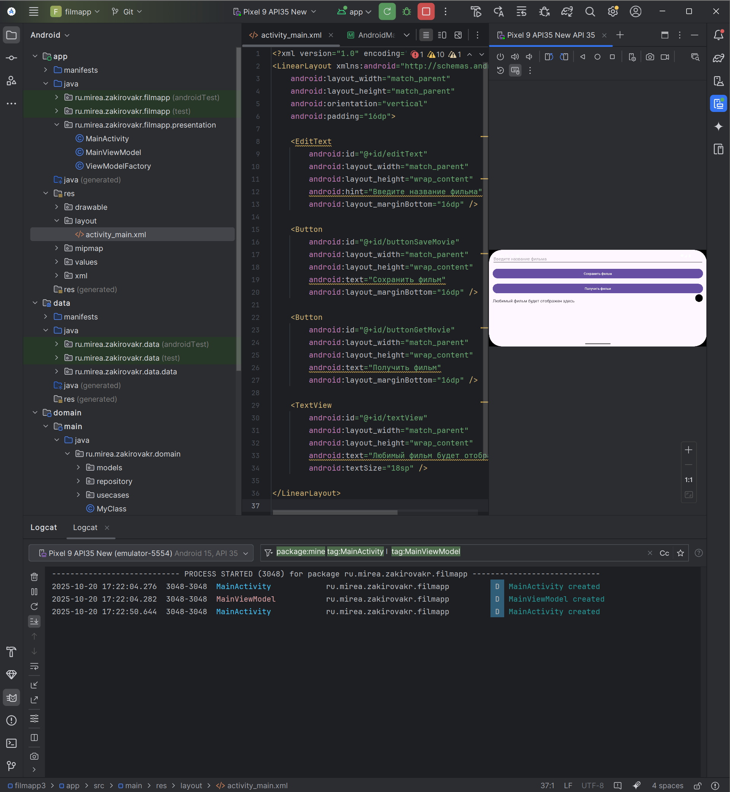
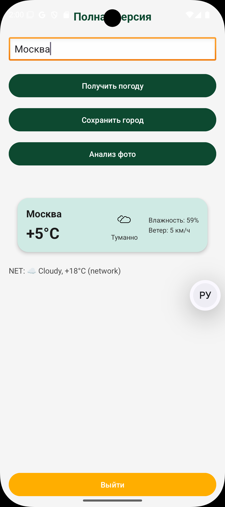

# Практическая работа №3 

## 1. МОДИФИКАЦИЯ СЛОЯ APP

​	Для выполнения задания был создан файл MainViewModel.java

```java
public class MainViewModel extends ViewModel {

    private final MovieRepository movieRepository;
    
    private final MutableLiveData<String> favoriteMovie = new MutableLiveData<>();

    public MainViewModel(MovieRepository movieRepository) {
        Log.d(MainViewModel.class.getSimpleName(), "MainViewModel created");
        this.movieRepository = movieRepository;
    }

    public MutableLiveData<String> getFavoriteMovie() {
        return favoriteMovie;
    }

    public void setText(MovieD movie) {
        boolean result = new SaveMovieToFavoriteUseCase(movieRepository).execute(movie);
        favoriteMovie.setValue(String.valueOf(result));
    }

    public void getText() {
        MovieD movie = new GetFavoriteFilmUseCase(movieRepository).execute();
        favoriteMovie.setValue(String.format("My favorite movie is %s", movie.getName()));
    }

    @Override
    protected void onCleared() {
        Log.d(MainViewModel.class.getSimpleName(), "MainViewModel cleared");
        super.onCleared();
    }
}
```

​	ViewModelFactory.java

```java
public class ViewModelFactory implements ViewModelProvider.Factory {

    private final Context appContext;

    public ViewModelFactory(Context context) {
        this.appContext = context.getApplicationContext();
    }

    @SuppressWarnings("unchecked")
    @NonNull
    @Override
    public <T extends ViewModel> T create(@NonNull Class<T> modelClass) {
        MovieStorage storage = new SharedPrefMovieStorage(appContext);
        MovieRepository repo = new MovieRepositoryImpl(storage);
        return (T) new MainViewModel(repo);
    }
}
```

​	MainActivity.java

```java
public class MainActivity extends AppCompatActivity {

    private MainViewModel vm;

    private EditText editText;
    private TextView textView;
    private Button saveButton;
    private Button getButton;

    @Override
    protected void onCreate(Bundle savedInstanceState) {
        super.onCreate(savedInstanceState);
        setContentView(R.layout.activity_main);
        Log.d(MainActivity.class.getSimpleName(), "MainActivity created");

        vm = new ViewModelProvider(this, new ViewModelFactory(this))
                .get(MainViewModel.class);

        initViews();
        bindObservers();
        bindClicks();
    }

    private void initViews() {
        editText   = findViewById(R.id.editText);
        textView   = findViewById(R.id.textView);
        saveButton = findViewById(R.id.buttonSaveMovie);
        getButton  = findViewById(R.id.buttonGetMovie);
    }

    private void bindObservers() {
        vm.getFavoriteMovie().observe(this, new Observer<String>() {
            @Override
            public void onChanged(String s) {
                textView.setText(s);
            }
        });
    }

    private void bindClicks() {
        saveButton.setOnClickListener(v -> {
            String name = editText.getText().toString().trim();
            if (!name.isEmpty()) {
                vm.setText(new MovieD(1, name));
                editText.setText("");
            }
        });

        getButton.setOnClickListener(v -> vm.getText());
    }
}
```

​	Далее показаны логи в logcat при повороте экрана:


​	После поворота:



​	При каждом создании Activity: MainActivity created. MainViewModel created — один раз на жизненный цикл Activity (после поворота возвращается тот же экземпляр).

​	Задание было выполнено:

- Activity теперь взаимодействует с domain только через ViewModel.
- Обновление UI — через LiveData в MainViewModel.
- ViewModel создаётся с зависимостями через ViewModelFactory.
- Значение «любимого фильма» сохраняется в состоянии ViewModel и не теряется при повороте (LiveData переотправит последнее значение).

## 2. КОНТРОЛЬНОЕ ЗАДАНИЕ

​	В ходе выполнения практической работы были созданы следующие файлы

​	WeatherViewModel.java — центральный слой презентации по MVVM: инкапсулирует обращение к domain (репозитории и use case’ы), хранит состояние экрана в `LiveData` (`weatherText`, `statusText`, `isLoading`) и агрегирует «замоканные» источники БД/сети через `MediatorLiveData` (`mergedSource`). Методы `getWeather`, `saveCity`, `recognizeWeather`, `logout` не возвращают значения — они обновляют LiveData, на которую подписан UI.

```java
public class WeatherViewModel extends ViewModel {

    private final UserRepository userRepository;
    private final WeatherRepository weatherRepository;

    private final MutableLiveData<String> weatherText = new MutableLiveData<>("");
    private final MutableLiveData<String> statusText  = new MutableLiveData<>("");

    private final MutableLiveData<Boolean> isLoading  = new MutableLiveData<>(false);

    // Пример объединения источников: MediatorLiveData
    private final MediatorLiveData<String> mergedSource = new MediatorLiveData<>();

    public WeatherViewModel(UserRepository userRepository,
                            WeatherRepository weatherRepository) {
        this.userRepository = userRepository;
        this.weatherRepository = weatherRepository;

        // Источник из "БД": сохранённый город + локальный use-case
        FakeDbDataSourceWeather db = new FakeDbDataSourceWeather(userRepository, weatherRepository);
        LiveData<String> dbSource = db.loadLocalWeatherLine();

        // Источник из "сети": имитация
        FakeNetworkDataSourceWeather net = new FakeNetworkDataSourceWeather();
        LiveData<String> netSource = net.fetchWeatherLine();

        mergedSource.addSource(dbSource, s -> mergedSource.setValue("DB: " + s));
        mergedSource.addSource(netSource, s -> mergedSource.setValue("NET: " + s));
    }

    public LiveData<String> getWeatherText()   { return weatherText; }
    public LiveData<String> getStatusText()    { return statusText;  }
    public LiveData<String> getMergedSource()  { return mergedSource;}
    public LiveData<Boolean> getIsLoading()    { return isLoading;   }

    public void getWeather(String city) {
        if (city == null || city.trim().isEmpty()) {
            weatherText.setValue("Введите название города");
            return;
        }
        statusText.setValue("Загрузка погоды для " + city + "...");
        isLoading.setValue(true);

        userRepository.fetchWeatherData(city, new WeatherCallback() {
            @Override
            public void onSuccess(String weatherData) {
                weatherText.postValue(weatherData);
                statusText.postValue("");
                isLoading.postValue(false);
            }

            @Override
            public void onError(String errorMessage) {
                GetWeatherByCityUseCase useCase = new GetWeatherByCityUseCase(weatherRepository);
                Weather w = useCase.execute(city);
                weatherText.postValue("Запасной вариант:\n" +
                        String.format("Погода в %s: %d°C", w.getCity(), w.getTemperature()));
                statusText.postValue("Ошибка: " + errorMessage);
                isLoading.postValue(false);
            }
        });
    }


    public void saveCity(String city) {
        if (city == null || city.trim().isEmpty()) {
            statusText.setValue("Введите город для сохранения");
            return;
        }
        userRepository.saveFavoriteCity(city);
        statusText.setValue("Город " + city + " сохранён в избранное");
        weatherText.setValue("Город " + city + " сохранен в избранное");
    }

    public void recognizeWeather() {
        RecognizeWeatherFromPhotoUseCase uc = new RecognizeWeatherFromPhotoUseCase(weatherRepository);
        String result = uc.execute();
        weatherText.setValue(String.format("Анализ фото: %s", result));
    }

    public void logout() {
        new LogoutUseCase(userRepository).execute();
        statusText.setValue("Вы вышли из системы");
    }
}
```

​	ViewModelFactory.java— фабрика создания `WeatherViewModel` с корректной передачей зависимостей (`UserRepositoryImpl`, `WeatherRepositoryImpl`) без «утечек» контекста в ViewModel. Используется `ViewModelProvider(this, new ViewModelFactory(this))` для того, чтобы одна и та же VM переживала повороты экрана и имела все нужные репозитории.

```java
public class ViewModelFactory implements ViewModelProvider.Factory {

    private final Context appContext;

    public ViewModelFactory(Context context) {
        this.appContext = context.getApplicationContext();
    }

    @SuppressWarnings("unchecked")
    @NonNull
    @Override
    public <T extends ViewModel> T create(@NonNull Class<T> modelClass) {
        UserRepository userRepo = new UserRepositoryImpl(appContext);
        WeatherRepository weatherRepo = new WeatherRepositoryImpl();
        return (T) new WeatherViewModel(userRepo, weatherRepo);
    }
}
```

​	FakeNetworkDataSource.java - имитация сетевого источника данных для демонстрации `MediatorLiveData`: возвращает `LiveData<String>` с задержкой ~1.2 сек и строкой погоды, позволяя показать, как VM объединяет несколько асинхронных потоков и обновляет интерфейс при поступлении «сетевого» ответа.

```java
public class FakeNetworkDataSourceWeather {

    public LiveData<String> fetchWeatherLine() {
        MutableLiveData<String> live = new MutableLiveData<>();
        new Thread(() -> {
            try {
                Thread.sleep(1200);
            } catch (InterruptedException ignored) {}
            live.postValue("☁️ Cloudy, +18°C (network)");
        }).start();
        return live;
    }
}
```

​	FakeDbDataSource.java— имитация локального/БД источника: читает сохранённый город через `UserRepository.getUserPreferences("favorite_city")`, получает температуру локальным use case `GetWeatherByCityUseCase` и публикует строку как `LiveData<String>`. Используется во `WeatherViewModel` как второй источник для `MediatorLiveData`.

```java
public class FakeDbDataSourceWeather {

    private final UserRepository userRepository;
    private final WeatherRepository weatherRepository;

    public FakeDbDataSourceWeather(UserRepository userRepository,
                                   WeatherRepository weatherRepository) {
        this.userRepository = userRepository;
        this.weatherRepository = weatherRepository;
    }

    public LiveData<String> loadLocalWeatherLine() {
        MutableLiveData<String> live = new MutableLiveData<>();
        new Thread(() -> {
            // Пусть это «БД»: читаем favorite_city из префов, а температуру — из локального репозитория
            String city = userRepository.getUserPreferences("favorite_city");
            if (city == null || city.isEmpty()) city = "Unknown";
            Weather w = new GetWeatherByCityUseCase(weatherRepository).execute(city);
            live.postValue("Local " + city + ": " + w.getTemperature() + "°C");
        }).start();
        return live;
    }
}
```

​	Исправлен MainActivity.java - — «тонкая» активити, связывающая UI и ViewModel: инициализирует `WeatherViewModel` через `ViewModelFactory`, подписывается на `LiveData` (`weatherText`, `statusText`, `isLoading`, `mergedSource`) и обновляет элементы интерфейса; обработчики кликов вызывают методы VM (`getWeather`, `saveCity`, `recognizeWeather`, `logout`). Благодаря LiveData состояние экрана сохраняется при повороте.

```java
public class MainActivity extends AppCompatActivity {

    private WeatherViewModel vm;

    private EditText editTextCity;
    private TextView textViewStatus;
    private TextView textMerged;
    private Button buttonGetWeather;
    private Button buttonLogout;
    private FrameLayout weatherCardContainer;
    private View weatherCardView;

    @Override
    protected void onCreate(Bundle savedInstanceState) {
        super.onCreate(savedInstanceState);
        setContentView(R.layout.activity_main);

        vm = new ViewModelProvider(this, new ViewModelFactory(this))
                .get(WeatherViewModel.class);

        initViews();
        bindObservers();
        setupClickListeners();
    }

    private void initViews() {
        editTextCity         = findViewById(R.id.editTextCity);
        textViewStatus       = findViewById(R.id.textViewStatus);
        textMerged           = findViewById(R.id.textMerged);
        buttonGetWeather     = findViewById(R.id.buttonGetWeather);
        buttonLogout         = findViewById(R.id.buttonLogout);
        weatherCardContainer = findViewById(R.id.weatherCardContainer);
    }

    private void bindObservers() {

        vm.getWeatherText().observe(this, this::renderWeatherCard);


        vm.getStatusText().observe(this, s -> {
            if (textViewStatus != null) textViewStatus.setText(s);
        });


        vm.getMergedSource().observe(this, s -> {
            if (textMerged != null) {
                textMerged.setText(s == null ? "" : s);
                textMerged.setVisibility(s == null || s.isEmpty() ? View.GONE : View.VISIBLE);
            }
        });


        vm.getIsLoading().observe(this, isLoading -> {
            if (buttonGetWeather != null) {
                buttonGetWeather.setEnabled(isLoading == null || !isLoading);
            }
        });
    }

    private void setupClickListeners() {
        findViewById(R.id.buttonGetWeather).setOnClickListener(v -> {
            String city = editTextCity.getText().toString().trim();
            vm.getWeather(city);
        });

        findViewById(R.id.buttonSaveCity).setOnClickListener(v -> {
            String city = editTextCity.getText().toString().trim();
            vm.saveCity(city);
        });

        findViewById(R.id.buttonRecognizeWeather).setOnClickListener(v -> vm.recognizeWeather());

        buttonLogout.setOnClickListener(v -> {
            vm.logout();
            Intent intent = new Intent(MainActivity.this, HomeActivity.class);
            startActivity(intent);
            finish();
        });
    }


    private void renderWeatherCard(String raw) {
        if (raw == null) raw = "";

        // Если это подсказка "Введите город..." — показываем простую надпись и не рисуем карточку
        String trimmed = raw.trim();
        String lower   = trimmed.toLowerCase();
        if (lower.startsWith("введите")) {
            clearCard();
            if (textViewStatus != null) textViewStatus.setText(trimmed);
            return;
        }


        if (trimmed.isEmpty()) {
            clearCard();
            return;
        }

        ensureCard();

        TextView tvCity    = weatherCardView.findViewById(R.id.tvCity);
        TextView tvTempBig = weatherCardView.findViewById(R.id.tvTempBig);
        TextView tvCond    = weatherCardView.findViewById(R.id.tvCondition);
        TextView tvHum     = weatherCardView.findViewById(R.id.tvHumidity);
        TextView tvWind    = weatherCardView.findViewById(R.id.tvWind);
        ImageView ivIcon   = weatherCardView.findViewById(R.id.ivWeatherIcon);

        // Ожидаемый формат из NetworkApi:
        // "🌍 Город: %s\n%s\n🌡️ Температура: %s\n💧 Влажность: %d%%\n💨 Ветер: %s"
        String city = "", condition = "", temp = "", humidity = "", wind = "";
        try {
            String[] lines = raw.split("\n");
            for (String line : lines) {
                String l = line.trim();
                if (l.startsWith("🌍") || l.startsWith("Город")) {
                    city = l.replace("🌍", "").replace("Город:", "").trim();
                } else if (l.startsWith("🌡") || l.startsWith("Температура")) {
                    temp = l.replace("🌡️", "").replace("Температура:", "").trim();
                } else if (l.startsWith("💧") || l.startsWith("Влажность")) {
                    humidity = l.replace("💧", "").trim();
                } else if (l.startsWith("💨") || l.startsWith("Ветер")) {
                    wind = l.replace("💨", "").trim();
                } else {
                    condition = l
                            .replace("☀️", "")
                            .replace("⛅", "")
                            .replace("🌧️", "")
                            .replace("❄️", "")
                            .replace("💨", "")
                            .replace("🌫️", "")
                            .trim();
                }
            }
        } catch (Exception ignore) { }

        tvCity.setText(city.isEmpty() ? "Город" : city);
        tvTempBig.setText(
                temp.isEmpty() ? "—" : temp.replace("Температура", "")
                        .replace(":", "")
                        .trim()
        );
        tvCond.setText(condition);
        tvHum.setText(humidity.isEmpty() ? "" : humidity);
        tvWind.setText(wind.isEmpty() ? "" : wind);

        // Всегда одна и та же картинка (пока), как просили
        ivIcon.setImageResource(R.drawable.ic);
    }

    private void ensureCard() {
        if (weatherCardView == null) {
            weatherCardView = LayoutInflater.from(this)
                    .inflate(R.layout.item_weather_card, weatherCardContainer, false);
            weatherCardContainer.removeAllViews();
            weatherCardContainer.addView(weatherCardView);
        }
    }

    private void clearCard() {
        if (weatherCardContainer != null) {
            weatherCardContainer.removeAllViews();
        }
        weatherCardView = null;
    }
}
```

​	Также был настроен дизайн карточек погоды. При нажатии на кнопку получить погоду видим следующий экран:



