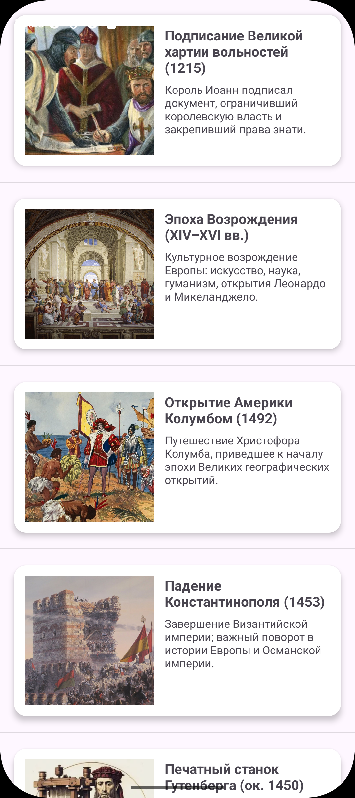

# Практическая работа №4

## 1.1 ScrollView

​	Был создан модуль ScrollViewApp. 

​	item.xml

```xml
<?xml version="1.0" encoding="utf-8"?>
<LinearLayout
    xmlns:android="http://schemas.android.com/apk/res/android"
    android:layout_width="match_parent"
    android:layout_height="wrap_content"
    android:orientation="horizontal"
    android:padding="8dp">

    <ImageView
        android:id="@+id/imageView"
        android:layout_width="24dp"
        android:layout_height="24dp"
        android:layout_marginEnd="8dp"
        android:src="@android:drawable/ic_dialog_info" />

    <TextView
        android:id="@+id/textView"
        android:layout_width="wrap_content"
        android:layout_height="wrap_content"
        android:text="Элемент"
        android:textSize="16sp" />
</LinearLayout>
```

​	activity_main.xml

```xml
<?xml version="1.0" encoding="utf-8"?>
<androidx.constraintlayout.widget.ConstraintLayout
    xmlns:android="http://schemas.android.com/apk/res/android"
    xmlns:app="http://schemas.android.com/apk/res-auto"
    android:layout_width="match_parent"
    android:layout_height="match_parent">

    <ScrollView
        android:id="@+id/scrollView"
        android:layout_width="0dp"
        android:layout_height="0dp"
        app:layout_constraintTop_toTopOf="parent"
        app:layout_constraintBottom_toBottomOf="parent"
        app:layout_constraintStart_toStartOf="parent"
        app:layout_constraintEnd_toEndOf="parent"
        android:fillViewport="true">

        <LinearLayout
            android:id="@+id/wrapper"
            android:layout_width="match_parent"
            android:layout_height="wrap_content"
            android:orientation="vertical"
            android:padding="12dp"/>
    </ScrollView>

</androidx.constraintlayout.widget.ConstraintLayout>
```

​	MainActivity.java

```java
public class MainActivity extends AppCompatActivity {

    private LinearLayout wrapper;
    private ScrollView scrollView;

    @Override
    protected void onCreate(Bundle savedInstanceState) {
        super.onCreate(savedInstanceState);
        setContentView(R.layout.activity_main);

        wrapper = findViewById(R.id.wrapper);
        scrollView = findViewById(R.id.scrollView);

        BigInteger value = BigInteger.ONE;
        for (int i = 1; i <= 100; i++) {
            value = value.shiftLeft(1);

            View view = getLayoutInflater().inflate(R.layout.item, null, false);

            TextView text = view.findViewById(R.id.textView);
            text.setText(String.format("Элемент %d: %s", i, value.toString()));

            ImageView img = view.findViewById(R.id.imageView);
            img.setImageResource(android.R.drawable.ic_dialog_info);

            wrapper.addView(view);
        }
    }
}
```

​	Демонстрация работы приложения. Отображается геометрическая прогрессия со знаменателем 2 до 100 элемента.


## 1.2 ListView

​	Был создан модуль ListViewApp. 

​	activity_main.xml

```xml
<?xml version="1.0" encoding="utf-8"?>
<FrameLayout xmlns:android="http://schemas.android.com/apk/res/android"
    android:layout_width="match_parent"
    android:layout_height="match_parent">

    <ListView
        android:id="@+id/listViewBooks"
        android:layout_width="match_parent"
        android:layout_height="match_parent"/>
</FrameLayout>
```

​	MainActivity.java

```java
public class MainActivity extends AppCompatActivity {
    private ListView listViewBooks;

    private String[] books = new String[] {
            "Достоевский — Идиот", "Булгаков — Мастер и Маргарита", "Тургенев — Отцы и дети",
            "Толстой — Война и мир", "Пушкин — Евгений Онегин", "Гоголь — Мёртвые души",
            "Чехов — Вишнёвый сад", "Лермонтов — Герой нашего времени", "Набоков — Защита Лужина",
            "Солженицын — Архипелаг ГУЛАГ", "Кавка — Процесс", "Оруэлл — 1984",
            "Хаксли — О дивный новый мир", "Керуак — В дороге", "Кинг — Противостояние",
            "Хемингуэй — Старик и море", "Ремарк — Три товарища", "Стейнбек — Гроздья гнева",
            "Кальдерон — Жизнь есть сон", "Камю — Чума", "Флобер — Мадам Бовари",
            "Пруст — В сторону Свана", "Верн — Двадцать тысяч лье", "Дюма — Граф Монте-Кристо",
            "Сэлинджер — Над пропастью", "Брэдбери — 451° по Фаренгейту", "Азимов — Основание",
            "Кларк — 2001", "Толкин — Властелин колец", "Роулинг — Гарри Поттер",
            "Мартин — Игра престолов", "Рот — Дивергент", "Харуки Мураками — Норвежский лес",
            "Гришэм — Клиент"
    };

    @Override
    protected void onCreate(Bundle savedInstanceState) {
        super.onCreate(savedInstanceState);
        setContentView(R.layout.activity_main);
        listViewBooks = findViewById(R.id.listViewBooks);

        ArrayAdapter<String> adapter = new ArrayAdapter<String>(
                this,
                android.R.layout.simple_list_item_2,
                android.R.id.text1,
                books
        ) {
            @Override
            public View getView(int position, View convertView, ViewGroup parent) {
                View view = super.getView(position, convertView, parent);
                TextView text1 = view.findViewById(android.R.id.text1);
                TextView text2 = view.findViewById(android.R.id.text2);

                text2.setText(getItem(position).toString());
                text1.setText(String.valueOf(position+1));
                return view;
            }
        };

        listViewBooks.setAdapter(adapter);
    }
}
```

​	Демонстрация работы приложения. Выводится список авторов и книг, которые я планирую прочитать в ближайшие 30 лет.


## 1.3 RecyclerView

​	Был создан новый модуль RecyclerViewApp.

event_item_view.xml

```xml
<?xml version="1.0" encoding="utf-8"?>
<androidx.cardview.widget.CardView xmlns:android="http://schemas.android.com/apk/res/android"
    xmlns:app="http://schemas.android.com/apk/res-auto"
    android:layout_width="match_parent"
    android:layout_height="wrap_content"
    app:cardUseCompatPadding="true"
    app:cardElevation="4dp"
    app:cardCornerRadius="14dp"
    android:layout_margin="8dp">

    <androidx.constraintlayout.widget.ConstraintLayout
        android:layout_width="match_parent"
        android:layout_height="wrap_content"
        android:padding="12dp">

        <ImageView
            android:id="@+id/imageEvent"
            android:layout_width="150dp"
            android:layout_height="150dp"
            android:contentDescription="@string/app_name"
            android:scaleType="centerCrop"
            app:layout_constraintBottom_toBottomOf="parent"
            app:layout_constraintStart_toStartOf="parent"
            app:layout_constraintTop_toTopOf="parent" />

        <TextView
            android:id="@+id/textEventTitle"
            android:layout_width="0dp"
            android:layout_height="wrap_content"
            android:text="Событие"
            android:textStyle="bold"
            android:textSize="16sp"
            android:layout_marginStart="12dp"
            app:layout_constraintStart_toEndOf="@id/imageEvent"
            app:layout_constraintTop_toTopOf="@id/imageEvent"
            app:layout_constraintEnd_toEndOf="parent"/>

        <TextView
            android:id="@+id/textEventDesc"
            android:layout_width="0dp"
            android:layout_height="wrap_content"
            android:text="Краткое описание события"
            android:textSize="13sp"
            android:layout_marginStart="12dp"
            android:layout_marginTop="6dp"
            app:layout_constraintStart_toEndOf="@id/imageEvent"
            app:layout_constraintTop_toBottomOf="@id/textEventTitle"
            app:layout_constraintEnd_toEndOf="parent"/>
    </androidx.constraintlayout.widget.ConstraintLayout>
</androidx.cardview.widget.CardView>
```

​	activity_main.xml

```xml
<?xml version="1.0" encoding="utf-8"?>
<androidx.constraintlayout.widget.ConstraintLayout
    xmlns:android="http://schemas.android.com/apk/res/android"
    xmlns:app="http://schemas.android.com/apk/res-auto"
    android:layout_width="match_parent"
    android:layout_height="match_parent">

    <androidx.recyclerview.widget.RecyclerView
        android:id="@+id/recyclerView"
        android:layout_width="0dp"
        android:layout_height="0dp"
        app:layout_constraintTop_toTopOf="parent"
        app:layout_constraintBottom_toBottomOf="parent"
        app:layout_constraintStart_toStartOf="parent"
        app:layout_constraintEnd_toEndOf="parent"/>
</androidx.constraintlayout.widget.ConstraintLayout>
```

​	Event.java

```java
public class Event {
    private final String title;
    private final String description;
    private final String imageName;

    public Event(String title, String description, String imageName) {
        this.title = title;
        this.description = description;
        this.imageName = imageName;
    }

    public String getTitle() { return title; }
    public String getDescription() { return description; }
    public String getImageName() { return imageName; }
}
```

​	EventRecyclerViewAdapter.java

```java
public class EventRecyclerViewAdapter extends RecyclerView.Adapter<EventViewHolder> {
    private final List<Event> events;
    private Context context;

    public EventRecyclerViewAdapter(List<Event> events) {
        this.events = events;
    }

    @NonNull
    @Override
    public EventViewHolder onCreateViewHolder(@NonNull ViewGroup parent, int viewType) {
        context = parent.getContext();
        View item = LayoutInflater.from(context).inflate(R.layout.event_item_view, parent, false);
        return new EventViewHolder(item);
    }

    @Override
    public void onBindViewHolder(@NonNull EventViewHolder holder, int position) {
        Event e = events.get(position);

        int resId = context.getResources().getIdentifier(e.getImageName(), "drawable", context.getPackageName());
        if (resId != 0) {
            holder.getImageEvent().setImageResource(resId);
        } else {
            holder.getImageEvent().setImageResource(android.R.drawable.ic_menu_info_details);
        }

        holder.getTextEventTitle().setText(e.getTitle());
        holder.getTextEventDesc().setText(e.getDescription());
    }

    @Override
    public int getItemCount() {
        return events.size();
    }
}
```

​	EventViewHolder.java

```java
public class EventViewHolder extends RecyclerView.ViewHolder {
    private final ImageView imageEvent;
    private final TextView textEventTitle;
    private final TextView textEventDesc;

    public EventViewHolder(@NonNull View itemView) {
        super(itemView);
        imageEvent     = itemView.findViewById(R.id.imageEvent);
        textEventTitle = itemView.findViewById(R.id.textEventTitle);
        textEventDesc  = itemView.findViewById(R.id.textEventDesc);
    }

    public ImageView getImageEvent() { return imageEvent; }
    public TextView getTextEventTitle() { return textEventTitle; }
    public TextView getTextEventDesc() { return textEventDesc; }
}
```

​	MainActivity.java

```java
public class MainActivity extends AppCompatActivity {

    @Override
    protected void onCreate(Bundle savedInstanceState) {
        super.onCreate(savedInstanceState);
        setContentView(R.layout.activity_main);

        RecyclerView rv = findViewById(R.id.recyclerView);
        rv.setLayoutManager(new LinearLayoutManager(this, LinearLayoutManager.VERTICAL, false));

        EventRecyclerViewAdapter adapter = new EventRecyclerViewAdapter(getEvents());
        rv.setAdapter(adapter);

        rv.addItemDecoration(new DividerItemDecoration(this, RecyclerView.VERTICAL));
    }

    private List<Event> getEvents() {
        List<Event> list = new ArrayList<>();
        list.add(new Event("Подписание Великой хартии вольностей (1215)",
                "Король Иоанн подписал документ, ограничивший королевскую власть и закрепивший права знати.",
                "event_magnacarta"));

        list.add(new Event("Эпоха Возрождения (XIV–XVI вв.)",
                "Культурное возрождение Европы: искусство, наука, гуманизм, открытия Леонардо и Микеланджело.",
                "event_renaissance"));

        list.add(new Event("Открытие Америки Колумбом (1492)",
                "Путешествие Христофора Колумба, приведшее к началу эпохи Великих географических открытий.",
                "event_columbus"));

        list.add(new Event("Падение Константинополя (1453)",
                "Завершение Византийской империи; важный поворот в истории Европы и Османской империи.",
                "event_constantinople"));

        list.add(new Event("Печатный станок Гутенберга (ок. 1450)",
                "Революция в распространении знаний: книгопечатание стало массовым и доступным.",
                "event_printing_press"));

        list.add(new Event("Промышленная революция (XVIII–XIX вв.)",
                "Механизация производства, паровые машины, фабрики и урбанизация.",
                "event_industrial"));

        list.add(new Event("Французская революция (1789)",
                "Провозглашение прав человека, падение монархии и изменение политической карты Европы.",
                "event_french_revolution"));

        list.add(new Event("Первая мировая война (1914–1918)",
                "Глобальный конфликт, приведший к крушению империй и изменению международных отношений.",
                "event_wwi"));

        list.add(new Event("Вторая мировая война (1939–1945)",
                "Крупнейшая война в истории; Холокост; бомбардировки Хиросимы и Нагасаки.",
                "event_wwii"));

        list.add(new Event("Первый полет человека в космос (1961)",
                "Советский космонавт Юрий Гагарин совершил первый в истории человечества полёт в космос.",
                "event_gagarin"));


        list.add(new Event("Распад СССР (1991)",
                "Завершение существования Советского Союза, образование независимых государств.",
                "event_ussr_dissolution"));

        return list;
    }
}
```

​	Демонстрация работы приложения. Был создан список исторических событий с кратким описанием и изображением.




## 2 КОНТРОЛЬНОЕ ЗАДАНИЕ

​	В пакете data.data.repository создан и реализован класс WeatherRepositoryImpl.java, который выступает в роли заглушки внешнего API. Метод loadStubWeatherList() возвращает список заранее подготовленных карточек погоды (города, температура, состояние, влажность, ветер, иконка).
 Эти данные имитируют ответ от внешнего погодного сервиса

WeatherRepositoryImpl.java

```java
public class WeatherRepositoryImpl implements WeatherRepository {
    @Override
    public Weather getWeatherByCity(String city) {
        return new Weather(city, 25);
    }

    @Override
    public boolean saveFavoriteCity(String city) {
        return true;
    }

    @Override
    public String recognizeWeatherFromPhoto() {
        return "Sunny";
    }

    @Override
    public List<WeatherItem> loadStubWeatherList() {
        List<WeatherItem> items = new ArrayList<>();

        items.add(new WeatherItem("Москва",            "+18°C", "Облачно",  "icon_cloud", "Влажность: 61%", "Ветер: 10 км/ч"));
        items.add(new WeatherItem("Евпатория",         "+15°C", "Дождь",     "icon_rain",  "Влажность: 80%", "Ветер: 12 км/ч"));
        items.add(new WeatherItem("Казань",            "+22°C", "Солнечно",  "icon_sun",   "Влажность: 45%", "Ветер:  6 км/ч"));
        items.add(new WeatherItem("Екатеринбург",      "+12°C", "Туман",     "icon_fog",   "Влажность: 70%", "Ветер:  9 км/ч"));
        items.add(new WeatherItem("Новосибирск",       "+9°C",  "Ветрено",   "icon_wind",  "Влажность: 55%", "Ветер: 22 км/ч"));
        items.add(new WeatherItem("Сочи",              "+24°C", "Солнечно",  "icon_sun",   "Влажность: 50%", "Ветер:  8 км/ч"));
        items.add(new WeatherItem("Нижний Новгород",   "+16°C", "Облачно",   "icon_cloud", "Влажность: 60%", "Ветер: 11 км/ч"));

        return items;
    }
}
```

​	Таким образом, репозиторий создаёт статический набор данных, который позже передаётся в ViewModel.

​	В классе WeatherViewModel.java создан объект MutableLiveData<List<WeatherItem>> weatherList,  в который репозиторий помещает заглушку данных.  ViewModel обеспечивает “мост” между бизнес-логикой (репозиторием) и UI-слоем.

WeatherViewModel.java

```java
public class WeatherViewModel extends ViewModel {

    private final UserRepository userRepository;
    private final WeatherRepository weatherRepository;

    private final MutableLiveData<String> weatherText = new MutableLiveData<>("");

    private final MutableLiveData<String> statusText  = new MutableLiveData<>("");

    private final MutableLiveData<Boolean> isLoading  = new MutableLiveData<>(false);

    private final MutableLiveData<List<WeatherItem>> weatherList = new MutableLiveData<>();

    private final MediatorLiveData<String> mergedSource = new MediatorLiveData<>();

    public WeatherViewModel(UserRepository userRepository,
                            WeatherRepository weatherRepository) {
        this.userRepository = userRepository;
        this.weatherRepository = weatherRepository;

        weatherList.setValue(weatherRepository.loadStubWeatherList());

        FakeDbDataSourceWeather db = new FakeDbDataSourceWeather(userRepository, weatherRepository);
        LiveData<String> dbSource = db.loadLocalWeatherLine();

        FakeNetworkDataSourceWeather net = new FakeNetworkDataSourceWeather();
        LiveData<String> netSource = net.fetchWeatherLine();

        mergedSource.addSource(dbSource, s -> mergedSource.setValue("DB: " + s));
        mergedSource.addSource(netSource, s -> mergedSource.setValue("NET: " + s));
    }

    public LiveData<String> getWeatherText()   { return weatherText; }
    public LiveData<String> getStatusText()    { return statusText;  }
    public LiveData<String> getMergedSource()  { return mergedSource;}
    public LiveData<Boolean> getIsLoading()    { return isLoading;   }
    public LiveData<List<WeatherItem>> getWeatherList() { return weatherList; }

    public void getWeather(String city) {
        if (city == null || city.trim().isEmpty()) {
            statusText.setValue("Введите название города");
            return;
        }
        statusText.setValue("Загрузка погоды для " + city + "...");
        isLoading.setValue(true);

        userRepository.fetchWeatherData(city, new WeatherCallback() {
            @Override
            public void onSuccess(String weatherData) {
                weatherText.postValue(weatherData);
                statusText.postValue("");
                isLoading.postValue(false);
            }

            @Override
            public void onError(String errorMessage) {
                GetWeatherByCityUseCase useCase = new GetWeatherByCityUseCase(weatherRepository);
                Weather w = useCase.execute(city);
                weatherText.postValue("Запасной вариант:\n" +
                        String.format("Погода в %s: %d°C", w.getCity(), w.getTemperature()));
                statusText.postValue("Ошибка: " + errorMessage);
                isLoading.postValue(false);
            }
        });
    }

    public void saveCity(String city) {
        if (city == null || city.trim().isEmpty()) {
            statusText.setValue("Введите город для сохранения");
            return;
        }
        userRepository.saveFavoriteCity(city);
        statusText.setValue("Город " + city + " сохранён в избранное");
    }

    public void recognizeWeather() {
        RecognizeWeatherFromPhotoUseCase uc = new RecognizeWeatherFromPhotoUseCase(weatherRepository);
        String result = uc.execute();
        statusText.setValue(String.format("Анализ фото: %s", result));
    }

    public void logout() {
        new LogoutUseCase(userRepository).execute();
        statusText.setValue("Вы вышли из системы");
    }
}
```

​	В пакете presentation.list создан адаптер WeatherListAdapter.java,
 который получает список WeatherItem и отображает их в виде карточек, используя разметку item_weather_card.xml.

WeatherListAdapter.java

```java
public class WeatherListAdapter extends RecyclerView.Adapter<WeatherListAdapter.VH> {

    private final List<WeatherItem> items = new ArrayList<>();
    private Context context;

    public void setItems(List<WeatherItem> newItems) {
        items.clear();
        if (newItems != null) items.addAll(newItems);
        notifyDataSetChanged();
    }

    @NonNull
    @Override
    public VH onCreateViewHolder(@NonNull ViewGroup parent, int viewType) {
        context = parent.getContext();
        View v = LayoutInflater.from(context).inflate(R.layout.item_weather_card, parent, false);
        return new VH(v);
    }

    @Override
    public void onBindViewHolder(@NonNull VH h, int position) {
        WeatherItem it = items.get(position);

        h.tvCity.setText(it.getCity());
        h.tvTempBig.setText(it.getTemperature());
        h.tvCondition.setText(it.getCondition());
        h.tvHumidity.setText(it.getHumidity());
        h.tvWind.setText(it.getWind());

        int resId = context.getResources()
                .getIdentifier(it.getIconName(), "drawable", context.getPackageName());
        if (resId != 0) {
            h.ivWeatherIcon.setImageResource(resId);
        } else {
            h.ivWeatherIcon.setImageResource(R.drawable.ic);
        }
    }

    @Override
    public int getItemCount() { return items.size(); }

    public void addFirst(WeatherItem item) {
        if (item == null) return;
        items.add(0, item);
        notifyItemInserted(0);
    }

    static class VH extends RecyclerView.ViewHolder {
        TextView tvCity, tvTempBig, tvCondition, tvHumidity, tvWind;
        ImageView ivWeatherIcon;
        VH(@NonNull View v) {
            super(v);
            tvCity        = v.findViewById(R.id.tvCity);
            tvTempBig     = v.findViewById(R.id.tvTempBig);
            tvCondition   = v.findViewById(R.id.tvCondition);
            tvHumidity    = v.findViewById(R.id.tvHumidity);
            tvWind        = v.findViewById(R.id.tvWind);
            ivWeatherIcon = v.findViewById(R.id.ivWeatherIcon);
        }
    }
}
```

item_weather_card.xml

```xml
<?xml version="1.0" encoding="utf-8"?>
<androidx.cardview.widget.CardView xmlns:android="http://schemas.android.com/apk/res/android"
    xmlns:card_view="http://schemas.android.com/apk/res-auto"
    android:layout_width="match_parent"
    android:layout_height="wrap_content"
    android:layout_margin="16dp"
    card_view:cardCornerRadius="20dp"
    card_view:cardElevation="4dp"
    card_view:cardBackgroundColor="#CFEAE4">

    <LinearLayout
        android:layout_width="match_parent"
        android:layout_height="wrap_content"
        android:padding="16dp"
        android:orientation="horizontal"
        android:gravity="center_vertical">
        
        <LinearLayout
            android:layout_width="222dp"
            android:layout_height="wrap_content"
            android:layout_weight="1"
            android:orientation="vertical">

            <TextView
                android:id="@+id/tvCity"
                android:layout_width="wrap_content"
                android:layout_height="wrap_content"
                android:text="Москва"
                android:textColor="#1B1B1B"
                android:textSize="18sp"
                android:textStyle="bold" />

            <TextView
                android:id="@+id/tvTempBig"
                android:layout_width="wrap_content"
                android:layout_height="wrap_content"
                android:layout_marginTop="4dp"
                android:text="+10"
                android:textColor="#1B1B1B"
                android:textSize="28sp"
                android:textStyle="bold" />
        </LinearLayout>

        <LinearLayout
            android:layout_width="64dp"
            android:layout_height="wrap_content"
            android:orientation="vertical"
            android:gravity="center_horizontal">

            <ImageView
                android:id="@+id/ivWeatherIcon"
                android:layout_width="40dp"
                android:layout_height="40dp"
                android:src="@drawable/ic" />

            <TextView
                android:id="@+id/tvCondition"
                android:layout_width="wrap_content"
                android:layout_height="wrap_content"
                android:text="Облачно"
                android:textSize="12sp"
                android:textColor="#2E2E2E"
                android:layout_marginTop="4dp"/>
        </LinearLayout>

        <LinearLayout
            android:layout_width="wrap_content"
            android:layout_height="wrap_content"
            android:orientation="vertical"
            android:layout_marginStart="12dp">

            <TextView
                android:id="@+id/tvHumidity"
                android:layout_width="wrap_content"
                android:layout_height="wrap_content"
                android:text="Влажность: 61%"
                android:textSize="12sp"
                android:textColor="#2E2E2E"/>

            <TextView
                android:id="@+id/tvWind"
                android:layout_width="wrap_content"
                android:layout_height="wrap_content"
                android:text="Ветер: 20 км/ч"
                android:textSize="12sp"
                android:textColor="#2E2E2E"
                android:layout_marginTop="2dp"/>
        </LinearLayout>

    </LinearLayout>
</androidx.cardview.widget.CardView>
```

​	Во фрагменте FavoritesFragment.java в методе onViewCreated подключена подписка на LiveData из ViewModel и инициализация адаптера.

FavoritesFragment.java

```java
public class FavoritesFragment extends Fragment {

    private WeatherViewModel vm;

    private EditText editTextCity;
    private TextView textStatus;
    private RecyclerView recycler;
    private WeatherListAdapter adapter;

    private String lastRenderedWeatherRaw = null;

    @Nullable @Override
    public View onCreateView(@NonNull LayoutInflater inflater,
                             @Nullable ViewGroup container,
                             @Nullable Bundle savedInstanceState) {
        return inflater.inflate(R.layout.fragment_favorites, container, false);
    }

    @Override
    public void onViewCreated(@NonNull View v, @Nullable Bundle savedInstanceState) {
        super.onViewCreated(v, savedInstanceState);

        vm = new ViewModelProvider(requireActivity(), new ViewModelFactory(requireContext()))
                .get(WeatherViewModel.class);

        editTextCity = v.findViewById(R.id.editTextCity);
        textStatus   = v.findViewById(R.id.textViewStatus);
        recycler     = v.findViewById(R.id.recyclerWeather);

        adapter = new WeatherListAdapter();
        recycler.setLayoutManager(new LinearLayoutManager(requireContext()));
        recycler.setAdapter(adapter);

        vm.getWeatherList().observe(getViewLifecycleOwner(), adapter::setItems);

        vm.getStatusText().observe(getViewLifecycleOwner(), s -> {
            textStatus.setText(s == null ? "" : s);
        });

        vm.getWeatherText().observe(getViewLifecycleOwner(), raw -> {
            if (raw == null || raw.trim().isEmpty()) return;
            if (raw.equals(lastRenderedWeatherRaw)) return;
            lastRenderedWeatherRaw = raw;

            WeatherItem item = parseRawToItem(raw);
            if (item != null) {
                adapter.addFirst(item);
                recycler.scrollToPosition(0);
            }
        });

        Button btnGet = v.findViewById(R.id.buttonGetWeather);
        Button btnSave = v.findViewById(R.id.buttonSaveCity);

        btnGet.setOnClickListener(view -> {
            String city = editTextCity.getText().toString().trim();
            vm.getWeather(city);
        });

        btnSave.setOnClickListener(view -> {
            String city = editTextCity.getText().toString().trim();
            vm.saveCity(city); 
        });
    }

    private WeatherItem parseRawToItem(@NonNull String raw) {
        String city = "", condition = "", temp = "", humidity = "", wind = "";
        try {
            String[] lines = raw.split("\n");
            for (String line : lines) {
                String l = line.trim();
                if (l.startsWith("Город:")) {
                    city = l.replace("Город:", "").trim();
                } else if (l.startsWith("Температура:")) {
                    temp = l.replace("Температура:", "").trim();
                } else if (l.startsWith("Влажность:")) {
                    humidity = l; 
                } else if (l.startsWith("Ветер:")) {
                    wind = l;     
                } else if (!TextUtils.isEmpty(l)) {
                    condition = l;
                }
            }
        } catch (Exception ignored) {}

        if (TextUtils.isEmpty(city) || TextUtils.isEmpty(temp)) return null;

        String iconName = resolveIconName(condition);

        return new WeatherItem(
                city,
                temp,
                condition,
                iconName,
                TextUtils.isEmpty(humidity) ? "" : humidity,
                TextUtils.isEmpty(wind) ? "" : wind
        );
    }

    private String resolveIconName(String conditionRaw) {
        if (conditionRaw == null) return "ic";
        String c = conditionRaw.toLowerCase();
        if (c.contains("солне") || c.contains("ясно"))   return "icon_sun";
        if (c.contains("облач") || c.contains("пасмур")) return "icon_cloud";
        if (c.contains("дожд")  || c.contains("ливн"))   return "icon_rain";
        if (c.contains("туман") || c.contains("дымк"))   return "icon_fog";
        if (c.contains("ветер") || c.contains("ветрен")) return "icon_wind";
        if (c.contains("снег")  || c.contains("снеж"))   return "icon_snow";
        return "ic"; 
    }
}
```

​	ViewModelFactory.java

```java
public class ViewModelFactory implements ViewModelProvider.Factory {

    private final Context appContext;

    public ViewModelFactory(Context context) {
        this.appContext = context.getApplicationContext();
    }

    @SuppressWarnings("unchecked")
    @NonNull
    @Override
    public <T extends ViewModel> T create(@NonNull Class<T> modelClass) {
        UserRepository userRepo = new UserRepositoryImpl(appContext);
        WeatherRepository weatherRepo = new WeatherRepositoryImpl();
        return (T) new WeatherViewModel(userRepo, weatherRepo);
    }
}
```

​	Демонстрация работы приложения 


