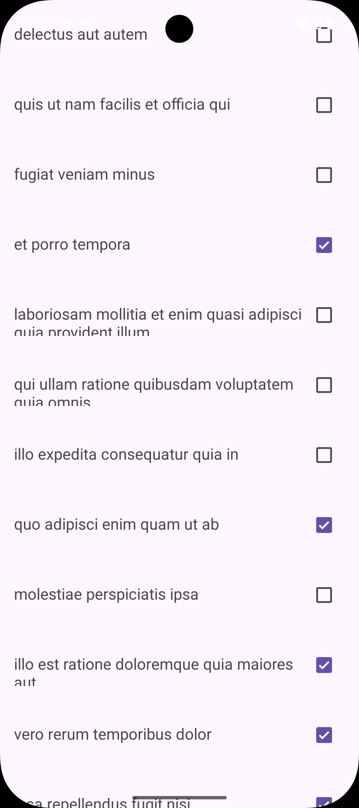

# Практическая работа №5

## 1 RETROFIT

​	Был создан новый проект и в нем  модуль RetrofitApp.

​	В AndroidManifest.xml добавь разрешение на интернет.

```xml
<uses-permission android:name="android.permission.INTERNET" />
```

​	Добавляет приложению право выходить в интернет — это необходимо Retrofit для выполнения HTTP-запросов (GET/PUT).

​	Добавлены зависимости в build.gradle

​	POJO-модель одной записи Todo. Аннотации @SerializedName/@Expose указывают Gson, как связать поля JSON с полями класса. Используется Retrofit’ом для парсинга ответа и в адаптере для отображения данных и изменения completed.

​	Todo.java

```java
public class Todo {
    @SerializedName("userId")
    @Expose
    private Integer userId;

    @SerializedName("id")
    @Expose
    private Integer id;

    @SerializedName("title")
    @Expose
    private String title;

    @SerializedName("completed")
    @Expose
    private Boolean completed;

    public Integer getUserId() { return userId; }
    public void setUserId(Integer userId) { this.userId = userId; }

    public Integer getId() { return id; }
    public void setId(Integer id) { this.id = id; }

    public String getTitle() { return title; }
    public void setTitle(String title) { this.title = title; }

    public Boolean getCompleted() { return completed; }
    public void setCompleted(Boolean completed) { this.completed = completed; }
}
```

​	ApiService.java

```java
public interface ApiService {
    @GET("todos")
    Call<List<Todo>> getTodos();

    @PUT("todos/{id}")
    Call<Todo> updateTodo(@Path("id") int id, @Body Todo todo);
}
```

- GET /todos — загрузка списка задач;
- PUT /todos/{id} — обновление задачи (используется, когда пользователь меняет CheckBox в списке).

​	MainActivity.java создаёт Retrofit-клиент и ApiService. Выполняет GET /todos и заполняет RecyclerView. Передаёт apiService в TodoAdapter, чтобы адаптер мог отправлять PUT при изменении чекбокса.

```java
public class MainActivity extends AppCompatActivity {

    public static final String TAG = "MainActivity";
    public static final String BASE_URL = "https://jsonplaceholder.typicode.com/";

    private RecyclerView recyclerView;
    private TodoAdapter todoAdapter;
    private ApiService apiService;

    @Override
    protected void onCreate(Bundle savedInstanceState) {
        super.onCreate(savedInstanceState);
        setContentView(R.layout.activity_main);

        recyclerView = findViewById(R.id.recyclerView);
        recyclerView.setLayoutManager(new LinearLayoutManager(this));

        Retrofit retrofit = new Retrofit.Builder()
                .baseUrl(BASE_URL)
                .addConverterFactory(GsonConverterFactory.create())
                .build();

        apiService = retrofit.create(ApiService.class);

        apiService.getTodos().enqueue(new Callback<List<Todo>>() {
            @Override
            public void onResponse(Call<List<Todo>> call, Response<List<Todo>> response) {
                if (response.isSuccessful() && response.body() != null) {
                    List<Todo> todos = response.body();

                    todoAdapter = new TodoAdapter(MainActivity.this, todos, apiService);
                    recyclerView.setAdapter(todoAdapter);
                } else {
                    Log.e(TAG, "Response error: " + response.code());
                }
            }

            @Override
            public void onFailure(Call<List<Todo>> call, Throwable t) {
                Log.e(TAG, "Network error: " + t.getMessage());
            }
        });
    }
}
```

​	TodoViewHolder.java. Держит ссылки на элементы разметки одной строки списка — заголовок и чекбокс. Нужен для быстрой работы RecyclerView и установки слушателя на CheckBox в адаптере.

```java
public class TodoViewHolder extends RecyclerView.ViewHolder {
    TextView textViewTitle;
    CheckBox checkBoxCompleted;

    public TodoViewHolder(@NonNull View itemView) {
        super(itemView);
        textViewTitle = itemView.findViewById(R.id.textViewTitle);
        checkBoxCompleted = itemView.findViewById(R.id.checkBoxCompleted);
    }
}
```

​	TodoAdapter.java 

- Связывает данные с представлением и обрабатывает клики по `CheckBox`.
- При изменении CheckBox:
  1. обновляет локальную модель todo.setCompleted(isChecked) (UI сразу синхронизирован),
  2. отправляет PUT на сервер (updateTodo(id, body)).

- Показывает Toast на успех/ошибку — для наглядности выполнения задания.

```java
public class TodoAdapter extends RecyclerView.Adapter<TodoViewHolder> {
    private static final String TAG = "TodoAdapter";

    private final LayoutInflater inflater;
    private final List<Todo> todos;
    private final ApiService apiService;

    public TodoAdapter(Context context, List<Todo> todos, ApiService apiService) {
        this.inflater = LayoutInflater.from(context);
        this.todos = todos;
        this.apiService = apiService;
    }

    @NonNull
    @Override
    public TodoViewHolder onCreateViewHolder(@NonNull ViewGroup parent, int viewType) {
        View view = inflater.inflate(R.layout.item, parent, false);
        return new TodoViewHolder(view);
    }

    @Override
    public void onBindViewHolder(@NonNull TodoViewHolder holder, int position) {
        Todo todo = todos.get(position);

        holder.checkBoxCompleted.setOnCheckedChangeListener(null);

        holder.textViewTitle.setText(todo.getTitle());
        holder.checkBoxCompleted.setChecked(
                todo.getCompleted() != null && todo.getCompleted()
        );

        holder.checkBoxCompleted.setOnCheckedChangeListener(new CompoundButton.OnCheckedChangeListener() {
            @Override
            public void onCheckedChanged(CompoundButton button, boolean isChecked) {
                todo.setCompleted(isChecked);

                apiService.updateTodo(todo.getId(), todo).enqueue(new Callback<Todo>() {
                    @Override
                    public void onResponse(Call<Todo> call, Response<Todo> response) {
                        if (response.isSuccessful()) {
                            Toast.makeText(inflater.getContext(),
                                    "Обновлено: id=" + todo.getId() + ", completed=" + isChecked,
                                    Toast.LENGTH_SHORT).show();
                        } else {
                            Log.e(TAG, "Update error: " + response.code());
                            Toast.makeText(inflater.getContext(),
                                    "Ошибка обновления: " + response.code(),
                                    Toast.LENGTH_SHORT).show();
                        }
                    }

                    @Override
                    public void onFailure(Call<Todo> call, Throwable t) {
                        Log.e(TAG, "Network error: " + t.getMessage());
                        Toast.makeText(inflater.getContext(),
                                "Сеть недоступна: " + t.getMessage(),
                                Toast.LENGTH_SHORT).show();
                    }
                });
            }
        });
    }

    @Override
    public int getItemCount() {
        return todos.size();
    }
}
```

​	Демонстрация работы приложения. 



## 2 PICASSO

​	item.xml описывает внешний вид каждой строки в RecyclerView.

```xml
<?xml version="1.0" encoding="utf-8"?>
<LinearLayout xmlns:android="http://schemas.android.com/apk/res/android"
    android:layout_width="match_parent"
    android:layout_height="wrap_content"
    android:orientation="horizontal"
    android:padding="16dp">

    <ImageView
        android:id="@+id/imageThumb"
        android:layout_width="64dp"
        android:layout_height="64dp"
        android:contentDescription="@string/app_name"
        android:scaleType="centerCrop"
        android:layout_marginEnd="12dp" />

    <TextView
        android:id="@+id/textViewTitle"
        android:layout_width="0dp"
        android:layout_height="wrap_content"
        android:layout_weight="1"
        android:textSize="18sp" />

    <CheckBox
        android:id="@+id/checkBoxCompleted"
        android:layout_width="wrap_content"
        android:layout_height="wrap_content" />
</LinearLayout>
```

​	TodoViewHolder.java  хранит ссылки на виджеты из item.xml, чтобы адаптер быстро их переиспользовал без повторных findViewById.

```java
public class TodoViewHolder extends RecyclerView.ViewHolder {
    public ImageView imageThumb;
    public TextView textViewTitle;
    public CheckBox checkBoxCompleted;

    public TodoViewHolder(@NonNull View itemView) {
        super(itemView);
        imageThumb = itemView.findViewById(R.id.imageThumb);
        textViewTitle = itemView.findViewById(R.id.textViewTitle);
        checkBoxCompleted = itemView.findViewById(R.id.checkBoxCompleted);
    }
}
```

​	TodoAdapter.java связывает данные с UI-элементами, загружает картинки через Picasso и отправляет на сервер обновления при клике по CheckBox.

```java
public class TodoAdapter extends RecyclerView.Adapter<TodoViewHolder> {
    private static final String TAG = "TodoAdapter";

    private final LayoutInflater inflater;
    private final List<Todo> todos;
    private final ApiService apiService;

    private static final String[] IMAGE_URLS = {
            "https://avatars.mds.yandex.net/get-shedevrum/12961523/8f1a4adcbb8411eea967fe19746b188b/orig",
            "https://avatars.mds.yandex.net/get-shedevrum/14347134/img_057b5bcbb29311f0b5ac86015376f2c1/orig",
            "https://avatars.mds.yandex.net/get-shedevrum/15403316/img_01737f5fb0c711f0bce0663089598102/orig",
            "https://avatars.mds.yandex.net/get-shedevrum/16287116/img_0cf5535fb2b911f0baf7c236a532996a/orig"
    };

    public TodoAdapter(Context context, List<Todo> todos, ApiService apiService) {
        this.inflater = LayoutInflater.from(context);
        this.todos = todos;
        this.apiService = apiService;
    }

    @NonNull
    @Override
    public TodoViewHolder onCreateViewHolder(@NonNull ViewGroup parent, int viewType) {
        View view = inflater.inflate(R.layout.item, parent, false);
        return new TodoViewHolder(view);
    }

    @Override
    public void onBindViewHolder(@NonNull TodoViewHolder holder, int position) {
        Todo todo = todos.get(position);

        holder.checkBoxCompleted.setOnCheckedChangeListener(null);
        holder.textViewTitle.setText(todo.getTitle());
        holder.checkBoxCompleted.setChecked(Boolean.TRUE.equals(todo.getCompleted()));

        int base = (todo.getId() != null ? todo.getId() : position);
        String imageUrl = IMAGE_URLS[ Math.abs(base) % IMAGE_URLS.length ];

        Picasso.get()
                .load(imageUrl)
                .placeholder(R.mipmap.ic_launcher)
                .error(R.mipmap.ic_launcher)
                .resize(64, 64)
                .centerCrop()
                .into(holder.imageThumb);

        holder.checkBoxCompleted.setOnCheckedChangeListener(new CompoundButton.OnCheckedChangeListener() {
            @Override
            public void onCheckedChanged(CompoundButton button, boolean isChecked) {
                todo.setCompleted(isChecked);

                apiService.updateTodo(todo.getId(), todo).enqueue(new Callback<Todo>() {
                    @Override
                    public void onResponse(Call<Todo> call, Response<Todo> response) {
                        if (response.isSuccessful()) {
                            Toast.makeText(inflater.getContext(),
                                    "Обновлено: id=" + todo.getId() + ", completed=" + isChecked,
                                    Toast.LENGTH_SHORT).show();
                        } else {
                            Log.e(TAG, "Update error: " + response.code());
                            Toast.makeText(inflater.getContext(),
                                    "Ошибка обновления: " + response.code(),
                                    Toast.LENGTH_SHORT).show();
                        }
                    }

                    @Override
                    public void onFailure(Call<Todo> call, Throwable t) {
                        Log.e(TAG, "Network error: " + t.getMessage());
                        Toast.makeText(inflater.getContext(),
                                "Сеть недоступна: " + t.getMessage(),
                                Toast.LENGTH_SHORT).show();
                    }
                });
            }
        });
    }

    @Override
    public int getItemCount() {
        return todos.size();
    }
}
```

​	Демонстрация работы приложения. 


## 3 КОНТРОЛЬНОЕ ЗАДАНИЕ

​	RetrofitProviders.java Создаёт и настраивает Retrofit. Основа сетевого слоя.

```java
public class RetrofitProviders {

    private static Retrofit geoRetrofit;
    private static Retrofit meteoRetrofit;

    private static final String GEO_BASE = "https://geocoding-api.open-meteo.com/";
    private static final String METEO_BASE = "https://api.open-meteo.com/";

    public static OpenMeteoService geoService() {
        if (geoRetrofit == null) {
            geoRetrofit = new Retrofit.Builder()
                    .baseUrl(GEO_BASE)
                    .addConverterFactory(GsonConverterFactory.create())
                    .build();
        }
        return geoRetrofit.create(OpenMeteoService.class);
    }

    public static OpenMeteoService meteoService() {
        if (meteoRetrofit == null) {
            meteoRetrofit = new Retrofit.Builder()
                    .baseUrl(METEO_BASE)
                    .addConverterFactory(GsonConverterFactory.create())
                    .build();
        }
        return meteoRetrofit.create(OpenMeteoService.class);
    }
}
```

​	OpenMeteoService.java Интерфейс Retrofit: методы геокодинга города и получения текущей погоды. Показывает, какие именно HTTP-запросы используются.

```java
public interface OpenMeteoService {

    @GET("v1/search")
    Call<GeoResponse> geocode(
            @Query("name") String name,
            @Query("count") int count,
            @Query("language") String language
    );

    @GET("v1/forecast")
    Call<ForecastResponse> current(
            @Query("latitude") double lat,
            @Query("longitude") double lon,
            @Query("current") String current,
            @Query("timezone") String timezone,
            @Query("wind_speed_unit") String windUnit,
            @Query("temperature_unit") String tempUnit
    );
}
```

​	GeoResponse.java

```java
public class GeoResponse {
    @SerializedName("results")
    public List<Result> results;

    public static class Result {
        @SerializedName("name")      public String name;
        @SerializedName("latitude")  public double latitude;
        @SerializedName("longitude") public double longitude;
        @SerializedName("country")   public String country;
        @SerializedName("admin1")    public String admin1;
    }
}
```

​	ForecastResponse.java

```java
public class ForecastResponse {

    @SerializedName("current")
    public Current current;

    public static class Current {
        @SerializedName("temperature_2m")        public float temperature2m;
        @SerializedName("relative_humidity_2m")  public int relativeHumidity2m;
        @SerializedName("wind_speed_10m")        public float windSpeed10m;
        @SerializedName("weather_code")          public int weatherCode;
    }
}
```

​	Нужны, чтобы показать структуру входных данных и откуда берутся значения для UI.

​	WeatherCodeMapper.java

```java
public class WeatherCodeMapper {
    
    public static String toRu(int code) {
        if (code == 0) return "Ясно";
        if (code == 1 || code == 2) return "Переменная облачность";
        if (code == 3) return "Пасмурно";
        if (code == 45 || code == 48) return "Туман";
        if (code >= 51 && code <= 57) return "Морось";
        if (code >= 61 && code <= 67) return "Дождь";
        if (code >= 71 && code <= 77) return "Снег";
        if (code >= 80 && code <= 82) return "Ливни";
        if (code >= 95 && code <= 99) return "Гроза";
        return "Неизвестно";
    }

    public static String toOwIconCode(int code) {
        if (code == 0) return "01d";
        if (code == 1 || code == 2) return "02d";
        if (code == 3) return "03d"; 
        if (code == 45 || code == 48) return "50d";
        if ((code >= 51 && code <= 57) || (code >= 61 && code <= 67))
            return "10d";
        if (code >= 71 && code <= 77) return "13d";
        if (code >= 80 && code <= 82) return "09d";
        if (code >= 95 && code <= 99) return "11d";
        return "03d";
    }
    
    public static String owIconUrl(String iconCode) {
        return "https://openweathermap.org/img/wn/" + iconCode + "@2x.png";
    }
}
```

​	WeatherRepositoryImpl.java 

- выполняет два запроса Retrofit (геокодинг  текущая погода),
- обрабатывает ошибки,
- маппит DTO  доменную модель WeatherItem,
- возвращает результат через WeatherRepository.WeatherRemoteCallback.

```java
public class WeatherRepositoryImpl implements WeatherRepository {

    @Override
    public Weather getWeatherByCity(String city) {
        return new Weather(city, 25);
    }

    @Override
    public boolean saveFavoriteCity(String city) {
        return true;
    }

    @Override
    public String recognizeWeatherFromPhoto() {
        return "Sunny";
    }

    @Override
    public List<WeatherItem> loadStubWeatherList() {
        List<WeatherItem> items = new ArrayList<>();
        items.add(new WeatherItem("Москва", "+18°C", "Облачно",  "icon_cloud", null,  "Влажность: 61%", "Ветер: 10 км/ч"));
        items.add(new WeatherItem("Евпатория", "+15°C", "Дождь", "icon_rain",  null,  "Влажность: 80%", "Ветер: 12 км/ч"));
        items.add(new WeatherItem("Казань", "+22°C", "Солнечно","icon_sun",   null,  "Влажность: 45%", "Ветер:  6 км/ч"));
        return items;
    }

    @Override
    public void fetchWeatherRemote(String city, WeatherRemoteCallback callback) {
        new Thread(() -> {
            try {
                OpenMeteoService geo = RetrofitProviders.geoService();
                Response<GeoResponse> geoResp = geo.geocode(city, 1, "ru").execute();
                if (!geoResp.isSuccessful() || geoResp.body() == null
                        || geoResp.body().results == null || geoResp.body().results.isEmpty()) {
                    callback.onError("Город не найден");
                    return;
                }
                GeoResponse.Result r = geoResp.body().results.get(0);

                OpenMeteoService meteo = RetrofitProviders.meteoService();
                String current = "temperature_2m,weather_code,relative_humidity_2m,wind_speed_10m";
                Response<ForecastResponse> meteoResp = meteo.current(
                        r.latitude, r.longitude, current, "auto", "ms", "celsius"
                ).execute();

                if (!meteoResp.isSuccessful() || meteoResp.body() == null || meteoResp.body().current == null) {
                    callback.onError("Ошибка ответа погодного сервиса");
                    return;
                }

                ForecastResponse.Current c = meteoResp.body().current;

                String cityName  = (r.name != null ? r.name : city);
                String condition = WeatherCodeMapper.toRu(c.weatherCode);
                String temp      = Math.round(c.temperature2m) + "°C";
                String humidity  = "Влажность: " + c.relativeHumidity2m + "%";
                String wind      = "Ветер: " + Math.round(c.windSpeed10m) + " м/с";

                String iconName = mapConditionToIconName(condition);

                String iconUrl = null;

                WeatherItem item = new WeatherItem(
                        cityName,
                        temp,
                        condition,
                        iconName,
                        iconUrl,
                        humidity,
                        wind
                );

                callback.onSuccess(item);
            } catch (Exception e) {
                callback.onError("Ошибка сети: " + e.getMessage());
            }
        }).start();
    }

    private String mapConditionToIconName(@Nullable String conditionRaw) {
        if (conditionRaw == null) return "ic";
        String c = conditionRaw.toLowerCase(Locale.getDefault());
        if (c.contains("солне") || c.contains("ясно"))   return "icon_sun";
        if (c.contains("облач") || c.contains("пасмур")) return "icon_cloud";
        if (c.contains("дожд")  || c.contains("ливн"))   return "icon_rain";
        if (c.contains("туман") || c.contains("дымк"))   return "icon_fog";
        if (c.contains("ветер") || c.contains("ветрен")) return "icon_wind";
        if (c.contains("снег")  || c.contains("снеж"))   return "icon_snow";
        return "ic";
    }
}
```

​	WeatherRepository.java фиксирует границу между слоями и контракт для сети.

```java
public interface WeatherRepository {
    Weather getWeatherByCity(String city);
    boolean saveFavoriteCity(String city);
    String recognizeWeatherFromPhoto();

    List<WeatherItem> loadStubWeatherList();

    interface WeatherRemoteCallback {
        void onSuccess(WeatherItem item);
        void onError(String message);
    }

    void fetchWeatherRemote(String city, WeatherRemoteCallback callback);
}
```

​	WeatherItem.java - доменная модель карточки погоды (город, температура, описание, влажность, ветер, иконка). Показывает, что именно отдаём во View.

```java
public class WeatherItem {
    private final String city;
    private final String temperature;
    private final String condition;
    private final String iconName;
    private final String iconUrl;
    private final String humidity;
    private final String wind;

    public WeatherItem(String city,
                       String temperature,
                       String condition,
                       String iconName,
                       String iconUrl,
                       String humidity,
                       String wind) {
        this.city = city;
        this.temperature = temperature;
        this.condition = condition;
        this.iconName = iconName;
        this.iconUrl = iconUrl;
        this.humidity = humidity;
        this.wind = wind;
    }

    public String getCity() { return city; }
    public String getTemperature() { return temperature; }
    public String getCondition() { return condition; }
    public String getIconName() { return iconName; }
    public String getIconUrl() { return iconUrl; }
    public String getHumidity() { return humidity; }
    public String getWind() { return wind; }
}
```

​	WeatherViewModel.java связывает UI и репозиторий

```java
public class WeatherViewModel extends ViewModel {

    private final UserRepository userRepository;
    private final WeatherRepository weatherRepository;

    private final MutableLiveData<String> statusText  = new MutableLiveData<>("");
    private final MutableLiveData<Boolean> isLoading  = new MutableLiveData<>(false);

    private final MutableLiveData<List<WeatherItem>> weatherList = new MutableLiveData<>();
    private final MutableLiveData<WeatherItem> latestItem = new MutableLiveData<>();

    private final MediatorLiveData<String> mergedSource = new MediatorLiveData<>();

    public WeatherViewModel(UserRepository userRepository,
                            WeatherRepository weatherRepository) {
        this.userRepository = userRepository;
        this.weatherRepository = weatherRepository;

        weatherList.setValue(weatherRepository.loadStubWeatherList());

        FakeDbDataSourceWeather db = new FakeDbDataSourceWeather(userRepository, weatherRepository);
        LiveData<String> dbSource = db.loadLocalWeatherLine();
        FakeNetworkDataSourceWeather net = new FakeNetworkDataSourceWeather();
        LiveData<String> netSource = net.fetchWeatherLine();

        mergedSource.addSource(dbSource, s -> mergedSource.setValue("DB: " + s));
        mergedSource.addSource(netSource, s -> mergedSource.setValue("NET: " + s));
    }

    public LiveData<String> getStatusText()    { return statusText;  }
    public LiveData<String> getMergedSource()  { return mergedSource;}
    public LiveData<Boolean> getIsLoading()    { return isLoading;   }
    public LiveData<List<WeatherItem>> getWeatherList() { return weatherList; }
    public LiveData<WeatherItem> getLatestItem() { return latestItem; }

    public void getWeather(String city) {
        if (city == null || city.trim().isEmpty()) {
            statusText.setValue("Введите название города");
            return;
        }
        statusText.setValue("Загрузка погоды для " + city + "...");
        isLoading.setValue(true);

        weatherRepository.fetchWeatherRemote(city, new WeatherRepository.WeatherRemoteCallback() {
            @Override
            public void onSuccess(WeatherItem item) {
                latestItem.postValue(item);
                statusText.postValue("");
                isLoading.postValue(false);
            }

            @Override
            public void onError(String message) {
                Weather w = new GetWeatherByCityUseCase(weatherRepository).execute(city);
                WeatherItem fallback = new WeatherItem(
                        w.getCity(),
                        w.getTemperature() + "°C",
                        "Локальные данные",
                        null,
                        null,
                        "",
                        ""
                );
                latestItem.postValue(fallback);
                statusText.postValue(message);
                isLoading.postValue(false);
            }
        });
    }

    public void saveCity(String city) {
        if (city == null || city.trim().isEmpty()) {
            statusText.setValue("Введите город для сохранения");
            return;
        }
        userRepository.saveFavoriteCity(city);
        statusText.setValue("Город " + city + " сохранён в избранное");
    }

    public void recognizeWeather() {
        String result = new RecognizeWeatherFromPhotoUseCase(weatherRepository).execute();
        statusText.setValue(String.format("Анализ фото: %s", result));
    }

    public void logout() {
        new LogoutUseCase(userRepository).execute();
        statusText.setValue("Вы вышли из системы");
    }
}
```

​	HomeActivity.java 

- Подписывается на LiveData<WeatherItem> из WeatherViewModel.
- Загружает иконку через Picasso: по URL либо по локальному ресурсу.

```java
public class HomeActivity extends AppCompatActivity {

    private EditText editTextCity;
    private TextView textViewAuthStatus, textViewStatus;
    private Button buttonGetWeather, buttonLogin, buttonLogout;

    private FrameLayout weatherCardContainer;
    private View weatherCardView;

    private UserRepository userRepository;
    private WeatherViewModel vm;

    @Override
    protected void onCreate(Bundle savedInstanceState) {
        super.onCreate(savedInstanceState);
        setContentView(R.layout.activity_home);

        userRepository = new UserRepositoryImpl(this);
        vm = new ViewModelProvider(this, new ViewModelFactory(this))
                .get(WeatherViewModel.class);

        initViews();
        setupClickListeners();
        bindObservers();
        checkAuthStatus();
    }

    @Override
    protected void onResume() {
        super.onResume();
        checkAuthStatus();
    }

    private void initViews() {
        editTextCity       = findViewById(R.id.editTextCity);
        textViewAuthStatus = findViewById(R.id.textViewAuthStatus);
        textViewStatus     = findViewById(R.id.textViewStatus);
        buttonGetWeather   = findViewById(R.id.buttonGetWeather);
        buttonLogin        = findViewById(R.id.buttonLogin);
        buttonLogout       = findViewById(R.id.buttonLogout);
        weatherCardContainer = findViewById(R.id.weatherCardContainer);
    }

    private void bindObservers() {
        vm.getStatusText().observe(this, s ->
                textViewStatus.setText(s == null ? "" : s)
        );
        vm.getLatestItem().observe(this, this::renderWeatherCard);
    }

    private void setupClickListeners() {
        buttonGetWeather.setOnClickListener(v -> {
            String city = editTextCity.getText().toString().trim();
            vm.getWeather(city);
        });
        buttonLogin.setOnClickListener(v -> navigateToLogin());
        buttonLogout.setOnClickListener(v -> logout());
    }

    private void navigateToLogin() {
        startActivity(new Intent(HomeActivity.this, LoginActivity.class));
    }

    private void navigateToMain() {
        startActivity(new Intent(HomeActivity.this, MainActivity.class));
        finish();
    }

    private void logout() {
        vm.logout();
        checkAuthStatus();
        clearCard();
    }

    private void checkAuthStatus() {
        boolean isLoggedIn = userRepository.isUserLoggedIn();
        if (isLoggedIn) {
            textViewAuthStatus.setText("Вы авторизованы");
            buttonLogin.setVisibility(View.GONE);
            buttonLogout.setVisibility(View.VISIBLE);
            navigateToMain();
        } else {
            textViewAuthStatus.setText("Войдите, чтобы использовать все возможности приложения");
            buttonLogin.setVisibility(View.VISIBLE);
            buttonLogout.setVisibility(View.GONE);
        }
    }

    private void renderWeatherCard(WeatherItem item) {
        if (item == null) {
            clearCard();
            return;
        }
        ensureCard();

        TextView tvCity    = weatherCardView.findViewById(R.id.tvCity);
        TextView tvTempBig = weatherCardView.findViewById(R.id.tvTempBig);
        TextView tvCond    = weatherCardView.findViewById(R.id.tvCondition);
        TextView tvHum     = weatherCardView.findViewById(R.id.tvHumidity);
        TextView tvWind    = weatherCardView.findViewById(R.id.tvWind);
        ImageView ivIcon   = weatherCardView.findViewById(R.id.ivWeatherIcon);

        tvCity.setText(item.getCity());
        tvTempBig.setText(item.getTemperature());
        tvCond.setText(item.getCondition());
        tvHum.setText(item.getHumidity());
        tvWind.setText(item.getWind());

        if (item.getIconUrl() != null && !item.getIconUrl().isEmpty()) {
            Picasso.get()
                    .load(item.getIconUrl())
                    .placeholder(R.drawable.ic)
                    .error(R.drawable.ic)
                    .into(ivIcon);
            return;
        }

        int resId = resolveIconRes(item);
        Picasso.get()
                .load(resId)
                .placeholder(R.drawable.ic)
                .error(R.drawable.ic)
                .into(ivIcon);
    }

    private void ensureCard() {
        if (weatherCardView == null) {
            weatherCardView = LayoutInflater.from(this)
                    .inflate(R.layout.item_weather_card, weatherCardContainer, false);
            weatherCardContainer.removeAllViews();
            weatherCardContainer.addView(weatherCardView);
        }
    }

    private void clearCard() {
        if (weatherCardContainer != null) {
            weatherCardContainer.removeAllViews();
        }
        weatherCardView = null;
    }

    private int resolveIconRes(WeatherItem item) {
        if (item.getIconName() != null && !item.getIconName().isEmpty()) {
            int fromName = getResources().getIdentifier(
                    item.getIconName(), "drawable", getPackageName()
            );
            if (fromName != 0) return fromName;
        }

        String c = item.getCondition() == null ? "" :
                item.getCondition().toLowerCase(Locale.getDefault());

        if (c.contains("солне") || c.contains("ясно"))   return R.drawable.icon_sun;
        if (c.contains("облач") || c.contains("пасмур")) return R.drawable.icon_cloud;
        if (c.contains("дожд")  || c.contains("ливн"))   return R.drawable.icon_rain;
        if (c.contains("туман") || c.contains("дымк"))   return R.drawable.icon_fog;
        if (c.contains("ветер") || c.contains("ветрен")) return R.drawable.icon_wind;
        if (c.contains("снег")  || c.contains("снеж"))   return R.drawable.icon_snow;

        return R.drawable.ic;
    }
}
```

​	Демонстрация работы приложения. Погода для Симферополя загрузилась из сети, остальное локальные данные. Картинки загрузились через Picasso


