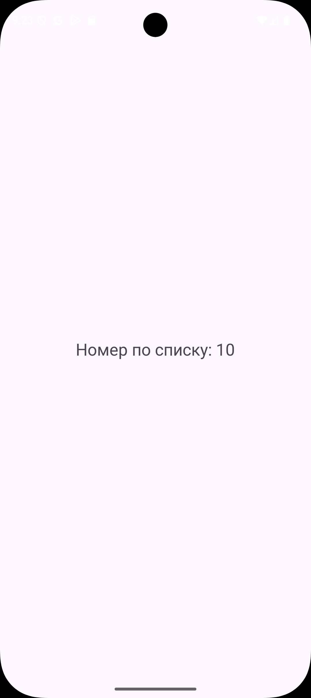
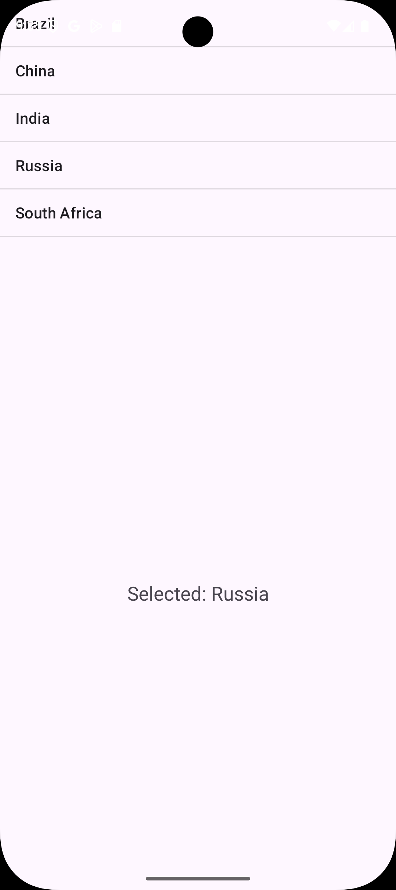
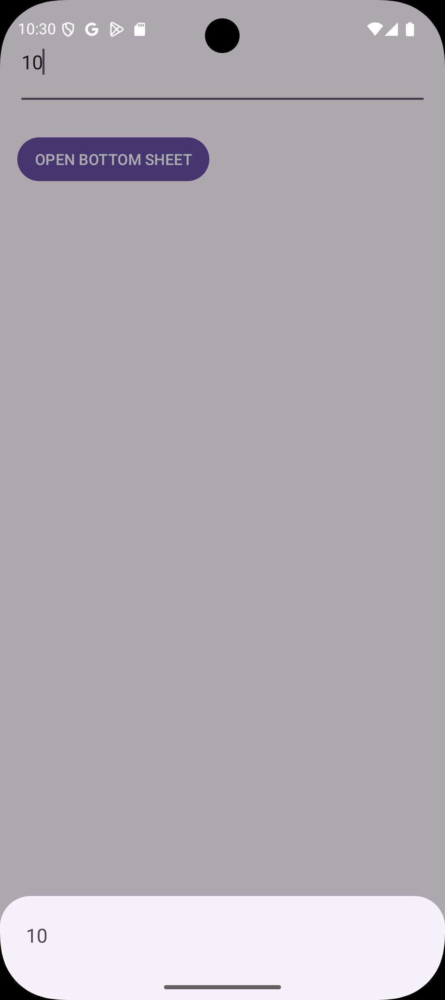

# Практическая работа №6

## 1. ЗНАКОМСТВО С FRAGMENT

​	Был создан новый модуль FragmentApp. 

BlankFragment.java— фрагмент, который принимает из аргументов номер по списку и показывает его в TextView.

```java
public class BlankFragment extends Fragment {

    @Override
    public View onCreateView(LayoutInflater inflater,
                             ViewGroup container,
                             Bundle savedInstanceState) {
        Log.d(BlankFragment.class.getSimpleName(), "onCreateView");
        View view   =  inflater.inflate(R.layout.fragment_blank,  container, false);
        return  view;
    }

    @Override
    public void onViewCreated(@NonNull View view, Bundle savedInstanceState) {
        int numberStudent = requireArguments().getInt("my_number_student", 0);
        Log.d(BlankFragment.class.getSimpleName(), String.valueOf(numberStudent));
        TextView tv = view.findViewById(R.id.textNumber);
        tv.setText("Номер по списку: " + numberStudent);
    }
}
```

MainActivity.java— создаёт Bundle с номером и добавляет BlankFragment в контейнер.

```java
public class MainActivity extends AppCompatActivity {

    @Override protected void onCreate(Bundle savedInstanceState) {
        super.onCreate(savedInstanceState);
        setContentView(R.layout.activity_main);

        if (savedInstanceState == null) {
            Bundle args = new Bundle();
            args.putInt("my_number_student", 10);

            getSupportFragmentManager().beginTransaction()
                    .setReorderingAllowed(true)
                    .add(R.id.fragment_container_view, BlankFragment.class, args)
                    .commit();
        }
    }
}
```

activity_main.xml — контейнер для фрагмента.

```xml
<?xml version="1.0" encoding="utf-8"?>
<androidx.fragment.app.FragmentContainerView
    xmlns:android="http://schemas.android.com/apk/res/android"
    android:id="@+id/fragment_container_view"
    android:layout_width="match_parent"
    android:layout_height="match_parent"/>
```

fragment_blank.xml— простая разметка для отображения номера.

```xml
<?xml version="1.0" encoding="utf-8"?>
<FrameLayout xmlns:android="http://schemas.android.com/apk/res/android"
    android:layout_width="match_parent"
    android:layout_height="match_parent">

    <TextView
        android:id="@+id/textNumber"
        android:layout_width="wrap_content"
        android:layout_height="wrap_content"
        android:text="Номер по списку: —"
        android:textSize="22sp"
        android:layout_gravity="center"/>
</FrameLayout>
```

Демонстрация работы приложения



## 2. FRAGMENT MANAGER

​	Был создан новый модуль FragmentManagerApp. В нём два фрагмента обмениваются данными через общий ViewModel.

ShareViewModel.java — общий ViewModel с LiveData для обмена значением между фрагментами.

```java
public class ShareViewModel extends ViewModel {
    private final MutableLiveData<String> selectedItem = new MutableLiveData<>();
    public void setSomeValue(String item) { selectedItem.setValue(item); }
    public LiveData<String> getSomeValue() { return selectedItem; }
}
```

MainActivity.java — создаёт ShareViewModel и размещает оба фрагмента в разных контейнерах.

```java
public class MainActivity extends AppCompatActivity {
    private ShareViewModel viewModel;

    @Override protected void onCreate(Bundle savedInstanceState) {
        super.onCreate(savedInstanceState);
        setContentView(R.layout.activity_main_two);

        viewModel = new ViewModelProvider(this).get(ShareViewModel.class);
        viewModel.getSomeValue().observe(this, item -> {
        });

        if (savedInstanceState == null) {
            getSupportFragmentManager().beginTransaction()
                    .setReorderingAllowed(true)
                    .add(R.id.headerContainerView, HeaderFragment.class, null)
                    .add(R.id.detailsContainerView, DetailsFragment.class, null)
                    .commit();
        }
    }
}
```

HeaderFragment.java— показывает список и при клике отправляет выбранное значение в ShareViewModel.

```java
public class HeaderFragment extends Fragment {
    private ShareViewModel viewModel;

    @Nullable
    @Override
    public View onCreateView(@NonNull LayoutInflater inflater, ViewGroup container,
                             Bundle savedInstanceState) {
        return inflater.inflate(R.layout.fragment_header, container, false);
    }

    @Override public void onViewCreated(@NonNull View view, @Nullable Bundle savedInstanceState) {
        viewModel = new ViewModelProvider(requireActivity()).get(ShareViewModel.class);

        ListView listView = view.findViewById(R.id.listView);
        String[] countries = {"Brazil", "China", "India", "Russia", "South Africa"};
        listView.setAdapter(new ArrayAdapter<>(requireContext(),
                android.R.layout.simple_list_item_1, countries));

        listView.setOnItemClickListener((AdapterView<?> parent, View v, int pos, long id) ->
                viewModel.setSomeValue(countries[pos]));
    }
}
```

DetailsFragment.java— подписывается на LiveData и отображает выбранный элемент.

```java
public class DetailsFragment extends Fragment {
    private ShareViewModel viewModel;

    @Nullable @Override
    public View onCreateView(@NonNull LayoutInflater inflater, ViewGroup container,
                             Bundle savedInstanceState) {
        return inflater.inflate(R.layout.fragment_details, container, false);
    }

    @Override public void onViewCreated(@NonNull View view, @Nullable Bundle savedInstanceState) {
        viewModel = new ViewModelProvider(requireActivity()).get(ShareViewModel.class);
        TextView tv = view.findViewById(R.id.textDetails);

        viewModel.getSomeValue().observe(getViewLifecycleOwner(), data -> {
            Log.d(DetailsFragment.class.getSimpleName(), data);
            tv.setText("Selected: " + data);
        });
    }
}
```

activity_main_two.xml — два контейнера: верхний для списка, нижний для деталей.

```xml
<?xml version="1.0" encoding="utf-8"?>
<androidx.appcompat.widget.LinearLayoutCompat
    xmlns:android="http://schemas.android.com/apk/res/android"
    android:orientation="vertical"
    android:layout_width="match_parent"
    android:layout_height="match_parent">

    <FrameLayout
        android:id="@+id/headerContainerView"
        android:layout_width="match_parent"
        android:layout_height="0dp"
        android:layout_weight="1"/>

    <FrameLayout
        android:id="@+id/detailsContainerView"
        android:layout_width="match_parent"
        android:layout_height="0dp"
        android:layout_weight="2"/>
</androidx.appcompat.widget.LinearLayoutCompat>
```

fragment_header.xml — ListView для списка.

```xml
<?xml version="1.0" encoding="utf-8"?>
<ListView xmlns:android="http://schemas.android.com/apk/res/android"
    android:id="@+id/listView"
    android:layout_width="match_parent"
    android:layout_height="match_parent"/>
```

fragment_details.xml — TextView для показа выбранного значения.

```xml
<?xml version="1.0" encoding="utf-8"?>
<TextView xmlns:android="http://schemas.android.com/apk/res/android"
    android:id="@+id/textDetails"
    android:layout_width="match_parent"
    android:layout_height="match_parent"
    android:gravity="center"
    android:textSize="20sp"/>
```

​	Демонстрация работы приложения



## 3. FRAGMENT RESULT API

​	Был создан новый модуль FragmentResultAPI. Передаём данные из одного фрагмента в другой через Fragment Result API и показываем в BottomSheetDialogFragment.

activity_main.xml — контейнер для размещения стартового фрагмента.

```xml
<?xml version="1.0" encoding="utf-8"?>
<FrameLayout xmlns:android="http://schemas.android.com/apk/res/android"
    android:id="@+id/fragment_container_view"
    android:layout_width="match_parent"
    android:layout_height="match_parent" />
```

MainActivity.java — подписка на результат по ключу requestKey и старт DataFragment.

```java
public class MainActivity extends AppCompatActivity {

    @Override
    protected void onCreate(Bundle savedInstanceState) {
        super.onCreate(savedInstanceState);
        setContentView(R.layout.activity_main);

        getSupportFragmentManager().setFragmentResultListener(
                "requestKey",
                this,
                new FragmentResultListener() {
                    @Override
                    public void onFragmentResult(@NonNull String requestKey, @NonNull Bundle bundle) {
                        String result = bundle.getString("key");
                        Log.d("MainActivity", "I'm MainActivity. Result = " + result);
                    }
                }
        );

        if (savedInstanceState == null) {
            getSupportFragmentManager()
                    .beginTransaction()
                    .replace(R.id.fragment_container_view, new DataFragment())
                    .commit();
        }
    }
}
```

fragment_data.xml — поле ввода и кнопка «Открыть Bottom Sheet».

```xml
<?xml version="1.0" encoding="utf-8"?>
<LinearLayout xmlns:android="http://schemas.android.com/apk/res/android"
    android:padding="16dp"
    android:orientation="vertical"
    android:layout_width="match_parent"
    android:layout_height="match_parent">

    <EditText
        android:id="@+id/editTextInfo"
        android:layout_width="match_parent"
        android:layout_height="83dp"
        android:hint="Enter data for Bottom Sheet" />

    <Button
        android:id="@+id/buttonOpenBottomSheet"
        android:layout_width="wrap_content"
        android:layout_height="wrap_content"
        android:text="OPEN BOTTOM SHEET"
        android:layout_marginTop="24dp"
        android:paddingLeft="16dp"
        android:paddingRight="16dp" />
</LinearLayout>
```

DataFragment.java — отправляет введённый текст через setFragmentResult и показывает BottomSheetFragment.

```java
public class DataFragment extends Fragment {

    @Nullable
    @Override
    public View onCreateView(@NonNull LayoutInflater inflater,
                             @Nullable ViewGroup container,
                             @Nullable Bundle savedInstanceState) {
        return inflater.inflate(R.layout.fragment_data, container, false);
    }

    @Override
    public void onViewCreated(@NonNull View view, @Nullable Bundle savedInstanceState) {
        EditText editText = view.findViewById(R.id.editTextInfo);
        Button btnOpen = view.findViewById(R.id.buttonOpenBottomSheet);

        btnOpen.setOnClickListener(v -> {
            String text = editText.getText().toString();

            Bundle bundle = new Bundle();
            bundle.putString("key", text);

            getChildFragmentManager().setFragmentResult("requestKey", bundle);

            BottomSheetFragment bottom = new BottomSheetFragment();
            bottom.show(getChildFragmentManager(), "ModalBottomSheet");
        });
    }
}
```

fragment_bottom_sheet.xml — простая разметка нижнего листа с TextView для результата. 

```xml
<?xml version="1.0" encoding="utf-8"?>
<LinearLayout xmlns:android="http://schemas.android.com/apk/res/android"
    android:padding="24dp"
    android:orientation="vertical"
    android:layout_width="match_parent"
    android:layout_height="wrap_content">

    <TextView
        android:id="@+id/textResult"
        android:layout_width="match_parent"
        android:layout_height="wrap_content"
        android:text="Result will be here"
        android:textSize="18sp" />
</LinearLayout>
```

BottomSheetFragment.java — слушает результат с тем же requestKey и показывает его в TextView.

```java
public class BottomSheetFragment extends BottomSheetDialogFragment {

    private String lastValue = "";

    @Override
    public void onCreate(@Nullable Bundle savedInstanceState) {
        super.onCreate(savedInstanceState);

        getParentFragmentManager().setFragmentResultListener(
                "requestKey",
                this,
                new FragmentResultListener() {
                    @Override
                    public void onFragmentResult(@NonNull String requestKey, @NonNull Bundle bundle) {
                        String text = bundle.getString("key");
                        lastValue = (text == null) ? "" : text;
                        Log.d(BottomSheetFragment.class.getSimpleName(), "Get text " + lastValue);

                        View v = getView();
                        if (v != null) {
                            TextView tv = v.findViewById(R.id.textResult);
                            tv.setText(lastValue);
                        }
                    }
                }
        );
    }

    @Nullable
    @Override
    public View onCreateView(@NonNull LayoutInflater inflater,
                             @Nullable ViewGroup container,
                             @Nullable Bundle savedInstanceState) {
        return inflater.inflate(R.layout.fragment_bottom_sheet, container, false);
    }

    @Override
    public void onViewCreated(@NonNull View view, @Nullable Bundle savedInstanceState) {
        TextView tv = view.findViewById(R.id.textResult);
        tv.setText(lastValue);
    }
}
```

​	Демонстрация работы приложения



## 4. КОНТРОЛЬНОЕ ЗАДАНИЕ