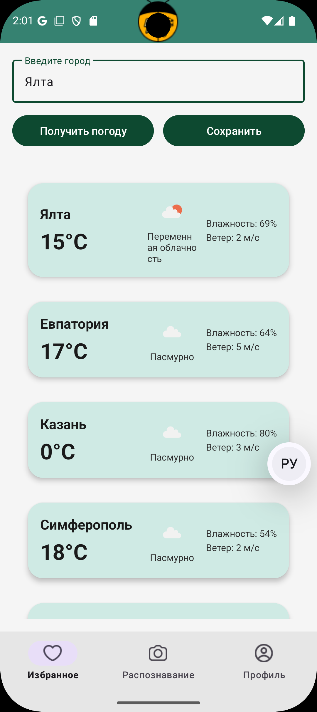
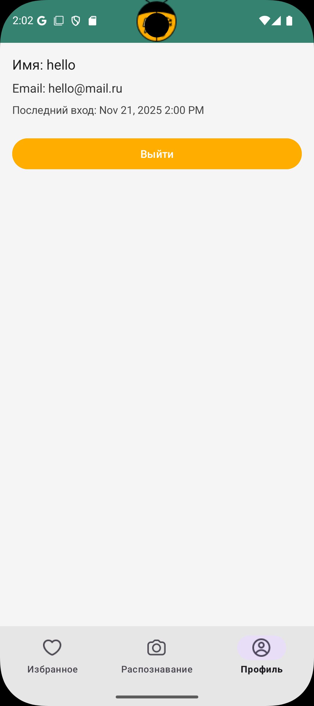
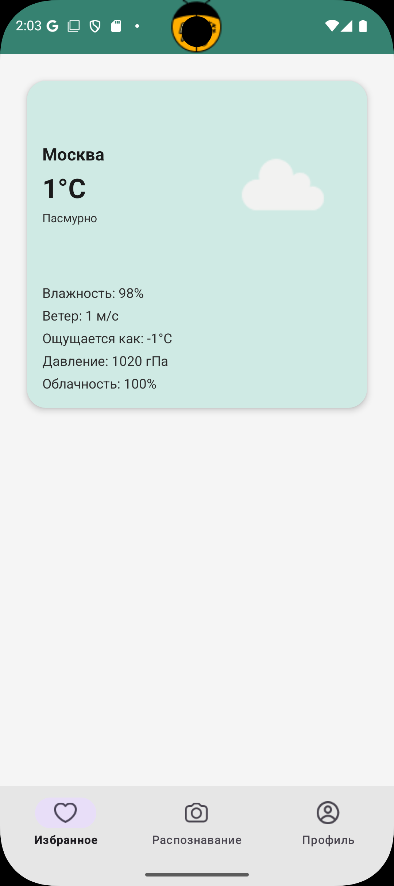

# Практическая работа №6

## 1. ЗНАКОМСТВО С FRAGMENT

​	Был создан новый модуль FragmentApp. 

BlankFragment.java— фрагмент, который принимает из аргументов номер по списку и показывает его в TextView.

```java
public class BlankFragment extends Fragment {

    @Override
    public View onCreateView(LayoutInflater inflater,
                             ViewGroup container,
                             Bundle savedInstanceState) {
        Log.d(BlankFragment.class.getSimpleName(), "onCreateView");
        View view   =  inflater.inflate(R.layout.fragment_blank,  container, false);
        return  view;
    }

    @Override
    public void onViewCreated(@NonNull View view, Bundle savedInstanceState) {
        int numberStudent = requireArguments().getInt("my_number_student", 0);
        Log.d(BlankFragment.class.getSimpleName(), String.valueOf(numberStudent));
        TextView tv = view.findViewById(R.id.textNumber);
        tv.setText("Номер по списку: " + numberStudent);
    }
}
```

MainActivity.java— создаёт Bundle с номером и добавляет BlankFragment в контейнер.

```java
public class MainActivity extends AppCompatActivity {

    @Override protected void onCreate(Bundle savedInstanceState) {
        super.onCreate(savedInstanceState);
        setContentView(R.layout.activity_main);

        if (savedInstanceState == null) {
            Bundle args = new Bundle();
            args.putInt("my_number_student", 10);

            getSupportFragmentManager().beginTransaction()
                    .setReorderingAllowed(true)
                    .add(R.id.fragment_container_view, BlankFragment.class, args)
                    .commit();
        }
    }
}
```

activity_main.xml — контейнер для фрагмента.

```xml
<?xml version="1.0" encoding="utf-8"?>
<androidx.fragment.app.FragmentContainerView
    xmlns:android="http://schemas.android.com/apk/res/android"
    android:id="@+id/fragment_container_view"
    android:layout_width="match_parent"
    android:layout_height="match_parent"/>
```

fragment_blank.xml— простая разметка для отображения номера.

```xml
<?xml version="1.0" encoding="utf-8"?>
<FrameLayout xmlns:android="http://schemas.android.com/apk/res/android"
    android:layout_width="match_parent"
    android:layout_height="match_parent">

    <TextView
        android:id="@+id/textNumber"
        android:layout_width="wrap_content"
        android:layout_height="wrap_content"
        android:text="Номер по списку: —"
        android:textSize="22sp"
        android:layout_gravity="center"/>
</FrameLayout>
```

Демонстрация работы приложения


## 2. FRAGMENT MANAGER

​	Был создан новый модуль FragmentManagerApp. В нём два фрагмента обмениваются данными через общий ViewModel.

ShareViewModel.java — общий ViewModel с LiveData для обмена значением между фрагментами.

```java
public class ShareViewModel extends ViewModel {
    private final MutableLiveData<String> selectedItem = new MutableLiveData<>();
    public void setSomeValue(String item) { selectedItem.setValue(item); }
    public LiveData<String> getSomeValue() { return selectedItem; }
}
```

MainActivity.java — создаёт ShareViewModel и размещает оба фрагмента в разных контейнерах.

```java
public class MainActivity extends AppCompatActivity {
    private ShareViewModel viewModel;

    @Override protected void onCreate(Bundle savedInstanceState) {
        super.onCreate(savedInstanceState);
        setContentView(R.layout.activity_main_two);

        viewModel = new ViewModelProvider(this).get(ShareViewModel.class);
        viewModel.getSomeValue().observe(this, item -> {
        });

        if (savedInstanceState == null) {
            getSupportFragmentManager().beginTransaction()
                    .setReorderingAllowed(true)
                    .add(R.id.headerContainerView, HeaderFragment.class, null)
                    .add(R.id.detailsContainerView, DetailsFragment.class, null)
                    .commit();
        }
    }
}
```

HeaderFragment.java— показывает список и при клике отправляет выбранное значение в ShareViewModel.

```java
public class HeaderFragment extends Fragment {
    private ShareViewModel viewModel;

    @Nullable
    @Override
    public View onCreateView(@NonNull LayoutInflater inflater, ViewGroup container,
                             Bundle savedInstanceState) {
        return inflater.inflate(R.layout.fragment_header, container, false);
    }

    @Override public void onViewCreated(@NonNull View view, @Nullable Bundle savedInstanceState) {
        viewModel = new ViewModelProvider(requireActivity()).get(ShareViewModel.class);

        ListView listView = view.findViewById(R.id.listView);
        String[] countries = {"Brazil", "China", "India", "Russia", "South Africa"};
        listView.setAdapter(new ArrayAdapter<>(requireContext(),
                android.R.layout.simple_list_item_1, countries));

        listView.setOnItemClickListener((AdapterView<?> parent, View v, int pos, long id) ->
                viewModel.setSomeValue(countries[pos]));
    }
}
```

DetailsFragment.java— подписывается на LiveData и отображает выбранный элемент.

```java
public class DetailsFragment extends Fragment {
    private ShareViewModel viewModel;

    @Nullable @Override
    public View onCreateView(@NonNull LayoutInflater inflater, ViewGroup container,
                             Bundle savedInstanceState) {
        return inflater.inflate(R.layout.fragment_details, container, false);
    }

    @Override public void onViewCreated(@NonNull View view, @Nullable Bundle savedInstanceState) {
        viewModel = new ViewModelProvider(requireActivity()).get(ShareViewModel.class);
        TextView tv = view.findViewById(R.id.textDetails);

        viewModel.getSomeValue().observe(getViewLifecycleOwner(), data -> {
            Log.d(DetailsFragment.class.getSimpleName(), data);
            tv.setText("Selected: " + data);
        });
    }
}
```

activity_main_two.xml — два контейнера: верхний для списка, нижний для деталей.

```xml
<?xml version="1.0" encoding="utf-8"?>
<androidx.appcompat.widget.LinearLayoutCompat
    xmlns:android="http://schemas.android.com/apk/res/android"
    android:orientation="vertical"
    android:layout_width="match_parent"
    android:layout_height="match_parent">

    <FrameLayout
        android:id="@+id/headerContainerView"
        android:layout_width="match_parent"
        android:layout_height="0dp"
        android:layout_weight="1"/>

    <FrameLayout
        android:id="@+id/detailsContainerView"
        android:layout_width="match_parent"
        android:layout_height="0dp"
        android:layout_weight="2"/>
</androidx.appcompat.widget.LinearLayoutCompat>
```

fragment_header.xml — ListView для списка.

```xml
<?xml version="1.0" encoding="utf-8"?>
<ListView xmlns:android="http://schemas.android.com/apk/res/android"
    android:id="@+id/listView"
    android:layout_width="match_parent"
    android:layout_height="match_parent"/>
```

fragment_details.xml — TextView для показа выбранного значения.

```xml
<?xml version="1.0" encoding="utf-8"?>
<TextView xmlns:android="http://schemas.android.com/apk/res/android"
    android:id="@+id/textDetails"
    android:layout_width="match_parent"
    android:layout_height="match_parent"
    android:gravity="center"
    android:textSize="20sp"/>
```

​	Демонстрация работы приложения


## 3. FRAGMENT RESULT API

​	Был создан новый модуль FragmentResultAPI. Передаём данные из одного фрагмента в другой через Fragment Result API и показываем в BottomSheetDialogFragment.

activity_main.xml — контейнер для размещения стартового фрагмента.

```xml
<?xml version="1.0" encoding="utf-8"?>
<FrameLayout xmlns:android="http://schemas.android.com/apk/res/android"
    android:id="@+id/fragment_container_view"
    android:layout_width="match_parent"
    android:layout_height="match_parent" />
```

MainActivity.java — подписка на результат по ключу requestKey и старт DataFragment.

```java
public class MainActivity extends AppCompatActivity {

    @Override
    protected void onCreate(Bundle savedInstanceState) {
        super.onCreate(savedInstanceState);
        setContentView(R.layout.activity_main);

        getSupportFragmentManager().setFragmentResultListener(
                "requestKey",
                this,
                new FragmentResultListener() {
                    @Override
                    public void onFragmentResult(@NonNull String requestKey, @NonNull Bundle bundle) {
                        String result = bundle.getString("key");
                        Log.d("MainActivity", "I'm MainActivity. Result = " + result);
                    }
                }
        );

        if (savedInstanceState == null) {
            getSupportFragmentManager()
                    .beginTransaction()
                    .replace(R.id.fragment_container_view, new DataFragment())
                    .commit();
        }
    }
}
```

fragment_data.xml — поле ввода и кнопка «Открыть Bottom Sheet».

```xml
<?xml version="1.0" encoding="utf-8"?>
<LinearLayout xmlns:android="http://schemas.android.com/apk/res/android"
    android:padding="16dp"
    android:orientation="vertical"
    android:layout_width="match_parent"
    android:layout_height="match_parent">

    <EditText
        android:id="@+id/editTextInfo"
        android:layout_width="match_parent"
        android:layout_height="83dp"
        android:hint="Enter data for Bottom Sheet" />

    <Button
        android:id="@+id/buttonOpenBottomSheet"
        android:layout_width="wrap_content"
        android:layout_height="wrap_content"
        android:text="OPEN BOTTOM SHEET"
        android:layout_marginTop="24dp"
        android:paddingLeft="16dp"
        android:paddingRight="16dp" />
</LinearLayout>
```

DataFragment.java — отправляет введённый текст через setFragmentResult и показывает BottomSheetFragment.

```java
public class DataFragment extends Fragment {

    @Nullable
    @Override
    public View onCreateView(@NonNull LayoutInflater inflater,
                             @Nullable ViewGroup container,
                             @Nullable Bundle savedInstanceState) {
        return inflater.inflate(R.layout.fragment_data, container, false);
    }

    @Override
    public void onViewCreated(@NonNull View view, @Nullable Bundle savedInstanceState) {
        EditText editText = view.findViewById(R.id.editTextInfo);
        Button btnOpen = view.findViewById(R.id.buttonOpenBottomSheet);

        btnOpen.setOnClickListener(v -> {
            String text = editText.getText().toString();

            Bundle bundle = new Bundle();
            bundle.putString("key", text);

            getChildFragmentManager().setFragmentResult("requestKey", bundle);

            BottomSheetFragment bottom = new BottomSheetFragment();
            bottom.show(getChildFragmentManager(), "ModalBottomSheet");
        });
    }
}
```

fragment_bottom_sheet.xml — простая разметка нижнего листа с TextView для результата. 

```xml
<?xml version="1.0" encoding="utf-8"?>
<LinearLayout xmlns:android="http://schemas.android.com/apk/res/android"
    android:padding="24dp"
    android:orientation="vertical"
    android:layout_width="match_parent"
    android:layout_height="wrap_content">

    <TextView
        android:id="@+id/textResult"
        android:layout_width="match_parent"
        android:layout_height="wrap_content"
        android:text="Result will be here"
        android:textSize="18sp" />
</LinearLayout>
```

BottomSheetFragment.java — слушает результат с тем же requestKey и показывает его в TextView.

```java
public class BottomSheetFragment extends BottomSheetDialogFragment {

    private String lastValue = "";

    @Override
    public void onCreate(@Nullable Bundle savedInstanceState) {
        super.onCreate(savedInstanceState);

        getParentFragmentManager().setFragmentResultListener(
                "requestKey",
                this,
                new FragmentResultListener() {
                    @Override
                    public void onFragmentResult(@NonNull String requestKey, @NonNull Bundle bundle) {
                        String text = bundle.getString("key");
                        lastValue = (text == null) ? "" : text;
                        Log.d(BottomSheetFragment.class.getSimpleName(), "Get text " + lastValue);

                        View v = getView();
                        if (v != null) {
                            TextView tv = v.findViewById(R.id.textResult);
                            tv.setText(lastValue);
                        }
                    }
                }
        );
    }

    @Nullable
    @Override
    public View onCreateView(@NonNull LayoutInflater inflater,
                             @Nullable ViewGroup container,
                             @Nullable Bundle savedInstanceState) {
        return inflater.inflate(R.layout.fragment_bottom_sheet, container, false);
    }

    @Override
    public void onViewCreated(@NonNull View view, @Nullable Bundle savedInstanceState) {
        TextView tv = view.findViewById(R.id.textResult);
        tv.setText(lastValue);
    }
}
```

​	Демонстрация работы приложения


## 4. КОНТРОЛЬНОЕ ЗАДАНИЕ

**Навигация и фрагменты**

​	MainActivity.java хранит BottomNavigationView; по выбору пункта меню делает replace(...) фрагментов; использует FragmentManager - это основа навигации между экранами;

```java
public class MainActivity extends AppCompatActivity {

    private WeatherViewModel vm;
    private UserRepository userRepository;

    @Override
    protected void onCreate(Bundle savedInstanceState) {
        super.onCreate(savedInstanceState);

        userRepository = new UserRepositoryImpl(this);

        if (!userRepository.isUserLoggedIn()) {
            goHomeAndFinish();
            return;
        }

        setContentView(R.layout.activity_main_nav);

        vm = new ViewModelProvider(this, new ViewModelFactory(this))
                .get(WeatherViewModel.class);

        if (savedInstanceState == null) {
            replace(new FavoritesFragment());
        }

        BottomNavigationView bottom = findViewById(R.id.bottomNav);
        bottom.setOnItemSelectedListener(item -> {
            int id = item.getItemId();
            if (id == R.id.menu_favorites) {
                replace(new FavoritesFragment());
                return true;
            } else if (id == R.id.menu_recognition) {
                replace(new RecognitionFragment());
                return true;
            } else if (id == R.id.menu_profile) {
                replace(new ProfileFragment());
                return true;
            }
            return false;
        });
    }

    @Override
    protected void onResume() {
        super.onResume();
        if (!userRepository.isUserLoggedIn()) {
            goHomeAndFinish();
        }
    }

    private void goHomeAndFinish() {
        Intent i = new Intent(this, HomeActivity.class);
        i.setFlags(Intent.FLAG_ACTIVITY_NEW_TASK | Intent.FLAG_ACTIVITY_CLEAR_TASK);
        startActivity(i);
        finish();
    }

    private void replace(@NonNull Fragment f) {
        getSupportFragmentManager()
                .beginTransaction()
                .replace(R.id.fragmentContainer, f)
                .commit();
    }
}
```

​	activity_main_nav.xml - разметка контейнера для фрагментов и нижней навигации.

```xml
<?xml version="1.0" encoding="utf-8"?>
<androidx.constraintlayout.widget.ConstraintLayout
    xmlns:android="http://schemas.android.com/apk/res/android"
    xmlns:app="http://schemas.android.com/apk/res-auto"
    android:layout_width="match_parent"
    android:layout_height="match_parent"
    android:background="#F5F5F5">

    <com.google.android.material.appbar.MaterialToolbar
        android:id="@+id/topAppBar"
        android:layout_width="0dp"
        android:layout_height="56dp"
        android:background="@color/wt_primary"
        android:backgroundTint="#368271"
        app:layout_constraintEnd_toEndOf="parent"
        app:layout_constraintStart_toStartOf="parent"
        app:layout_constraintTop_toTopOf="parent">

        <ImageView
            android:layout_width="wrap_content"
            android:layout_height="match_parent"
            android:layout_gravity="center"
            android:adjustViewBounds="true"
            android:contentDescription="@string/app_name"
            android:src="@drawable/app_logo" />
    </com.google.android.material.appbar.MaterialToolbar>

    <FrameLayout
        android:id="@+id/fragmentContainer"
        android:layout_width="0dp"
        android:layout_height="0dp"
        app:layout_constraintTop_toBottomOf="@id/topAppBar"
        app:layout_constraintBottom_toTopOf="@id/bottomNav"
        app:layout_constraintStart_toStartOf="parent"
        app:layout_constraintEnd_toEndOf="parent"/>

    <com.google.android.material.bottomnavigation.BottomNavigationView
        android:id="@+id/bottomNav"
        android:layout_width="0dp"
        android:layout_height="wrap_content"
        android:background="#E6E6E6"
        android:backgroundTint="#FFFFFF"
        app:layout_constraintBottom_toBottomOf="parent"
        app:layout_constraintEnd_toEndOf="parent"
        app:layout_constraintStart_toStartOf="parent"
        app:menu="@layout/bottom_nav_menu" />
</androidx.constraintlayout.widget.ConstraintLayout>
```

​	bottom_nav_menu.xml - задаёт пункты Избранное / Распознавание / Профиль

```xml
<?xml version="1.0" encoding="utf-8"?>
<menu xmlns:android="http://schemas.android.com/apk/res/android">
    <item
        android:id="@+id/menu_favorites"
        android:title="Избранное"
        android:icon="@drawable/ic_heart"/>
    <item
        android:id="@+id/menu_recognition"
        android:title="Распознавание"
        android:icon="@drawable/ic_camera"/>
    <item
        android:id="@+id/menu_profile"
        android:title="Профиль"
        android:icon="@drawable/ic_profile"/>
</menu>

```

​	WeatherViewModel.java - хранит состояние UI: LiveData списков, статуса загрузки, последней погоды;

```java
public class WeatherViewModel extends ViewModel {

    private final UserRepository userRepository;
    private final WeatherRepository weatherRepository;

    private final MutableLiveData<String> statusText  = new MutableLiveData<>("");
    private final MutableLiveData<Boolean> isLoading  = new MutableLiveData<>(false);

    private final MutableLiveData<List<WeatherItem>> weatherList = new MutableLiveData<>();
    private final MutableLiveData<WeatherItem> latestItem = new MutableLiveData<>();

    private final MediatorLiveData<String> mergedSource = new MediatorLiveData<>();

    public WeatherViewModel(UserRepository userRepository,
                            WeatherRepository weatherRepository) {
        this.userRepository = userRepository;
        this.weatherRepository = weatherRepository;

        weatherList.setValue(weatherRepository.loadStubWeatherList());

        FakeDbDataSourceWeather db = new FakeDbDataSourceWeather(userRepository, weatherRepository);
        LiveData<String> dbSource = db.loadLocalWeatherLine();
        FakeNetworkDataSourceWeather net = new FakeNetworkDataSourceWeather();
        LiveData<String> netSource = net.fetchWeatherLine();

        mergedSource.addSource(dbSource, s -> mergedSource.setValue("DB: " + s));
        mergedSource.addSource(netSource, s -> mergedSource.setValue("NET: " + s));
    }

    public LiveData<String> getStatusText()    { return statusText;  }
    public LiveData<String> getMergedSource()  { return mergedSource;}
    public LiveData<Boolean> getIsLoading()    { return isLoading;   }
    public LiveData<List<WeatherItem>> getWeatherList() { return weatherList; }
    public LiveData<WeatherItem> getLatestItem() { return latestItem; }

    public void getWeather(String city) {
        if (city == null || city.trim().isEmpty()) {
            statusText.setValue("Введите название города");
            return;
        }
        statusText.setValue("Загрузка погоды для " + city + "...");
        isLoading.setValue(true);

        weatherRepository.fetchWeatherRemote(city, new WeatherRepository.WeatherRemoteCallback() {
            @Override
            public void onSuccess(WeatherItem item) {
                latestItem.postValue(item);
                statusText.postValue("");
                isLoading.postValue(false);
            }

            @Override
            public void onError(String message) {
                // Локальный фолбэк через use-case
                Weather w = new GetWeatherByCityUseCase(weatherRepository).execute(city);
                WeatherItem fallback = new WeatherItem(
                        w.getCity(),
                        w.getTemperature() + "°C",
                        "Локальные данные",
                        null,   // iconName
                        null,   // iconUrl
                        "",     // humidity
                        "",     // wind
                        "",     // feelsLike
                        "",     // pressure
                        ""      // clouds
                );
                latestItem.postValue(fallback);
                statusText.postValue(message);
                isLoading.postValue(false);
            }
        });
    }


    public void saveCity(String city) {
        if (city == null || city.trim().isEmpty()) {
            statusText.setValue("Введите город для сохранения");
            return;
        }
        userRepository.saveFavoriteCity(city);
        statusText.setValue("Город " + city + " сохранён в избранное");
    }

    public void recognizeWeather() {
        String result = new RecognizeWeatherFromPhotoUseCase(weatherRepository).execute();
        statusText.setValue(String.format("Анализ фото: %s", result));
    }

    public void logout() {
        new LogoutUseCase(userRepository).execute();
        statusText.setValue("Вы вышли из системы");
    }
}
```

​	ViewModelFactory.java - передаёт зависимости в WeatherViewModel.

```java
public class ViewModelFactory implements ViewModelProvider.Factory {

    private final Context appContext;

    public ViewModelFactory(Context context) {
        this.appContext = context.getApplicationContext();
    }

    @SuppressWarnings("unchecked")
    @NonNull
    @Override
    public <T extends ViewModel> T create(@NonNull Class<T> modelClass) {
        UserRepository userRepo = new UserRepositoryImpl(appContext);
        WeatherRepository weatherRepo = new WeatherRepositoryImpl();
        return (T) new WeatherViewModel(userRepo, weatherRepo);
    }
}
```

​	**1. Экран избранного (список)**

​	FavoritesFragment.java реализует список из предыдущей практики через фрагмент и ViewModel.

```java
public class FavoritesFragment extends Fragment {

    private WeatherViewModel vm;

    private EditText editTextCity;
    private TextView textStatus;
    private RecyclerView recycler;
    private WeatherListAdapter adapter;

    @Nullable
    @Override
    public View onCreateView(@NonNull LayoutInflater inflater,
                             @Nullable ViewGroup container,
                             @Nullable Bundle savedInstanceState) {
        return inflater.inflate(R.layout.fragment_favorites, container, false);
    }

    @Override
    public void onViewCreated(@NonNull View v, @Nullable Bundle savedInstanceState) {
        super.onViewCreated(v, savedInstanceState);

        vm = new ViewModelProvider(requireActivity(), new ViewModelFactory(requireContext()))
                .get(WeatherViewModel.class);

        editTextCity = v.findViewById(R.id.editTextCity);
        textStatus   = v.findViewById(R.id.textViewStatus);
        recycler     = v.findViewById(R.id.recyclerWeather);

        adapter = new WeatherListAdapter();
        recycler.setLayoutManager(new LinearLayoutManager(requireContext()));
        recycler.setAdapter(adapter);

        // ==== клик по карточке ====
        adapter.setOnItemClickListener(item -> {
            WeatherDetailFragment fragment = WeatherDetailFragment.newInstance(item);
            requireActivity().getSupportFragmentManager()
                    .beginTransaction()
                    .setReorderingAllowed(true)
                    .replace(R.id.fragmentContainer, fragment)
                    .addToBackStack(null)
                    .commit();
        });

        vm.getWeatherList().observe(getViewLifecycleOwner(), adapter::setItems);
        vm.getStatusText().observe(getViewLifecycleOwner(), s ->
                textStatus.setText(s == null ? "" : s)
        );

        vm.getLatestItem().observe(getViewLifecycleOwner(), item -> {
            if (item != null) {
                adapter.addFirst(item);
                recycler.scrollToPosition(0);
            }
        });

        Button btnGet = v.findViewById(R.id.buttonGetWeather);
        Button btnSave = v.findViewById(R.id.buttonSaveCity);

        btnGet.setOnClickListener(view -> {
            String city = editTextCity.getText().toString().trim();
            vm.getWeather(city);
        });

        btnSave.setOnClickListener(view -> {
            String city = editTextCity.getText().toString().trim();
            vm.saveCity(city);
        });
    }
}
```

​	fragment_favorites.xml - разметка списка.

```xml
<?xml version="1.0" encoding="utf-8"?>
<LinearLayout
    xmlns:android="http://schemas.android.com/apk/res/android"
    android:layout_width="match_parent"
    android:layout_height="match_parent"
    android:orientation="vertical"
    android:padding="16dp"
    android:background="#F5F5F5">

    <com.google.android.material.textfield.TextInputLayout
        style="@style/Widget.Material3.TextInputLayout.OutlinedBox"
        android:layout_width="match_parent"
        android:layout_height="wrap_content">

        <com.google.android.material.textfield.TextInputEditText
            android:id="@+id/editTextCity"
            android:layout_width="match_parent"
            android:layout_height="wrap_content"
            android:hint="Введите город"/>
    </com.google.android.material.textfield.TextInputLayout>

    <LinearLayout
        android:layout_width="match_parent"
        android:layout_height="wrap_content"
        android:orientation="horizontal"
        android:layout_marginTop="12dp">

        <Button
            android:id="@+id/buttonGetWeather"
            android:layout_width="0dp"
            android:layout_height="48dp"
            android:layout_weight="1"
            android:text="Получить погоду"
            android:backgroundTint="#0D4930"
            android:textColor="#FFFFFF"/>

        <Space
            android:layout_width="12dp"
            android:layout_height="wrap_content"/>

        <Button
            android:id="@+id/buttonSaveCity"
            android:layout_width="0dp"
            android:layout_height="48dp"
            android:layout_weight="1"
            android:text="Сохранить"
            android:backgroundTint="#0D4930"
            android:textColor="#FFFFFF"/>
    </LinearLayout>

    <TextView
        android:id="@+id/textViewStatus"
        android:layout_width="match_parent"
        android:layout_height="wrap_content"
        android:textColor="#555555"
        android:textSize="14sp"
        android:layout_marginTop="8dp"/>

    <androidx.recyclerview.widget.RecyclerView
        android:id="@+id/recyclerWeather"
        android:layout_width="match_parent"
        android:layout_height="0dp"
        android:layout_marginTop="8dp"
        android:padding="4dp"
        android:clipToPadding="false"
        android:overScrollMode="never"
        android:layout_weight="1"/>

</LinearLayout>
```

​	

​	**2. Экран распознавания**

​	RecognitionFragment.java -  второй экран по заданию; вызывает распознавание/получение погоды по фото через ViewModel; отражает результат.

```java
public class RecognitionFragment extends Fragment {

    @Nullable @Override
    public View onCreateView(@NonNull LayoutInflater inflater,
                             @Nullable ViewGroup container,
                             @Nullable Bundle savedInstanceState) {
        return inflater.inflate(R.layout.fragment_recognition, container, false);
    }
}
```

​	**3. Экран профиля**

​	ProfileFragment.java - читает данные пользователя (email/статус входа/прочее) из UserRepository или ViewModel; показывает персональный экран; содержит кнопку Выйти, которая чистит авторизацию.

```java
public class ProfileFragment extends Fragment {

    private UserRepository userRepo;

    @Nullable @Override
    public View onCreateView(@NonNull LayoutInflater inflater,
                             @Nullable ViewGroup container,
                             @Nullable Bundle savedInstanceState) {
        return inflater.inflate(R.layout.fragment_profile, container, false);
    }

    @Override
    public void onViewCreated(@NonNull View v, @Nullable Bundle savedInstanceState) {
        super.onViewCreated(v, savedInstanceState);
        userRepo = new UserRepositoryImpl(requireContext());

        TextView tvName  = v.findViewById(R.id.tvProfileName);
        TextView tvEmail = v.findViewById(R.id.tvProfileEmail);
        TextView tvLast  = v.findViewById(R.id.tvProfileLastLogin);

        Button btnLogin  = v.findViewById(R.id.buttonLogin);
        Button btnLogout = v.findViewById(R.id.buttonLogout);

        boolean logged = userRepo.isUserLoggedIn();
        if (logged) {
            User u = userRepo.getCurrentUser();
            PreferencesStorage prefs = new PreferencesStorage(requireContext());

            String name  = (u != null && u.getDisplayName() != null) ? u.getDisplayName() : prefs.getUserName();
            String email = (u != null && u.getEmail() != null) ? u.getEmail() : prefs.getUserEmail();
            long last    = prefs.getLastLogin();

            tvName.setText("Имя: " + (name == null ? "—" : name));
            tvEmail.setText("Email: " + (email == null ? "—" : email));
            String lastStr = (last == 0) ? "—" :
                    DateFormat.getDateTimeInstance(DateFormat.MEDIUM, DateFormat.SHORT)
                            .format(new Date(last));
            tvLast.setText("Последний вход: " + lastStr);

            tvName.setVisibility(View.VISIBLE);
            tvEmail.setVisibility(View.VISIBLE);
            tvLast.setVisibility(View.VISIBLE);
            btnLogout.setVisibility(View.VISIBLE);

            btnLogin.setVisibility(View.GONE);

            btnLogout.setOnClickListener(view -> {
                userRepo.logout();
                requireActivity().recreate();
            });
        } else {
            tvName.setVisibility(View.GONE);
            tvEmail.setVisibility(View.GONE);
            tvLast.setVisibility(View.GONE);
            btnLogout.setVisibility(View.GONE);

            btnLogin.setVisibility(View.VISIBLE);
            btnLogin.setOnClickListener(view -> {
                startActivity(new Intent(requireContext(), LoginActivity.class));
                requireActivity().finish();
            });
        }
    }
}
```

​	fragment_profile.xml

```xml
<?xml version="1.0" encoding="utf-8"?>
<LinearLayout
    xmlns:android="http://schemas.android.com/apk/res/android"
    android:layout_width="match_parent"
    android:layout_height="match_parent"
    android:orientation="vertical"
    android:padding="16dp"
    android:background="#F5F5F5">

    <TextView
        android:id="@+id/tvProfileName"
        android:layout_width="match_parent"
        android:layout_height="wrap_content"
        android:text="Имя: —"
        android:textSize="18sp"
        android:textColor="#1B1B1B"
        android:layout_marginBottom="8dp"/>

    <TextView
        android:id="@+id/tvProfileEmail"
        android:layout_width="match_parent"
        android:layout_height="wrap_content"
        android:text="Email: —"
        android:textSize="16sp"
        android:textColor="#333333"
        android:layout_marginBottom="8dp"/>

    <TextView
        android:id="@+id/tvProfileLastLogin"
        android:layout_width="match_parent"
        android:layout_height="wrap_content"
        android:text="Последний вход: —"
        android:textSize="14sp"
        android:textColor="#444444"
        android:layout_marginBottom="24dp"/>

    <Button
        android:id="@+id/buttonLogin"
        android:layout_width="match_parent"
        android:layout_height="48dp"
        android:text="Войти"
        android:backgroundTint="#0D4930"
        android:textColor="#FFFFFF"
        android:visibility="gone"/>

    <Button
        android:id="@+id/buttonLogout"
        android:layout_width="match_parent"
        android:layout_height="48dp"
        android:text="Выйти"
        android:backgroundTint="#FFAE00"
        android:textColor="#FFFFFF"
        android:visibility="gone"/>

</LinearLayout>
```



​	**4. Список и элементы UI**	

​	WeatherListAdapter.java - принимает список WeatherItem; создаёт карточки; обрабатывает клики (если открывать детальный экран).

```java
public class WeatherListAdapter extends RecyclerView.Adapter<WeatherListAdapter.VH> {

    private final List<WeatherItem> items = new ArrayList<>();
    private Context context;

    public interface OnItemClickListener {
        void onClick(WeatherItem item);
    }

    private OnItemClickListener listener;

    public void setOnItemClickListener(OnItemClickListener l) {
        this.listener = l;
    }

    public void setItems(List<WeatherItem> newItems) {
        items.clear();
        if (newItems != null) items.addAll(newItems);
        notifyDataSetChanged();
    }

    public void addFirst(WeatherItem item) {
        if (item == null) return;
        items.add(0, item);
        notifyItemInserted(0);
    }

    @NonNull
    @Override
    public VH onCreateViewHolder(@NonNull ViewGroup parent, int viewType) {
        context = parent.getContext();
        View v = LayoutInflater.from(context).inflate(R.layout.item_weather_card, parent, false);
        return new VH(v);
    }

    @Override
    public void onBindViewHolder(@NonNull VH h, int position) {
        WeatherItem it = items.get(position);

        h.tvCity.setText(it.getCity());
        h.tvTempBig.setText(it.getTemperature());
        h.tvCondition.setText(it.getCondition());
        h.tvHumidity.setText(it.getHumidity());
        h.tvWind.setText(it.getWind());

        String owCode = mapConditionToOwIconCode(it.getCondition());
        String url = WeatherCodeMapper.owIconUrl(owCode);

        Picasso.get()
                .load(url)
                .placeholder(R.drawable.ic)
                .error(R.drawable.ic)
                .into(h.ivWeatherIcon);

        // ==== клик по всей карточке ====
        h.itemView.setOnClickListener(v -> {
            if (listener != null) {
                listener.onClick(it);
            }
        });
    }

    @Override
    public int getItemCount() { return items.size(); }

    static class VH extends RecyclerView.ViewHolder {
        TextView tvCity, tvTempBig, tvCondition, tvHumidity, tvWind;
        ImageView ivWeatherIcon;
        VH(@NonNull View v) {
            super(v);
            tvCity        = v.findViewById(R.id.tvCity);
            tvTempBig     = v.findViewById(R.id.tvTempBig);
            tvCondition   = v.findViewById(R.id.tvCondition);
            tvHumidity    = v.findViewById(R.id.tvHumidity);
            tvWind        = v.findViewById(R.id.tvWind);
            ivWeatherIcon = v.findViewById(R.id.ivWeatherIcon);
        }
    }

    private String mapConditionToOwIconCode(String cond) {
        if (cond == null) return "03d";
        String c = cond.toLowerCase();
        if (c.contains("ясн")) return "01d";
        if (c.contains("перемен") || c.contains("небольш")) return "02d";
        if (c.contains("пасмур") || c.contains("облач")) return "03d";
        if (c.contains("туман")) return "50d";
        if (c.contains("ливн")) return "09d";
        if (c.contains("дожд")) return "10d";
        if (c.contains("гроза")) return "11d";
        if (c.contains("снег"))  return "13d";
        return "03d";
    }
}
```

​	**5. Детальный экран + back stack**

​	WeatherDetailFragment.java - демонстрация использования back stack при переходе из списка в детали.

```java
public class WeatherDetailFragment extends Fragment {

    @Nullable
    @Override
    public View onCreateView(@NonNull LayoutInflater inflater,
                             @Nullable ViewGroup container,
                             @Nullable Bundle savedInstanceState) {
        return inflater.inflate(R.layout.fragment_weather_detail, container, false);
    }

    @Override
    public void onViewCreated(@NonNull View v, @Nullable Bundle savedInstanceState) {
        Bundle args = getArguments();
        if (args == null) return;

        String city      = args.getString("city", "");
        String temp      = args.getString("temp", "");
        String cond      = args.getString("cond", "");
        String humidity  = args.getString("humidity", "");
        String wind      = args.getString("wind", "");
        String iconUrl   = args.getString("iconUrl", "");
        String feelsLike = args.getString("feelsLike", "");
        String pressure  = args.getString("pressure", "");
        String clouds    = args.getString("clouds", "");

        TextView tvCity      = v.findViewById(R.id.tvCity);
        TextView tvTempBig   = v.findViewById(R.id.tvTempBig);
        TextView tvCond      = v.findViewById(R.id.tvCondition);
        TextView tvHum       = v.findViewById(R.id.tvHumidity);
        TextView tvWind      = v.findViewById(R.id.tvWind);
        TextView tvFeelsLike = v.findViewById(R.id.tvFeelsLike);
        TextView tvPressure  = v.findViewById(R.id.tvPressure);
        TextView tvClouds    = v.findViewById(R.id.tvClouds);
        ImageView ivIcon     = v.findViewById(R.id.ivWeatherIcon);

        tvCity.setText(city);
        tvTempBig.setText(temp);
        tvCond.setText(cond);
        tvHum.setText(humidity);
        tvWind.setText(wind);

        if (!TextUtils.isEmpty(feelsLike)) tvFeelsLike.setText(feelsLike);
        if (!TextUtils.isEmpty(pressure))  tvPressure.setText(pressure);
        if (!TextUtils.isEmpty(clouds))    tvClouds.setText(clouds);

        // --- ЛОГИКА ПОДГРУЗКИ ИКОНКИ ---

        if (TextUtils.isEmpty(iconUrl)) {
            String code = mapConditionToOwIconCode(cond);
            iconUrl = WeatherCodeMapper.owIconUrl(code);
        }

        Picasso.get()
                .load(iconUrl)
                .placeholder(R.drawable.ic)
                .error(R.drawable.ic)
                .into(ivIcon);
    }

    // Фабричный метод для создания фрагмента из WeatherItem
    public static WeatherDetailFragment newInstance(WeatherItem item) {
        WeatherDetailFragment f = new WeatherDetailFragment();
        Bundle b = new Bundle();
        b.putString("city",     item.getCity());
        b.putString("temp",     item.getTemperature());
        b.putString("cond",     item.getCondition());
        b.putString("humidity", item.getHumidity());
        b.putString("wind",     item.getWind());
        b.putString("iconUrl",  item.getIconUrl());
        b.putString("feelsLike", item.getFeelsLike());
        b.putString("pressure",     item.getPressure());
        b.putString("clouds",  item.getClouds());
        f.setArguments(b);
        return f;
    }

    private String mapConditionToOwIconCode(String cond) {
        if (cond == null) return "03d";
        String c = cond.toLowerCase(Locale.getDefault());
        if (c.contains("ясн")) return "01d";
        if (c.contains("перемен") || c.contains("небольш")) return "02d";
        if (c.contains("пасмур") || c.contains("облач")) return "03d";
        if (c.contains("туман")) return "50d";
        if (c.contains("ливн")) return "09d";
        if (c.contains("дожд")) return "10d";
        if (c.contains("гроза")) return "11d";
        if (c.contains("снег"))  return "13d";
        return "03d";
    }
}
```

​	fragment_weather_detail.xml

```xml
<?xml version="1.0" encoding="utf-8"?>
<ScrollView xmlns:android="http://schemas.android.com/apk/res/android"
    android:layout_width="match_parent"
    android:layout_height="match_parent"
    android:padding="12dp"
    android:background="#F5F5F5">

    <LinearLayout
        android:layout_width="match_parent"
        android:layout_height="wrap_content"
        android:orientation="vertical">

        <include layout="@layout/item_weather_detail"/>

    </LinearLayout>

</ScrollView>
```

