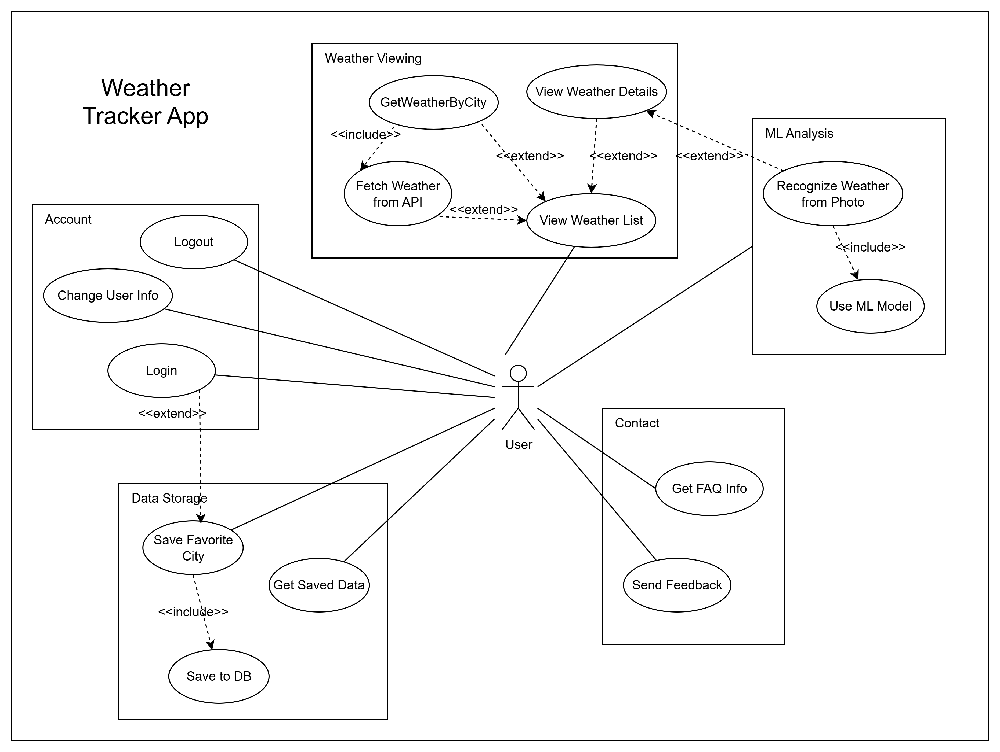
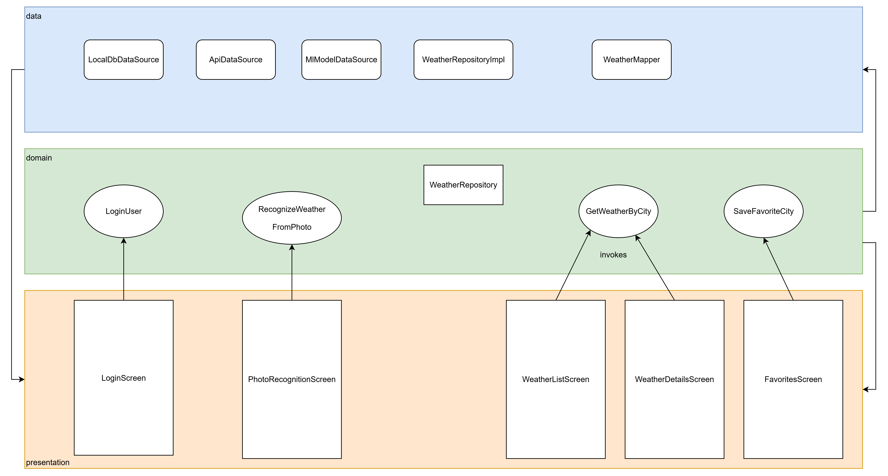
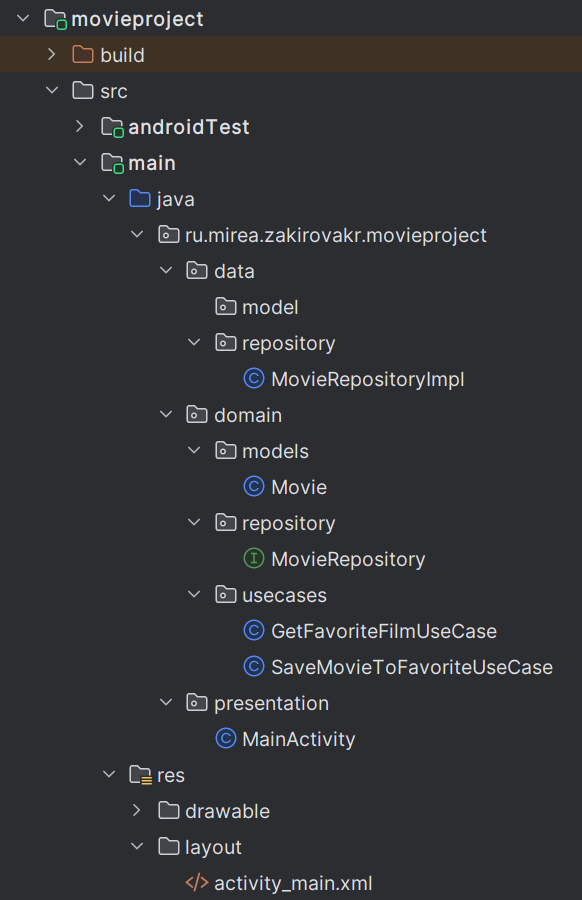
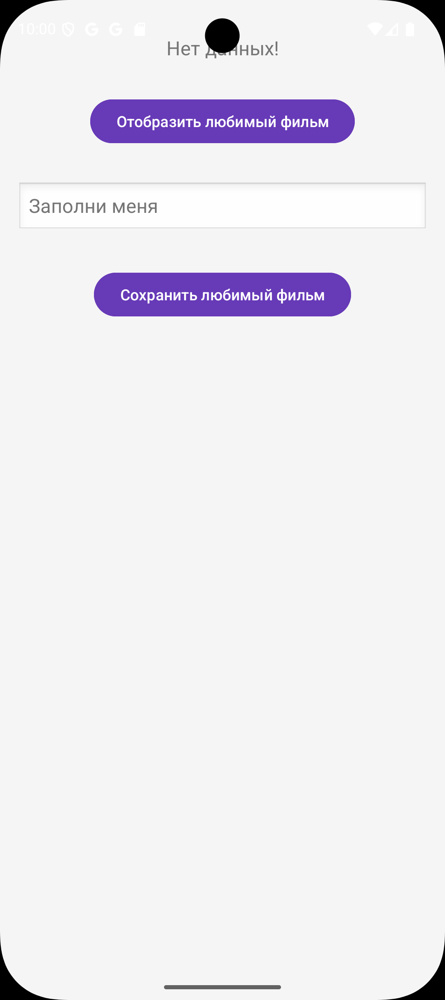
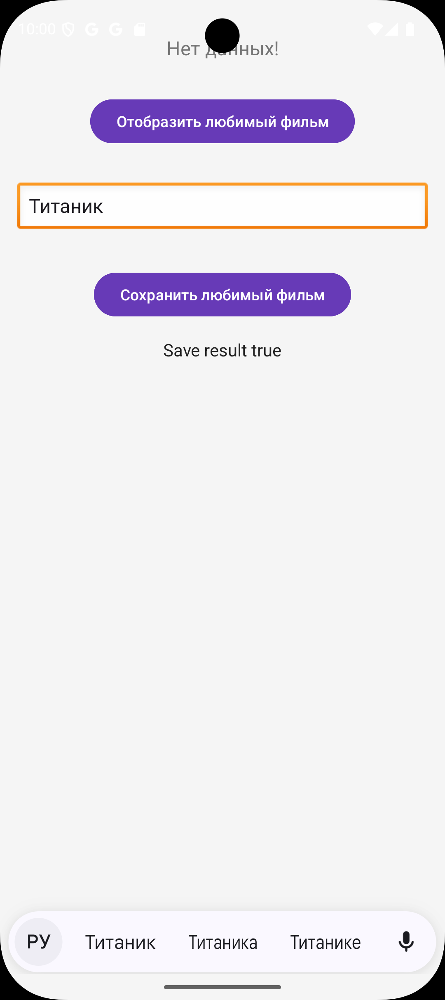
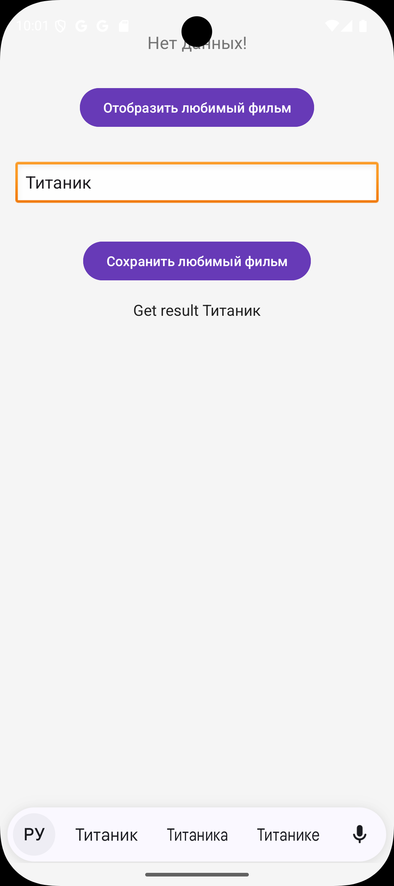
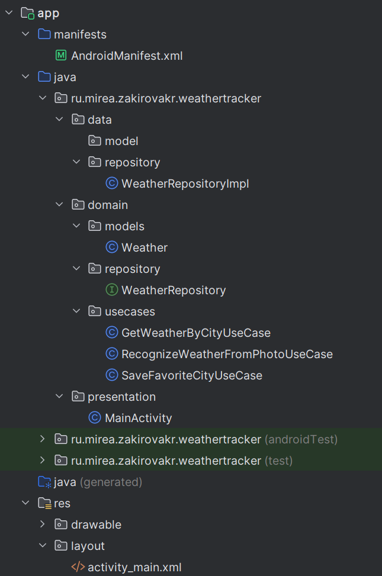
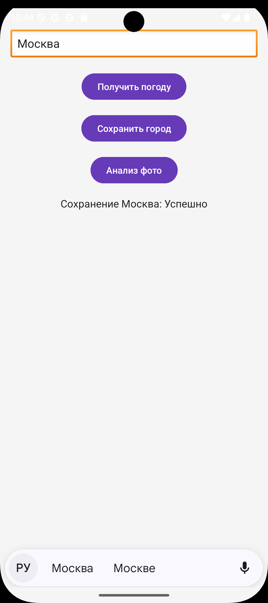
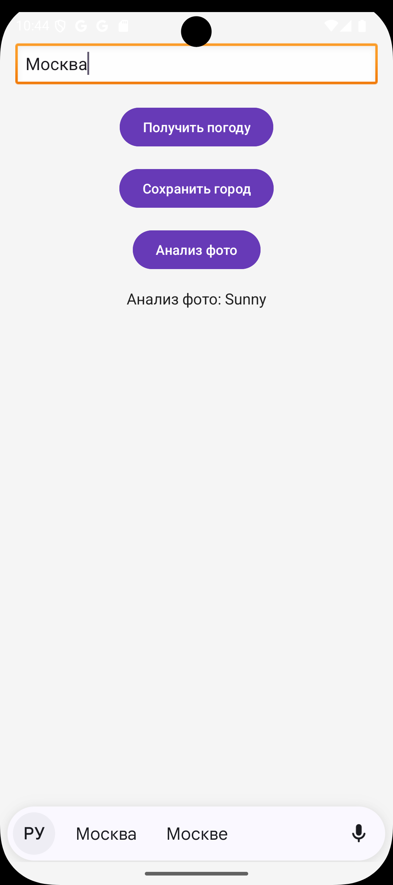

# Практическая работа №1

## 1 ПРОЕКТИРОВАНИЕ ПРИЛОЖЕНИЯ

​	Был продуман функционал приложения и сформирована диаграмма вариантов использования.

**"Weather Tracker"** — мобильное приложение для просмотра погоды в разных городах. Оно удовлетворяет всем требованиям:

- Авторизация (логин для сохранения предпочтений).
- Взаимодействие с внешним сервисом (API погоды, например, OpenWeatherMap, возвращающий JSON с данными о погоде).
- Сохранение данных в БД (локальная SQLite для хранения любимых городов и истории просмотров).
- Отображение списка сущностей с изображениями (список городов с иконками погоды).
- Отображение страницы сущности (детальная страница погоды для выбранного города).
- Различные возможности: Гость может только просматривать базовую погоду, авторизованный пользователь — добавлять города в избранное и использовать ML для анализа фото.
- Использование обученной модели: TensorFlow Lite модель для распознавания погоды по фото (например, готовую модель для классификации изображений на "солнечно", "дождливо", "облачно" из репозитория TensorFlow Hub, такую как MobileNet с кастомной обучением на датасете погоды. Анализ: модель легковесная, работает оффлайн, точность ~85% на простых изображениях; альтернативы — EfficientNet Lite, но MobileNet проще для интеграции).

Приложение использует чистую архитектуру: Use Cases управляют бизнес-логикой (получение погоды, сохранение, распознавание), сущности — City, WeatherData, User; границы — через репозитории для API и БД.



​	На основе сформированных use case спроектированы экраны приложения с указанием их зоны ответственности.



## 2 РЕАЛИЗАЦИЯ КАРКАСА ПРИЛОЖЕНИЯ

​	Была создана следующая структура проекта для разделения на слои.



​	**Movie.java (domain/models/)**: Определяет сущность Movie с полями id и name, используется как модель данных.

```java
public class Movie {
    private int id;
    private String name;

    public Movie(int id, String name) {
        this.id = id;
        this.name = name;
    }

    public String getName() {
        return name;
    }

    public int getId() {
        return id;
    }
}
```

​	**MovieRepository.java (domain/repository/)**: Интерфейс, задающий контракт для методов saveMovie и getMovie.

```java
public interface MovieRepository {
    boolean saveMovie(Movie movie);
    Movie getMovie();
}
```

​	**GetFavoriteFilmUseCase.java (domain/usecases/)**: Выполняет получение любимого фильма через репозиторий.

```java
public class GetFavoriteFilmUseCase {
    private MovieRepository movieRepository;

    public GetFavoriteFilmUseCase(MovieRepository movieRepository) {
        this.movieRepository = movieRepository;
    }

    public Movie execute() {
        return movieRepository.getMovie();
    }
}
```

​	**SaveMovieToFavoriteUseCase.java (domain/usecases/)**: Выполняет сохранение фильма через репозиторий.

```java
public class SaveMovieToFavoriteUseCase {
    private MovieRepository movieRepository;

    public SaveMovieToFavoriteUseCase(MovieRepository movieRepository) {
        this.movieRepository = movieRepository;
    }

    public boolean execute(Movie movie) {
        return movieRepository.saveMovie(movie);
    }
}
```

​	**MovieRepositoryImpl.java (data/repository/)**: Реализует MovieRepository, сохраняет и получает данные через SharedPreferences.

```java
public class MovieRepositoryImpl implements MovieRepository {
    private static final String PREFS_NAME = "favorite_movie_prefs";
    private static final String KEY_MOVIE_ID = "favorite_movie_id";
    private static final String KEY_MOVIE_NAME = "favorite_movie_name";

    private SharedPreferences sharedPreferences;

    public MovieRepositoryImpl(Context context) {
        this.sharedPreferences = context.getSharedPreferences(PREFS_NAME, Context.MODE_PRIVATE);
    }

    @Override
    public boolean saveMovie(Movie movie) {
        if (movie.getName().isEmpty()) {
            return false;
        }
        SharedPreferences.Editor editor = sharedPreferences.edit();
        editor.putInt(KEY_MOVIE_ID, movie.getId());
        editor.putString(KEY_MOVIE_NAME, movie.getName());
        return editor.commit();
    }

    @Override
    public Movie getMovie() {
        int id = sharedPreferences.getInt(KEY_MOVIE_ID, -1);
        String name = sharedPreferences.getString(KEY_MOVIE_NAME, null);
        if (id == -1 || name == null) {
            return new Movie(1, "Doctor Strange");
        }
        return new Movie(id, name);
    }
}
```

​	**MainActivity.java (presentation/)**: Главная активность, инициализирует UI, обрабатывает клики и вызывает Use Case'ы.

```java
public class MainActivity extends AppCompatActivity {

    @Override
    protected void onCreate(Bundle savedInstanceState) {
        super.onCreate(savedInstanceState);
        setContentView(R.layout.activity_main);

        EditText text = findViewById(R.id.editTextMovie);
        TextView textView = findViewById(R.id.textViewMovie);

        MovieRepository movieRepository = new MovieRepositoryImpl(this);  // Передаём Context

        findViewById(R.id.buttonSaveMovie).setOnClickListener(new View.OnClickListener() {
            @Override
            public void onClick(View view) {
                Boolean result = new SaveMovieToFavoriteUseCase(movieRepository).execute(new Movie(2, text.getText().toString()));
                textView.setText(String.format("Save result %s", result));
            }
        });

        findViewById(R.id.buttonGetMovie).setOnClickListener(new View.OnClickListener() {
            @Override
            public void onClick(View view) {
                Movie movie = new GetFavoriteFilmUseCase(movieRepository).execute();
                textView.setText(String.format("Get result %s", movie.getName()));
            }
        });
    }
}
```

​	При запуске приложения открывается экран. Заполняем.



​	Сохраняем.



​	Отображаем.



## 3 КОНТРОЛЬНОЕ ЗАДАНИЕ

​	Был создан проект с классами use-case, указанными на этапе проектирования на уровне слоя domain и data. Репозиторий возвращает тестовые данные.

​	Была создана следующая структура проекта.



​	**Weather.java (domain/models/)**: Определяет сущность Weather с полями (city, temperature) и геттерами для данных о погоде.

```java
public class Weather {
    private String city;
    private int temperature;

    public Weather(String city, int temperature) {
        this.city = city;
        this.temperature = temperature;
    }

    public String getCity() {
        return city;
    }

    public int getTemperature() {
        return temperature;
    }
}
```

​	**WeatherRepository.java (domain/repository/)**: Интерфейс репозитория с методами для получения погоды по городу, сохранения любимого города и анализа фото.

```java
public interface WeatherRepository {
    Weather getWeatherByCity(String city);
    boolean saveFavoriteCity(String city);
    String recognizeWeatherFromPhoto();
}
```

​	**GetWeatherByCityUseCase.java (domain/usecases/)**: Use Case для получения погоды по городу через репозиторий, возвращает тестовые данные.

```java
public class GetWeatherByCityUseCase {
    private final WeatherRepository weatherRepository;

    public GetWeatherByCityUseCase(WeatherRepository weatherRepository) {
        this.weatherRepository = weatherRepository;
    }

    public Weather execute(String city) {
        return weatherRepository.getWeatherByCity(city);
    }
}
```

​	**SaveFavoriteCityUseCase.java (domain/usecases/)**: Use Case для сохранения города в избранное через репозиторий, возвращает тестовый результат.

```java
public class SaveFavoriteCityUseCase {
    private final WeatherRepository weatherRepository;

    public SaveFavoriteCityUseCase(WeatherRepository weatherRepository) {
        this.weatherRepository = weatherRepository;
    }

    public boolean execute(String city) {
        return weatherRepository.saveFavoriteCity(city);
    }
}
```

​	**RecognizeWeatherFromPhotoUseCase.java (domain/usecases/)**: Use Case для анализа фото на погоду через репозиторий, возвращает тестовую строку (например, "Sunny").

```java
public class RecognizeWeatherFromPhotoUseCase {
    private final WeatherRepository weatherRepository;

    public RecognizeWeatherFromPhotoUseCase(WeatherRepository weatherRepository) {
        this.weatherRepository = weatherRepository;
    }

    public String execute() {
        return weatherRepository.recognizeWeatherFromPhoto();
    }
}
```

​	**WeatherRepositoryImpl.java (data/repository/)**: Реализация репозитория с тестовыми данными для всех методов (без реального API/DB).

```java
public class WeatherRepositoryImpl implements WeatherRepository {
    @Override
    public Weather getWeatherByCity(String city) {
        // Тестовые данные: фиксированная погода для любого города
        return new Weather(city, 25); // Возвращаем 25°C для примера
    }

    @Override
    public boolean saveFavoriteCity(String city) {
        // Тестовый результат: всегда успешно
        return true;
    }

    @Override
    public String recognizeWeatherFromPhoto() {
        // Тестовые данные: фиксированное значение
        return "Sunny"; // Возвращаем "Sunny" как тестовый результат
    }
}
```

​	**MainActivity.java (presentation/)**: Главная активность, инициализирует UI и тестирует Use Case'ы с выводом результатов.

```java
public class MainActivity extends AppCompatActivity {

    @Override
    protected void onCreate(Bundle savedInstanceState) {
        super.onCreate(savedInstanceState);
        setContentView(R.layout.activity_main);

        EditText editTextCity = findViewById(R.id.editTextCity);
        TextView textViewResult = findViewById(R.id.textViewResult);

        WeatherRepository weatherRepository = new WeatherRepositoryImpl();
        GetWeatherByCityUseCase getWeatherUseCase = new GetWeatherByCityUseCase(weatherRepository);
        SaveFavoriteCityUseCase saveCityUseCase = new SaveFavoriteCityUseCase(weatherRepository);
        RecognizeWeatherFromPhotoUseCase recognizeWeatherUseCase = new RecognizeWeatherFromPhotoUseCase(weatherRepository);

        findViewById(R.id.buttonGetWeather).setOnClickListener(new View.OnClickListener() {
            @Override
            public void onClick(View v) {
                String city = editTextCity.getText().toString();
                Weather weather = getWeatherUseCase.execute(city);
                textViewResult.setText(String.format("Погода в %s: %d°C", weather.getCity(), weather.getTemperature()));
            }
        });

        findViewById(R.id.buttonSaveCity).setOnClickListener(new View.OnClickListener() {
            @Override
            public void onClick(View v) {
                String city = editTextCity.getText().toString();
                boolean result = saveCityUseCase.execute(city);
                textViewResult.setText(String.format("Сохранение %s: %s", city, result ? "Успешно" : "Ошибка"));
            }
        });

        findViewById(R.id.buttonRecognizeWeather).setOnClickListener(new View.OnClickListener() {
            @Override
            public void onClick(View v) {
                String result = recognizeWeatherUseCase.execute();
                textViewResult.setText(String.format("Анализ фото: %s", result));
            }
        });
    }
}
```

​	При запуске приложения открывается экран




